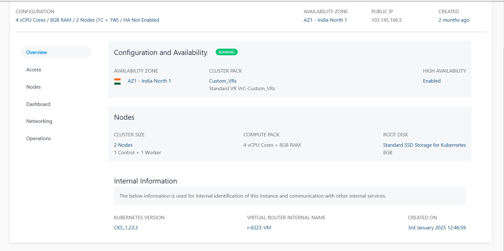

# Viewing Kubernetes Cluster Details

Apiculus Cloud Console offers a detailed view of Kubernetes clusters on the UI. Apiculus also brings the full power and accessibility of cluster management via the kubectl interface.

To view cluster details on the UI, follow these steps:

1. Navigate to **Compute > Kubernetes**
2. All the Kubernetes clusters for your account will be listed here with the following details.
    1. Kubernetes Cluster Name (Along with the configuration details)
    2. Public IP address
    3. Autoscaling Enabled/Disabled
    4. Created 

You can view a list of sections and the various operations or actions you can perform inside the particular section by clicking on the Kubernetes Cluster name. Below the cluster name is an informational view where you can find the below details.

- Configuration
- Availability Zone
- Cluster Pack
- High Availability Enabled/Disabled

A quick option is available in the top right corner, i.e., to  **POWER OFF/ON** the cluster.

Details on available Kubernetes Cluster operations and actions can be found in their respective sections:

- [Overview](docs/Subscribers/Compute/Kubernetes/Overview.md)
- [Access](AccessingaClusterusingtheCommandLine.md)
- [Nodes](ScalingKubernetesClusters.md)
- [Dashboard](AboutKubernetesDashboard.md)
- [Networking](IngressNetworkingonKubernetesClusters.md)
- [Operations](ClusterOperations)