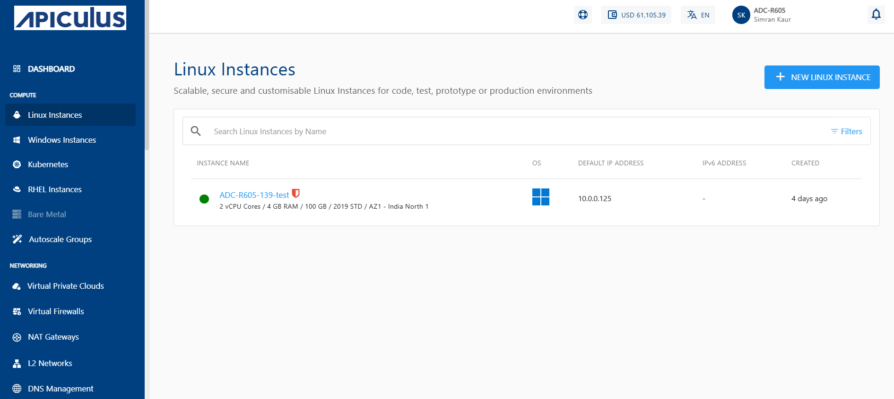
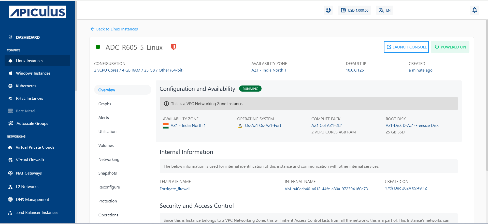

# About Linux Instances

Before creating a Linux instance, it is important to plan the architecture, networking and access to the Linux Instances. 

Apiculus offers a highly usable and visual way of working with and operating Linux Instances using the Cloud Console. You can access all the Linux Instances available in your account in the following way:

1. Navigate to **Compute > Linux Instances**.
2. All the Linux instances for your account are listed here with the following details:
	- Instance Name and the configuration details
	- OS Icon
	- Default IP Address
	- Created

To view a list of section where you can perform various operations or actions, click the **instance name**. Below the Instance name, there is an informational view where you can find the following details:

- Configuration
- Availability Zone
- Default IP
- Created 

On the top right corner, two quick options are available, one to **LAUNCH CONSOLE** and the other to **POWER OFF/ON** the Instance.

Details on available Linux Instance operations and actions can be found in their respective sections.

- [Overview](docs/Subscribers/Compute/LinuxInstances/Overview.md)
- [Graphs & Utilisation](ViewingGraphsandUtilizationofLinuxInstances.md)
- [Alerts](docs/Subscribers/Networking/VirtualFirewall/FirewallInstances/ConfiguringAlerts.md)
- [Volumes](docs/Subscribers/Networking/VirtualFirewall/FirewallInstances/VolumeManagement.md)
- [Networking](docs/Subscribers/Networking/VirtualFirewall/FirewallInstances/NetworkingManagement.md)
- [Snapshots](WorkingwithLinuxInstanceSnapshots.md)
- [Reconfigure](docs/Subscribers/Compute/LinuxInstances/ReconfiguringLinuxInstances.md)
- [Operations](docs/Subscribers/Compute/LinuxInstances/Operations.md)

