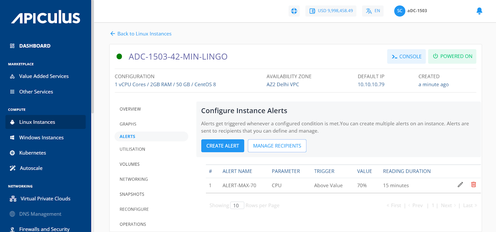
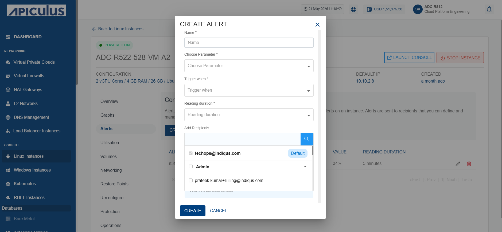
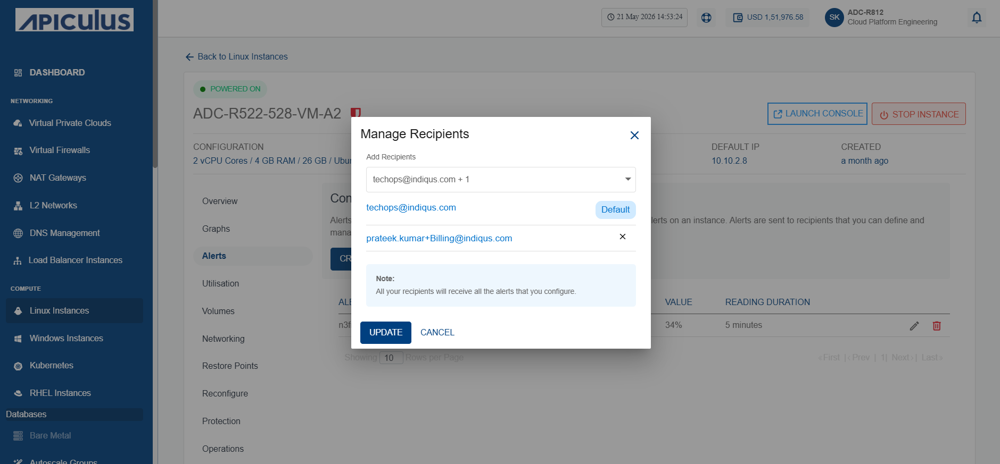

# Configuring Alerts

To view the configured alerts or configure new ones, navigate to the [Operating Linux Instances](AboutLinuxInstances.md), and select Linux Instance and access the **Alerts** tab.

Alerts get triggered whenever a configured condition is met. You can create multiple alerts on an instance. Alerts are sent to recipients that you can define and manage.

You can configure alerts for instances running on the Apiculus. You can define alerts for Instances and configure the email recipients for these alerts using a straightforward and easy-to-use interface.

## Instance Alerts

The Alerts tab lists all the alerts already configured for that particular Linux Instance. In addition, it will show the following details:
- ID
- Name for the alert
- Parameter
- Trigger When
- Value
- Reading Duration

## Adding an Alert

To create or add alerts, click the **Create Alert** button. The Create Alert window opens.

The various fields of the Create Alert screen are as follows:

- **Name** - You can define the name for your alert.
- **Choose Parameter** - This option will allow you to define what parameter needs to be monitored to trigger the alert email. Apiculus Cloud supports CPU, RAM, Disk, 1-min Load Average, 5-min Load Average, 15-min Load Average parameters.
- **Trigger when** - This set of options lets you define whether to trigger above or below a custom value.
- **Reading duration** - This option lets you define the breach window, that is, the duration for which the breach must be consistent to trigger the alert email.
- **Add Recipients** - You can add recipients from the dropdown.

## Configuring Recipients

This section list and display all the email IDs already configured for the alerts. You can delete the existing email IDs and add other email IDs by following these steps:

1. Click on the **Manage Recipients**.
2. Click on **+ Add Recipients**.
3. Select the recipients from the dropdown.
4. Click on the **Update** button, and update the recipient's list.

:::note
All the recipients configured will receive all the setup alerts. If no email ID is configured or added, then no email will be sent for the already configured alerts.
:::

