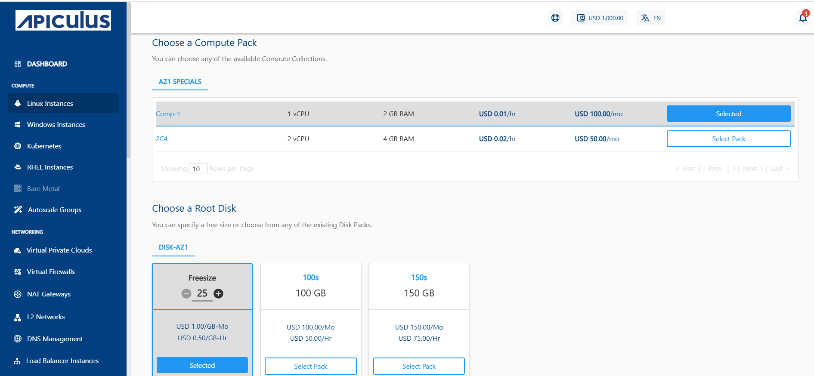
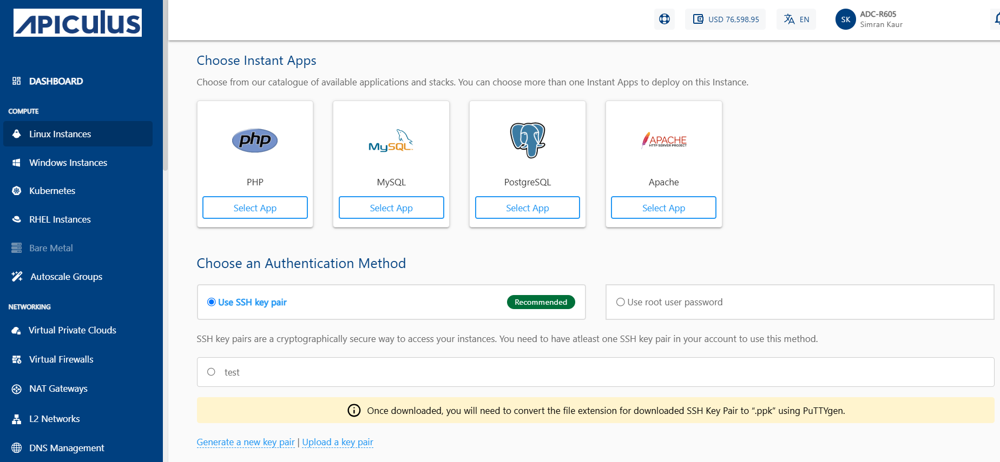
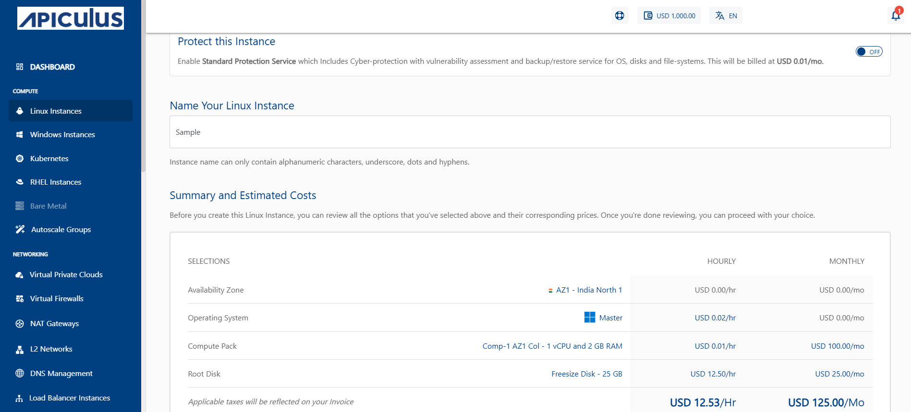

# Creating Linux Instances

Before creating a Linux instance, it is important to plan the architecture, networking and access to the Linux Instances. 

To create a Linux instance, follow these steps:

1. Navigate to **Compute > Linux Instances**.
2. Click on **+ NEW LINUX INSTANCE** button.
   
3. Choose an **Availability Zone**, which is the geographical region where your Instance will be deployed. 
4. Select a VPC or VNF network from the **Select Network** Dropdown and, select the appropriate tier listed in **Select Network**.
	:::note
	To add a Linux Instance to a VPC or VNF, you need to have a VPC or VNF configured with at least one tier.
	:::
5. Select the **OS Image** to run on your Instance.
6. Select the **Compute Pack** from the available compute collections.
7. Select the  **Root Disk** from the available options.
8. Select the option to **Protect this Instance**.
   
9. In **Choose Instant Apps**, select the available applications. To Verify/Login into your selected database, refer to [App Overlays](AppOverlays.md).
    
10. **Choose an Authentication Method**:
    - **Use SSH key pair**: To view all the SSH key pairs present in your account, click the **Use SSH key pair** option. If your account doesn’t have any SSH key pair, then you can click the **Generate a new key pair** or upload the key pair by clicking the **Upload a key pair** option.
    - **Use root user password**: On selecting Use root user password, the **Also email me the password** option is displayed. If you select this option, the password, along with the details, for instance, will be emailed to your registered email ID.
11. In the **Name Your Linux Instance** field, enter the desired name for your Linux Instance. The Instance name contain alphanumeric characters, underscore, dots and hyphens only. 
12. Verify the Estimated Cost of your Linux Instance based on the chosen specifications from the Summary and Estimated Costs Section (Here, both Hourly and Monthly Prices summary are displayed).
	
13. Click on the check box after going through the policies mentioned by your cloud service provider.
14. Choose the BUY HOURLY or BUY MONTHLY option. A confirmation window appears and the price summary will be displayed along with the discount codes if you have any in your account. 
    - You can apply any of the discount codes listed by clicking on the **APPLY** button. 
    - You can also remove the applied discount code by clicking on the **REMOVE** button. 
    - You can cancel this action by clicking on the **CANCEL** button.
15. Click **CONFIRM** to create the Linux Instance.

:::note
It might take up to 5-8 minutes for the Linux instance to get created. You may use the Cloud Console during this time, but it is advised that you do not refresh the browser window.
:::

Once ready, you get notified of this purchase on your registered email ID. To access the newly created Linux Instances, navigate to **Compute >** **Linux Instances** on the main navigation panel.

