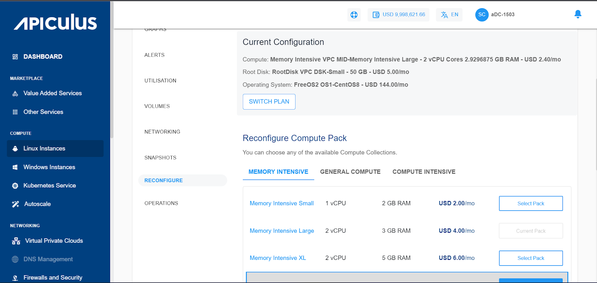
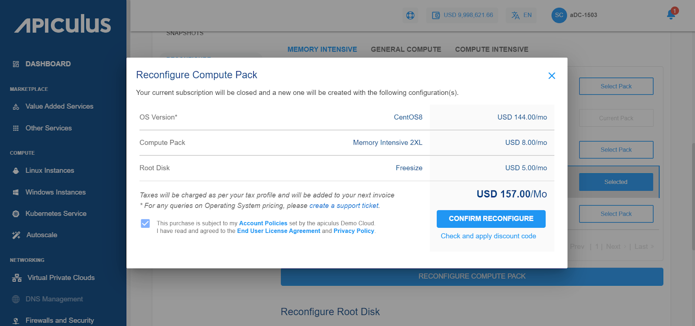

# Reconfiguring Linux Instances

To view a available reconfiguration options, navigate to the  [Operating Linux Instances](AboutLinuxInstances.md), select a Linux Instance and access the **Reconfigure** tab.

A Linux Instance on Apiculus can be reconfigured in the following ways:

- Billing interval changed between monthly and hourly.
- Choosing and applying a new Compute pack.
- Choosing and applying a new Root Disk pack.

:::note
You can only reconfigure with the same billing interval. If you wish just to change the billing interval, please use the Switch Plan button. We suggest switching the plan first before reconfiguring the Instance if you intend to use both the Reconfigure and Switch Plan options. You will be charged as per the pack you have reconfigured, not based on the older pack.
:::

