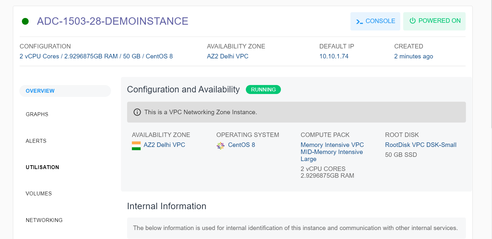
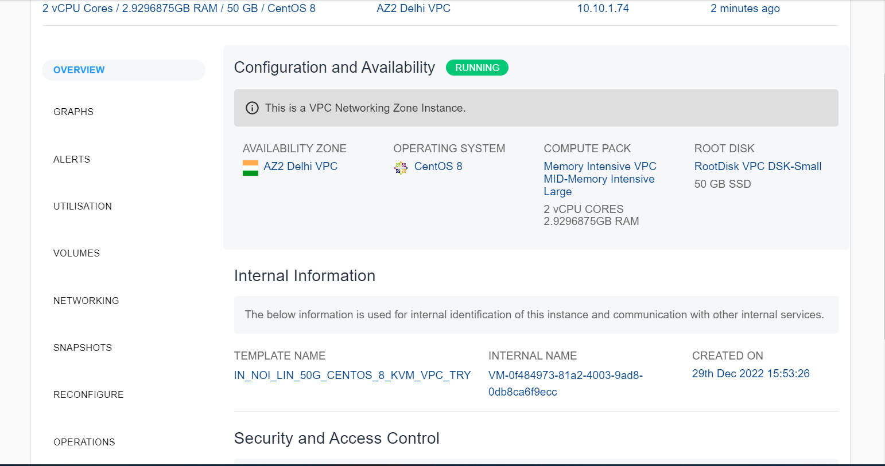
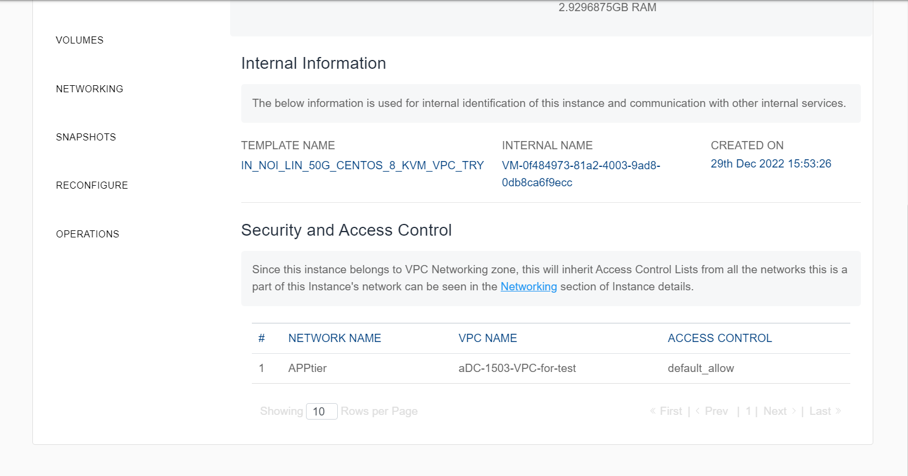

# Viewing Details of Linux Instances

To view the below details, navigate to the [Operating Linux Instances](AboutLinuxInstances.md), select a Linux Instance and access the **Overview** tab.

- [Configuration and Availability](#configuration-and-availability)
- [Internal Information](#internal-information)
- [Security and Access Control](#security-and-access-control)
---
## Configuration and Availability

This section displays the instance's status, **RUNNING**, is displayed in greyed out and the information about the networking zone.

## Internal Information
This section displays the information used for internal identification of this instance and communication with other internal services.
    - Template Name
    - Internal Name
    - Created On

## Security and Access Control
This section displays the following information:

- Network Name
- VPC Name
- Access Control

