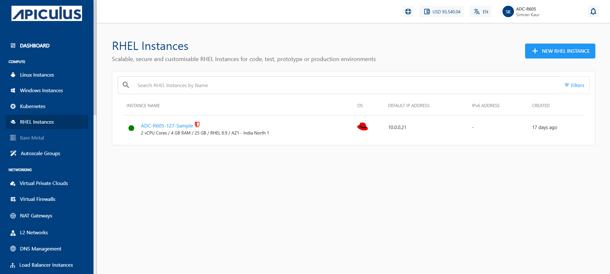
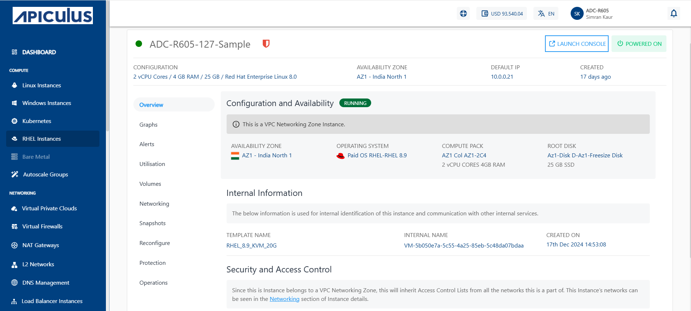

# About RHEL Instances

Instances are computing units that provide you with resources to run your applications/workloads. Red Hat Enterprise Linux (RHEL) Instances are virtual machines that run the images of RHEL Operating System.

Before creating an RHEL instance, it is important to plan the architecture, networking and access to the RHEL Instances. As a thumb rule:

- You can use a Basic/Flat (or elastic compute) RHEL Instance to get started quickly and set up your RHEL Instances behind apiculus Cloud’s global server load balancer (GSLB) and control access by setting up virtual firewall rules; or;
- You can use a tiered network (or Advanced VPC, virtual private cloud) RHEL Instances to configure advanced networking and application architectures and control access by setting up access control lists.

Apiculus offers a highly usable and visual way of working with and operating RHEL Instances using the CloudConsole. All RHEL Instances available in your account can be accessed in the following way:

1. Navigate to **Compute > RHEL Instances**.
2. All the RHEL instances for your account are listed here with the following details:
	- Instance Name and the configuration details
	- OS Icon
	- Default IP Address
	- IPv6 Address
	- Created

Click on the instance name to view a list of sections and the various operations or actions you can perform by going inside the particular section. 

Below the Instance name, there is an informational view where you can find the following details:
- Configuration
- Availability Zone
- Default IP
- Created 

On the top right corner, two quick options are available, one to **Launch Console** and the other to **POWER OFF/ON** the Instance.
 
Details on available RHEL Instance operations and actions can be found in their respective sections on the left.

- [Overview](ViewingDetailsofRHELInstances.md)
- [Graphs](ViewingGraphsandUtilizationofRHELInstances.md)
- [Alerts](ConfiguringAlertsonRHELInstances.md)
- [Utilisation](ViewingGraphsandUtilizationofRHELInstances.md)
- [Volumes](VolumeManagementwithRHELInstances.md)
- [Networking](NetworkingManagementwithRHELInstances.md)
- [Snapshots](WorkingwithRHELInstanceSnapshots.md)
- [Reconfigure](ReconfiguringRHELInstances.md)
- [Operations](RHELInstanceOperations.md)