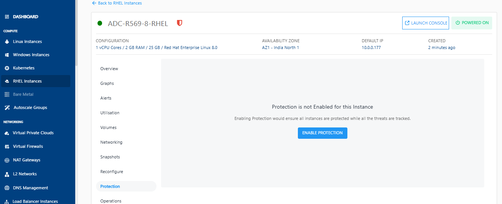
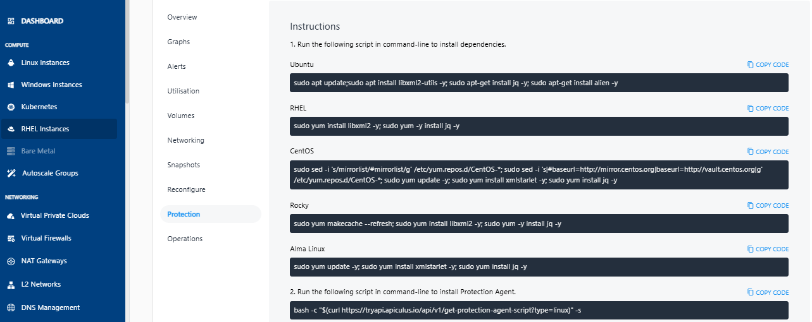

# Protecting RHEL Instances

Enabling protection ensures that all instances are protected while all the threats are tracked.

To enable instance protection, follow these steps:

1. From [Operating RHEL Instances](AboutRHELInstances.md), navigate to the RHEL Instance and access the **Protection** tab.
   

3. Click on the **Enable Protection** button. The following screen appears where the standard protection service is selected and charged at USD 0.01 per month for each GB of backup storage used.
   

4. To enable advanced protection features (charged at USD 0.50 per month for each protected instance) such as antivirus, anti-malware and backup/restore service for the SQL databases, turn on the toggle button. 
5. Click **Confirm**. The protection gets enabled and the following screen appears:
   
4.  Run the respective script (mentioned under Point No. 1 in above screen) in command-line to install dependencies.
5.  Run the script mentioned on the screen (mentioned under Point No. 2 in above screen) in command-line to install Protection Agent.

