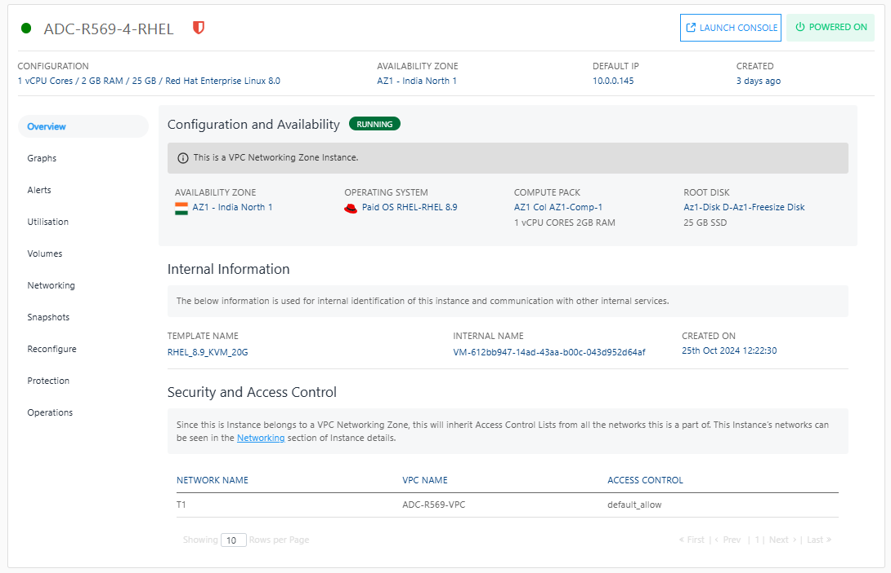

# Viewing Details of RHEL Instances

Navigate to a [RHEL Instance](AboutRHELInstances.md) and access the **Overview** tab to see its details.
## Configuration and Availability
- The instance's status, **RUNNING**, is displayed in **green**, whereas STOPPED is displayed in greyed out.
- Information about the networking zone, whether it is a VPC networking zone or a Basic/Flat/EC networking zone.

## Internal Information
This displays the information that is used for internal identification of this instance and communication with other internal services.
    - Template Name
    -  Internal Name
    -  Created On
## Security and Access Control
The following information is avaialble:
	- Network Name
	- VPC Name
	- Access Control
