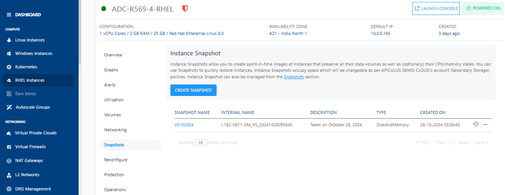
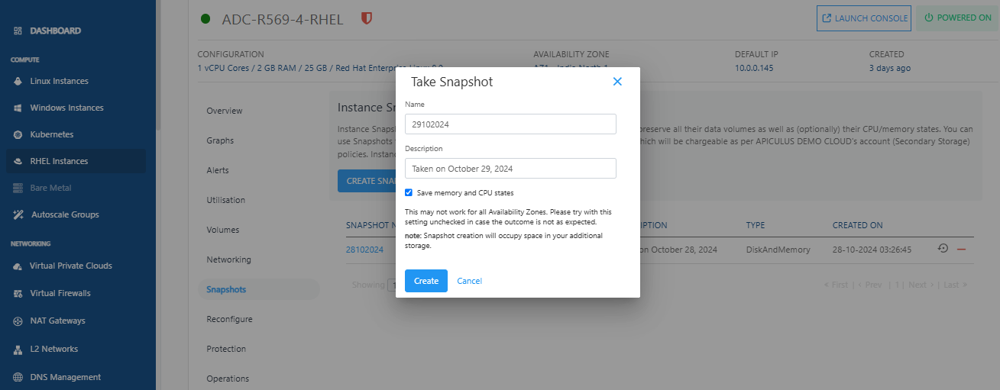

# Working with RHEL Instance Snapshots

Navigate to a [RHEL Instances](AboutRHELInstances.md) and access the **Snapshots** tab to see all the snapshots taken for this Instance.

Instance Snapshots allow you to create point-in-time images of instances that preserve all their data volume as well as (optionally) their CPU/memory states. You can use Snapshots to quickly restore Instances.

The Snapshots section shows all RHEL Instance snapshots, which can be used to revert the RHEL Instances to an earlier state.

Snapshot will list down the following details:

- Snapshot Name
- Internal Name
- Description
- Type
- Created On

Two quick options are available, one is to revert the Instance from the snapshot, and the other is to delete the particular snapshot.

To create a snapshot: 
1. Click on the **CREATE SNAPSHOT** button. 
2. Enter the name of the snapshot and the description of the snapshot.
3. Click on **Create**.

