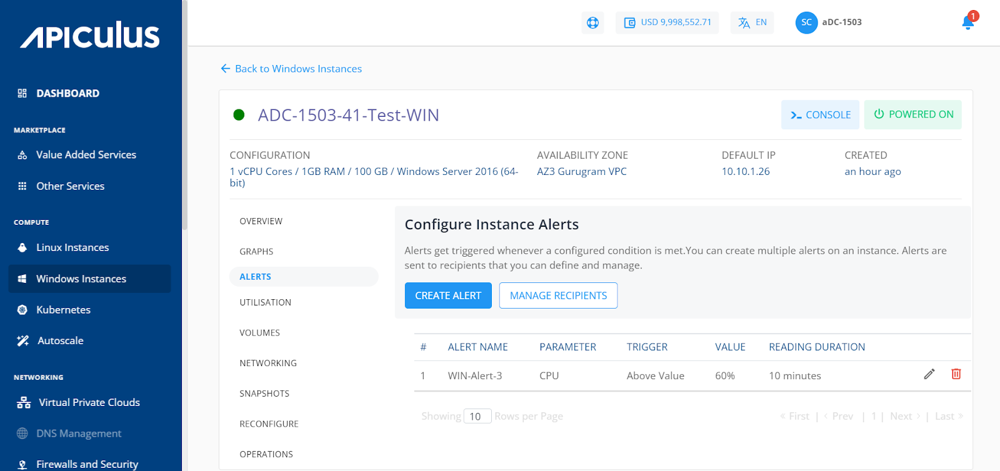
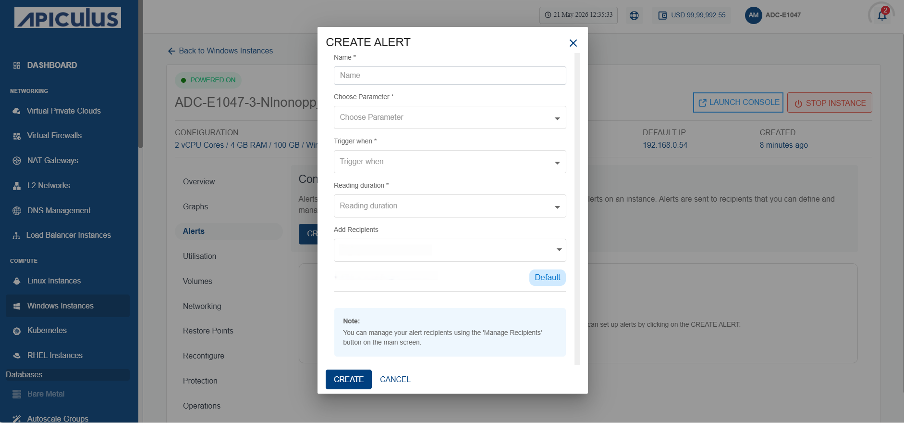
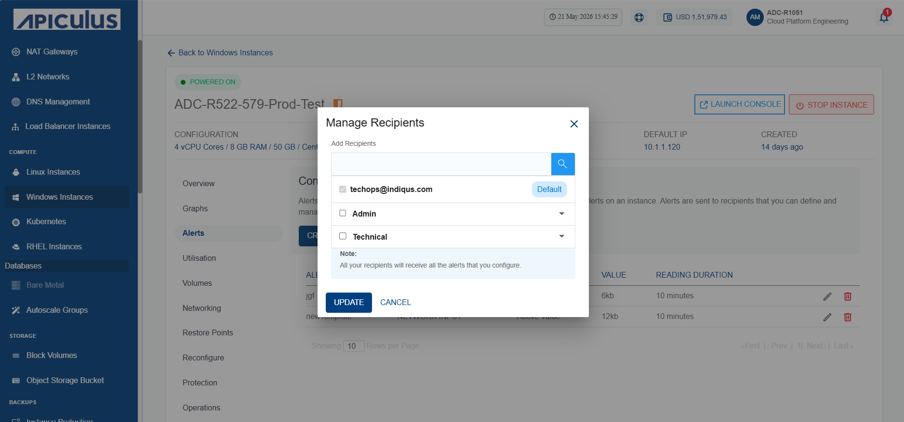

# Configuring Alerts on Windows Instances

To view the configured alerts or configure new ones, navigate to [Operating Windows Instances](AboutWindowsInstances), select a Windows Instance and access the **Alerts** tab .

Alerts get triggered whenever a configured condition is met. You can create multiple alerts on an instance. Alerts are sent to recipients that you can define and manage.

Subscribers can configure alerts for instances running on the Apiculus. Subscribers can define alerts for Instances and configure the email recipients for these alerts using a straightforward and easy-to-use interface.

# Instance Alerts

The Alerts tab can be accessed from the instances details. It shows the alerts already configured for that particular VM with following details:
- ID
- Alert Name
- Parameter
- Trigger
- Value
- Reading Duration

# Adding an Alert

Subscribers can create or add alerts simply by clicking on the **Add Alert** button. The following screen will open up, and the subscriber needs to describe the details of the alert.

The various fields of the add alert page are described below:

- **Name** - You can define the name for your alert.
- **Choose parameter** - This option allows you to define what parameter needs to be monitored to trigger the alert email. Apiculus Cloud supports CPU, RAM, Disk, 1-min Load Average, 5-min Load Average, 15-min Load Average parameters.
- **Trigger when** - This set of options lets you define whether to trigger above or below a custom value.
- **Reading duration** - This option lets you define the breach window, i.e., the duration for which the breach has to be consistent to trigger the alert email.
- **Add Recipients** - You can add recipients from the dropdown.
# Configuring Recipients

This will list and display all the email IDs already configured for the alerts. You can delete the existing ids and add other email ids by following these steps:

1. Click on the **Manage Recipients** button.
2. Click on **+ Add Recipients** button.
3. Select the **Recipients**.
4. Then click **Update**, and update the recipient's list.

:::note
	All the recipients configured will receive all the setup alerts. If no email ID is configured or added, then no email will be sent for the already configured alerts.
:::

