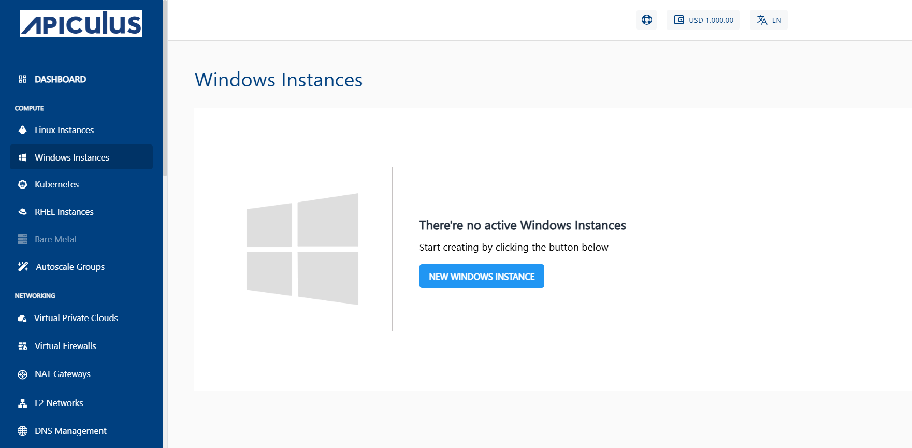

# Creating Windows Instances

Before creating a Windows Instance, it is important to plan the architecture, networking and access to the Windows Instances. 

To create a Windows instance, follow these steps:

1. Navigate to **Compute > Windows** Instances.
2. Click on the **+ NEW WINDOWS INSTANCE** button.
   
3. Choose an Availability Zone, which is the geographical region where your Instance will be deployed. 
	
4. Select a VPC or VNF network from the **Select Network** Dropdown and, select the appropriate tier listed in **Select a Network Tier**.
	:::note
	To add a Windows Instance to a VPC or VNF, you need to have a VPC or VNF configured with at least one tier.
	:::
5. Choose an Image to run on your Instance. This can be an operating system or a custom image that is available under **MY IMAGES.**
6. Select a compute pack from the available compute collections.
7. Select the Root Disk from the available Disk Packs. You can use the free size option to specify the Root Disk size.
   
8. Verify the Estimated Cost of your Windows Instance based on the chosen specifications from the Summary and Estimated Costs Section (Here, both Hourly and Monthly Prices summary are displayed).
9. Click on the check box after going through the policies mentioned by your cloud service provider.
10. Choose the BUY HOURLY or BUY MONTHLY option. A confirmation window appears and the price summary will be displayed along with the discount codes if you have any in your account. 
    - You can apply any of the discount codes listed by clicking on the **APPLY** button. 
    - You can also remove the applied discount code by clicking on the **REMOVE** button. 
    - You can cancel this action by clicking on the **CANCEL** button.
    
11. Click **CONFIRM** to create the Windows Instance.

:::note 
This might take up to 5-8 minutes. You may use the Cloud Console during this time, but it is advised that you do not refresh the browser window.
:::

Once ready, you are notified of this purchase on your email address on record. To access the  newly created Windows Instances, navigate to **Compute >** **Windows Instances** on the main navigation panel.

