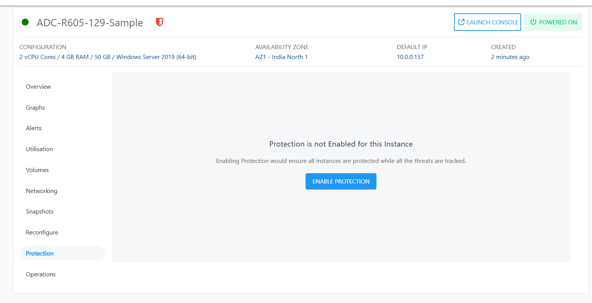
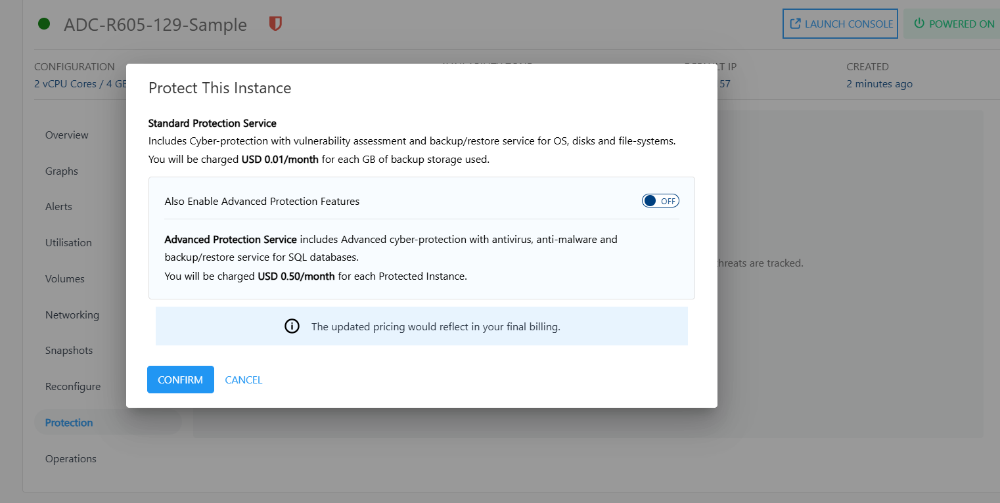
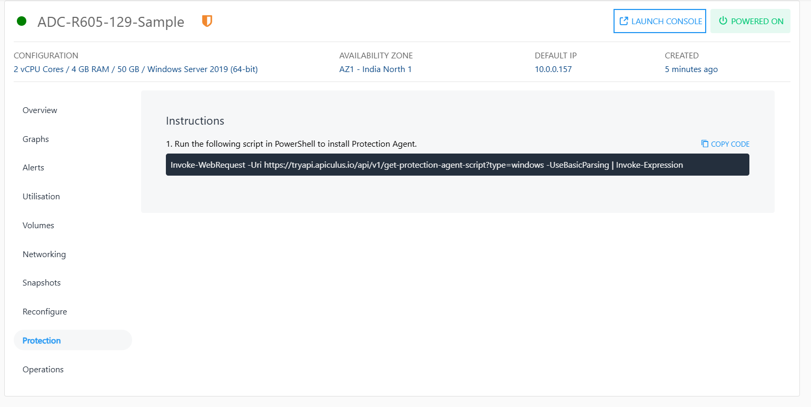

# Protection

Enabling protection ensures that all instances are protected while all the threats are tracked.

To enable instance protection, follow these steps:

1. Navigate to **Windows Instance** and access the **Protection** tab.
2. Click on the **Enable Protection** button. The following screen appears where the standard protection service is selected and charged at USD 0.01 per month for each GB of backup storage used.
   
3. To enable advanced protection features (charged at USD 0.50 per month for each protected instance) such as antivirus, anti-malware and backup/restore service for the SQL databases, turn on the toggle button. 
   
4. To enable the protection, click **Confirm**. 
6. Run the respective script (mentioned under Point No. 1 in above screen) in command-line to install Protection Agent.
   

