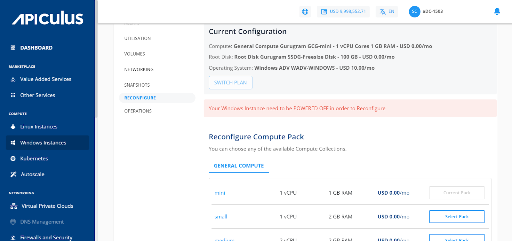

# Reconfiguring Windows Instances

To view available reconfiguration options, navigate to [Operating Windows Instances](AboutWindowsInstances), select a Windows Instance, and access the **Reconfigure** tab.

A Windows Instance on Apiculus can be reconfigured in the following ways:

- The Billing interval changed between monthly and hourly.
- Choosing and applying a new Compute pack.
- Choosing and applying a new Root Disk pack.

:::note
You can only reconfigure with the same billing interval. To change the billing interval, use the **Switch Plan** button. It is recommended to switch the plan before reconfiguring the Instance if you wish to use both the Reconfigure and Switch Plan options. You will be charged as per the pack you have reconfigured, not based on the older pack.
:::

