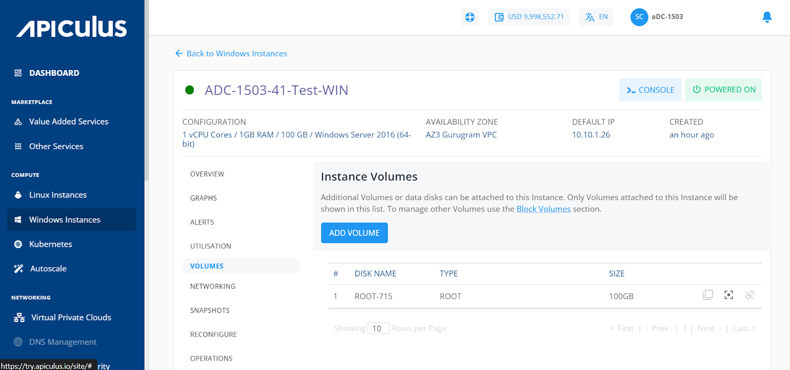

# Volume Management with Windows Instances

To view the disks attached to this instance, navigate to [Operating Windows Instances](AboutWindowsInstances), select a Windows Instance and access the **Volumes** tab.
Windows Instances on Apiculus work with the [Block Volumes Service](/docs/Subscribers/Storage/BlockVolumes/AboutBlockVolumes) and let you carry out basic disk operations.

The following quick actions available:

- **Create Template** - Click on it, and enter the image name and description.
- **Create Snapshot** - To create a Volume snapshot.
- **Detach/attach** - To attach/detach the volume to/from the instance.

:::note
Volume-level operations are available as part of the Block Volumes Service.
:::

