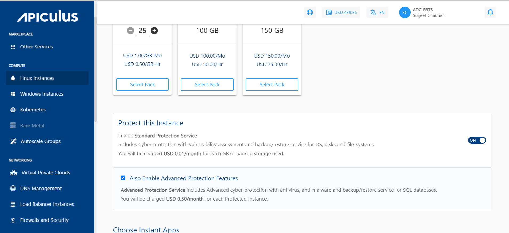
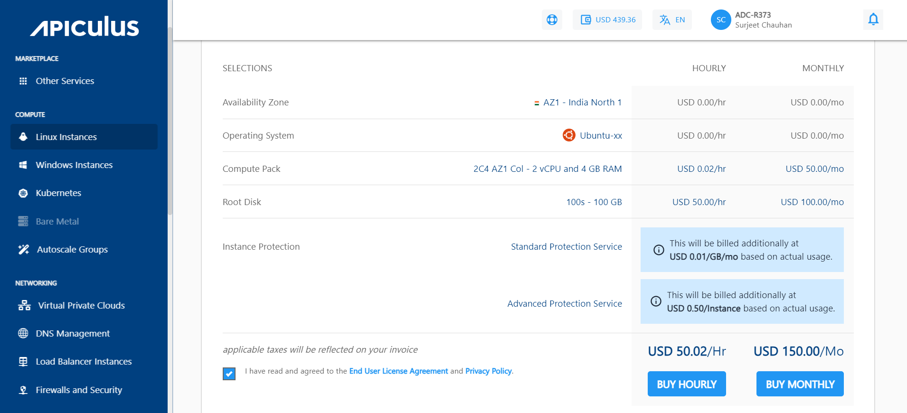
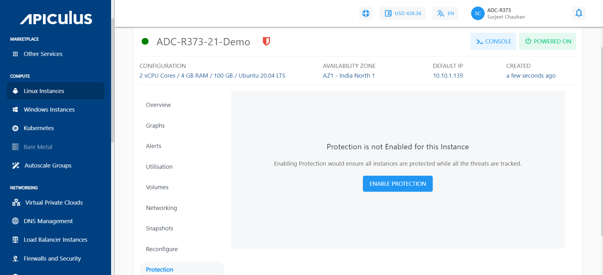
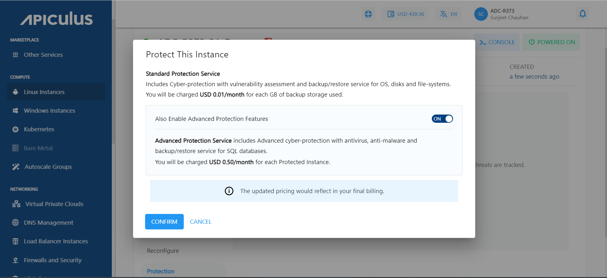
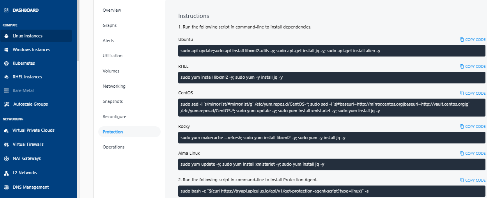

# Enabling Instance Protection

The Instance Protection service can be enabled in two ways:

## During Instance Creation

To enable protection while creating a [Linux](/docs/Subscribers/Compute/LinuxInstances/CreatingLinuxInstances) or a [Windows](/docs/Subscribers/Compute/WindowsInstances/CreatingWindowsInstances) instance, follow these steps:

1. Enable the Protect this Instance switch. There, you will get a Standard Protection Service, and you can also opt for Advance Protection Features. 
	
2. The pricing summary will be updated based on your selection.
	

## After Instance Creation

If you already have a Linux or Windows Instance and didn't enable the protection service while creating the instance, you can activate it later. Navigate to the Listing of the **Linux/Windows** Instances. Click the **particular instance**. 

To enable the protection plan service, follow these steps:

1. Navigate to the instance listing, select the **Protection** section and click the **ENABLE PROTECTION** button.
    
2. Click **Confirm**, and if you want to enable the advanced protection features, then enable the switch as shown in the below screenshot:
    
	    :::note
	   When a user enables the Advance Plan, it works in addition to the Standard Plan. The pricing is calculated based on per GB/usage basis for Standard Plan features and per instance/per workload for Advance plan features.
	   :::
	 3. After the confirmation, the steps for the activation will be listed, and these steps need to be run through the command line.
		 
    4. Run the respective script (mentioned under Point No. 1 in above screen) in the command-line to install dependencies. 
    5. Run the respective script (mentioned under Point No. 2 in above screen) in command-line to install the Protection Agent.

:::note
The list of [Supported Operating systems](https://www.acronis.com/en-us/support/documentation/AcronisCyberProtect_15/index.html#cshid=36983) and environments.
:::

