# Managing Protected Instances

To manage the protected instances, you can perform the following operations:

- [Viewing Protected Instances](#viewing-protected-instances)
- [Protection](#protection)
- [Backup and Alerts](#backups-and-alerts)
- [Operations](#operations)
## Viewing Protected Instances

1. In the main navigation menu, navigate to the Backups menu and select the **Instance Protection** option.
2. Click the **Protected Instances** to display a list of all protected instances.
	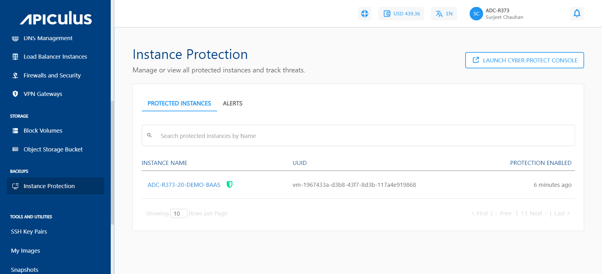
3. Select a specific instance name to view the following options:

## Protection 

To view the last backup was taken and when the upcoming backup is scheduled, navigate to **Instance Protection** and click the details of the Instance protection.

Here, you get the option to **Run Now**, click on it to start taking the backup.

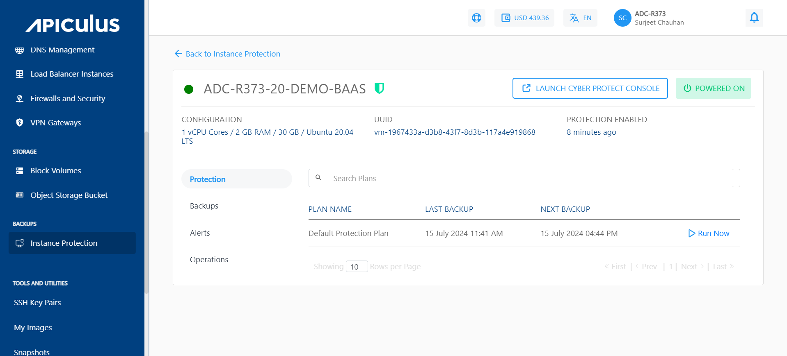
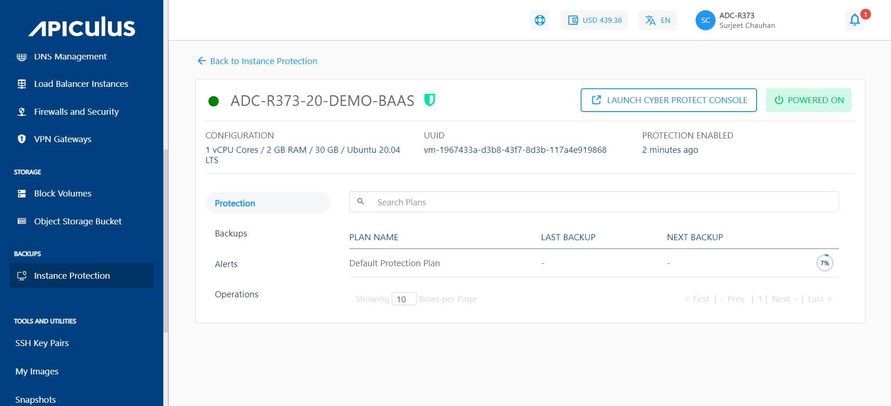

## Backups and Alerts

To view all available backups, navigate to **Instance Protection** and select the **Backups** tab.
	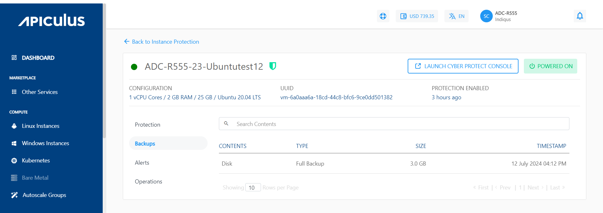
To restore a backup, click the **LAUNCH CYBER PROTECT CONSOLE**.

## Viewing Alerts

To view Alerts, navigate to **Instance Protection** and select the **Alerts** tab. The Alerts section displays these details:
	- **ALERT TYPE** - It specifies the category of the Alert.
	- **POLICY NAME** - It shows the name of the policy.
	- **SEVERITY** - It shows the level of urgency of the alert.
	- **ALERT MESSAGE** - It specifies brief description about the specific issue or event that triggered the alert.
	- **TIMESTAMP** - It shows the date and time when the alert was generated.
	  
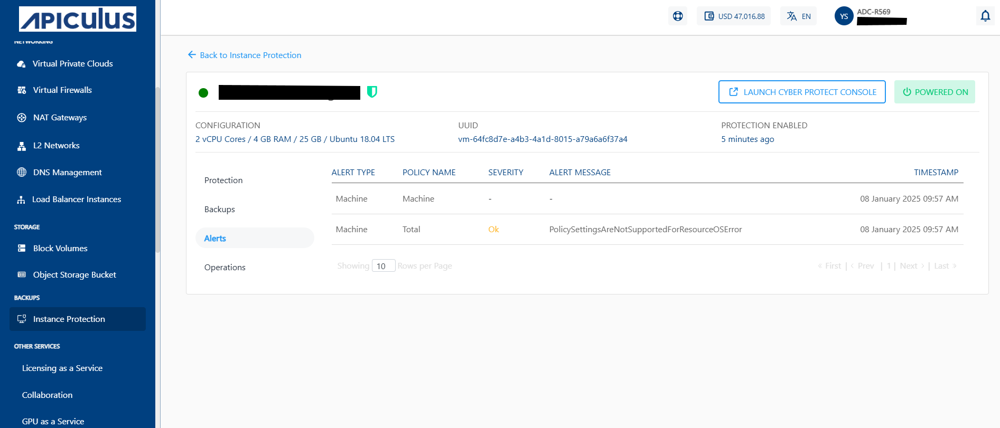

## Operations

## Changing the Protection Plan

To switch your current plan to a different one, follow these steps:

1. Navigate to the **Backups** and select the **Instance Protection** and click the particular instance.
2. Navigate to the **Operations** section and click on the **Change Plan** button.
	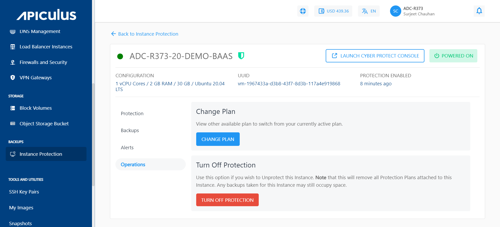
3. According to your current plan, you can opt for advanced protection features or, disable these advanced features accordingly.
	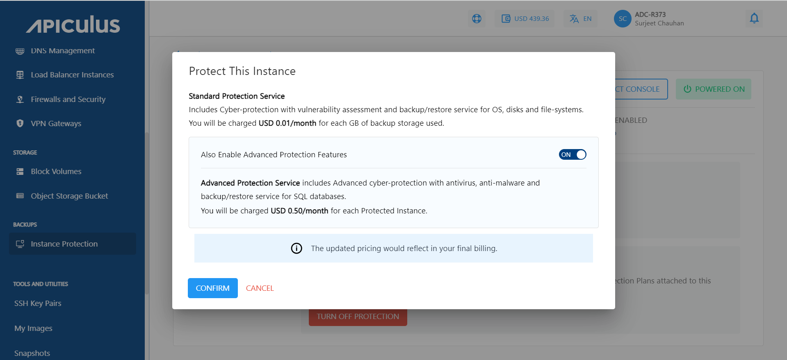
The change plan can also be made by navigating to the Protection section of a particular Instance.

## Turning off the Protection Plan

Protection can be turned off in two ways. The first one is as follows:

-  To Turn off the protection plan, navigate to the **protection** section and click the **TURN OFF PROTECTION** for a particular instance and click confirm.
	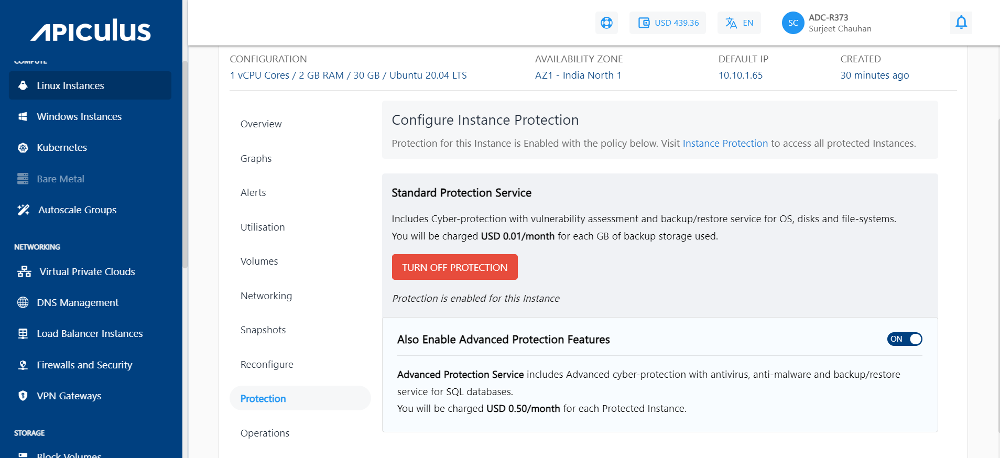
- Click **YES, CONFIRM**, and the protection will be turned off for this particular instance.
	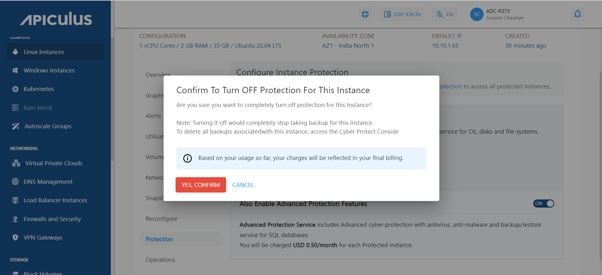
	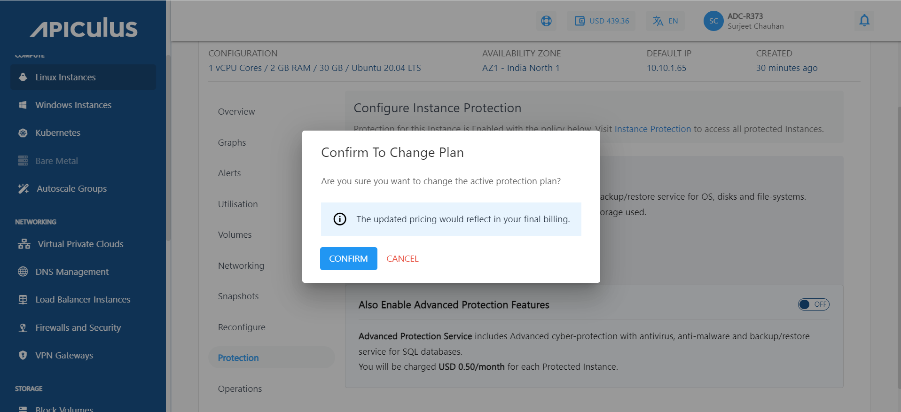

The other way is mentioned as follows:

- Navigate to the **Backups** and select the **Instance Protection** and click on the particular instance.
- Navigate to the **Operations** section and click **Turn off** **Protection.**
	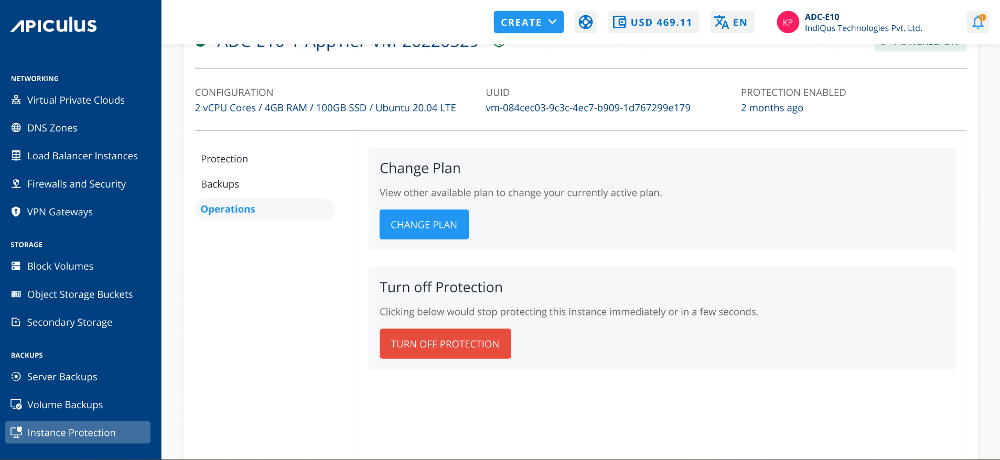
- To Turn off the protection for particular instance, Click **YES, CONFIRM**.
	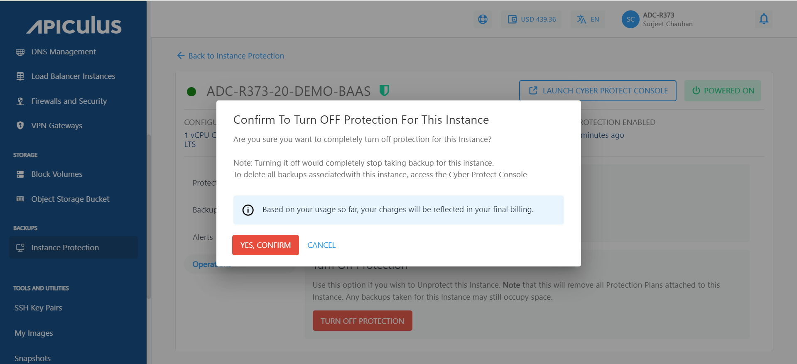

