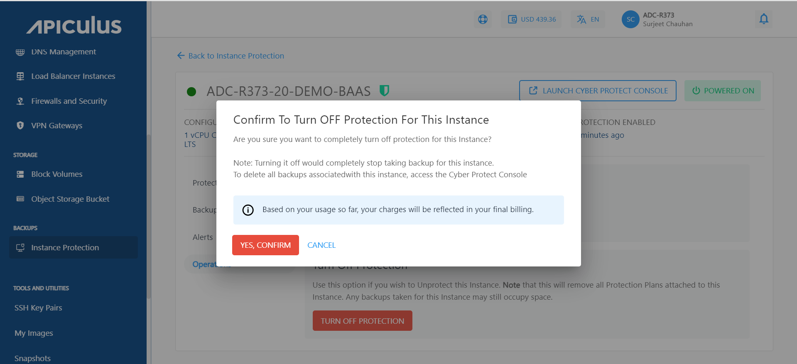

# Operations

## Changing the Protection Plan

To switch your current plan to a different one, follow these steps:

1. Navigate to the **Backups** and select the **Instance Protection** and click the particular instance.
2. Navigate to the **Operations** section and click on the **Change Plan** button.
	
3. According to your current plan, you can opt for advanced protection features or, disable these advanced features accordingly.
	
The change plan can also be made by navigating to the Protection section of a particular Instance.

## Turning off the Protection Plan

Protection can be turned off in two ways. The first one is as follows:

-  To Turn off the protection plan, navigate to the **protection** section and click the **TURN OFF PROTECTION** for a particular instance and click confirm.
	

- Click **YES, CONFIRM**, and the protection will be turned off for this particular instance.
	
	

The other way is mentioned as follows:

- Navigate to the **Backups** and select the **Instance Protection** and click on the particular instance.
- Navigate to the **Operations** section and click **Turn off** **Protection.**
	
- To Turn off the protection for particular instance, Click **YES, CONFIRM**.
	

