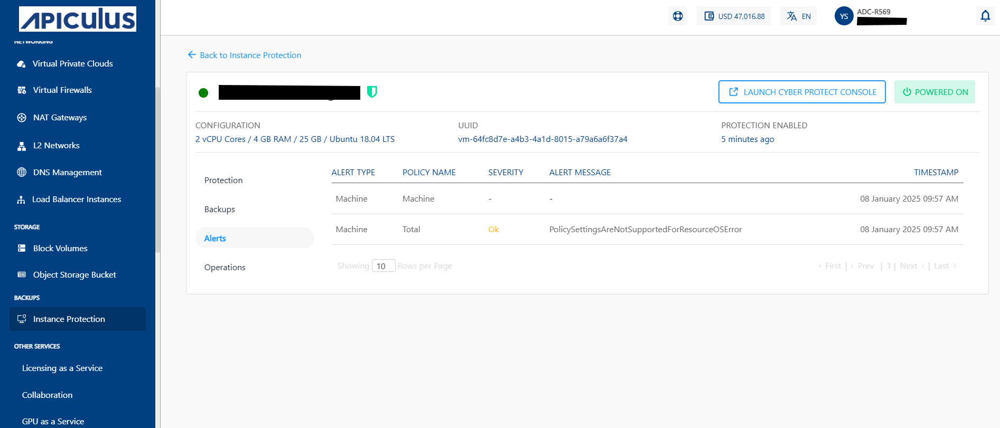

# Viewing Backup and Alerts

## **Backup**

To view all available backups, navigate to **Instance Protection** and select the **Backups** tab.
	
To restore a backup, click the **LAUNCH CYBER PROTECT CONSOLE**.

## **Viewing Alerts**

To view Alerts, navigate to **Instance Protection** and select the **Alerts** tab. The Alerts section displays these details:
	- **ALERT TYPE** - It specifies the category of the Alert.
	- **POLICY NAME** - It shows the name of the policy.
	- **SEVERITY** - It shows the level of urgency of the alert.
	- **ALERT MESSAGE** - It specifies brief description about the specific issue or event that triggered the alert.
	- **TIMESTAMP** - It shows the date and time when the alert was generated.
	