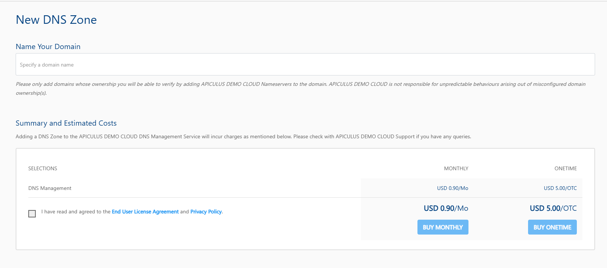

# Linking Domains to Apiculus Cloud Console

The Apiculus-powered cloud has nameservers if the service provider has enabled this service. These name servers are simply fully-qualified domain names (FQDN) for the servers that store all the domain/zone information. Typically, these name servers will be in the following format:

```
ns1.<cloud-url>  
ns2.<cloud-url>  
ns3.<cloud-url>
```


There are 2 main steps involved in linking your owned domains to Apiculus DNS.

1. Navigate to **Networking > DNS Management** and click the **NEW ZONE** button. On Apiculus, each domain name is stored as a Zone file.
	:::note
	Apiculus supports pricing per DNS Zone, which could be monthly or a one-time cost, depending on how the cloud service provider has priced the Service. Once the Zone is created, navigate to it from the list of available DNS Zones, then go to the **Nameservers** section, where you will find the nameserver information.
	:::
	
2. In a different tab or browser window, open the control panel of your domain name provider (e.g., Bigrock, GoDaddy, Dreamhost, etc.) and navigate to the section where DNS records are managed. There will usually be a specific area for editing nameservers. Locate this section and update the nameserver information with the values provided in the **DNS Management** section of the Apiculus Cloud Console.
	
Once the nameservers have been propagated (which takes around 5-10 minutes), you'll be able to find your updated nameserver information if you whois your domain name. This also implicitly establishes your ownership of the domain.


