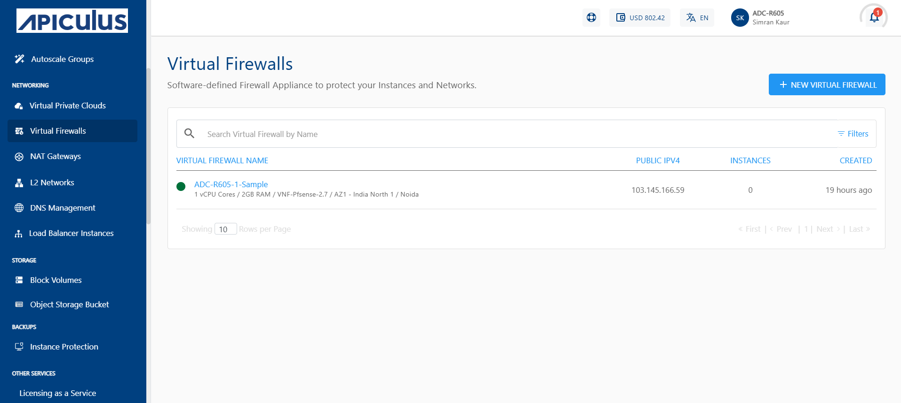
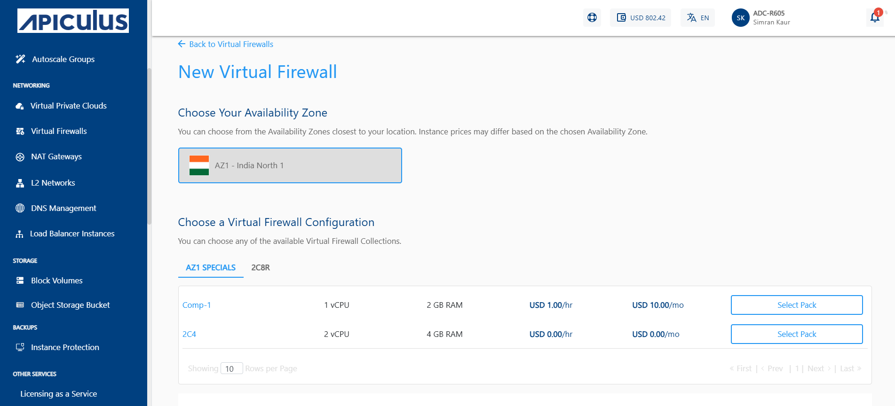
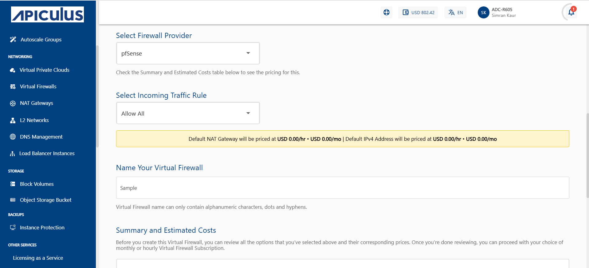
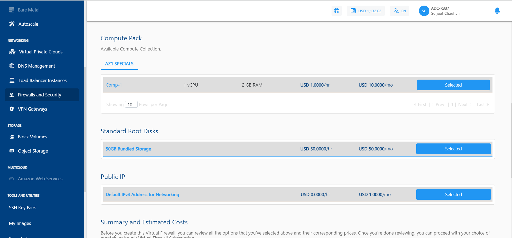
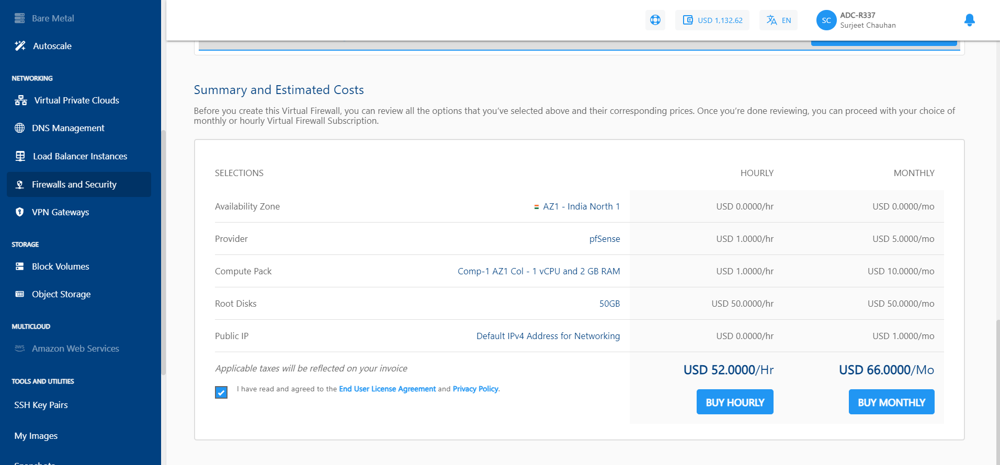
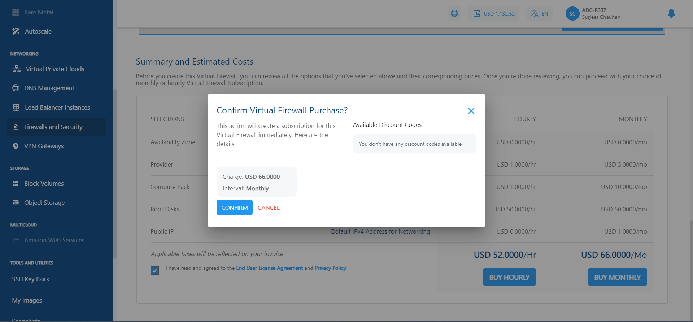
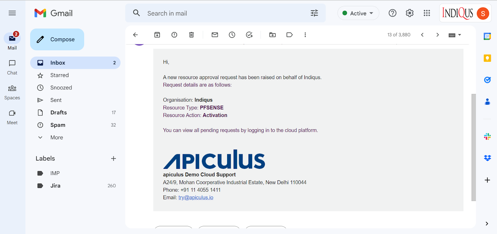
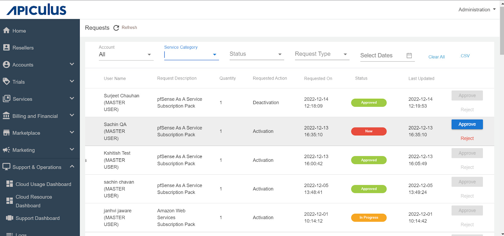
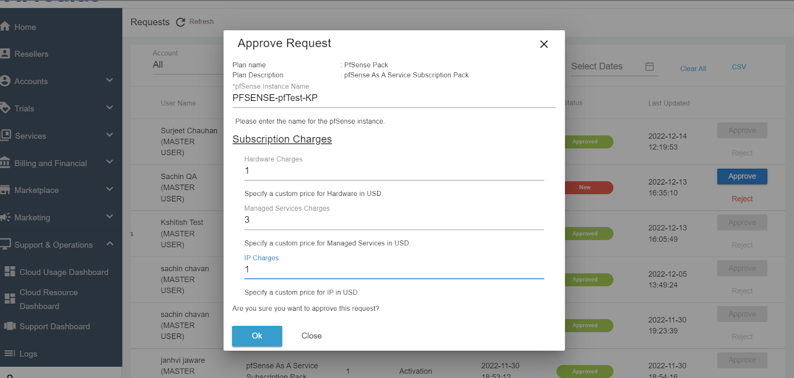
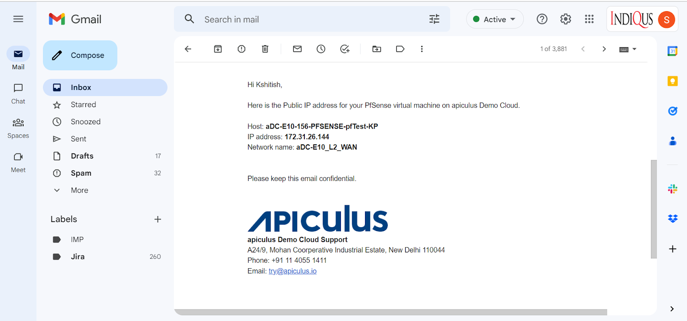

# Creating a Virtual Firewall

Virtual Firewalls can be created from the **Firewalls and Security** section in the main menu and navigating to the **Virtual Firewalls** tab. Using the **Create Virtual Firewall** button, the Service can be activated in a self-explained manner.
:::note
 Apiculus currently only supports one Virtual Firewall per Availability Zone.
 :::

The Virtual Firewall service can be configured for provisioning in a self-service or an approval-based manner.

## Managing Virtual Firewall Provisioning Requests

If **approval-based provisioning** is enabled for the VFI Service, the following process will be followed:
1. **Request Submission**
	-  A provisioning request is automatically raised to the cloud administrator.
	- The requester will be notified via email once the request is approved or rejected.
	  
2. **Request Status**
	-  Upon approval or activation, the Virtual Firewall appliance becomes visible in the **Virtual Firewalls list**.
	  
3. **Accessing the Request**
	- The request is available under the **Requests** section in the **Support & Operations** menu on the Ananta admin console.
4. **Admin Actions**
	- The administrator can:
	    - Review the request
	    - Approve or reject the request
	    - Enter any custom price overrides
	    - Click **OK** to finalize the action
	- The **end user** and the **admin** will receive an email notification regarding the request status.
	  
5. **End User Notification**
	- If the request is approved, the end user will receive an additional email with- **Subscription details, Service access information.**
	  

