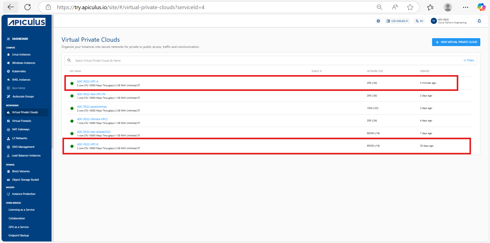
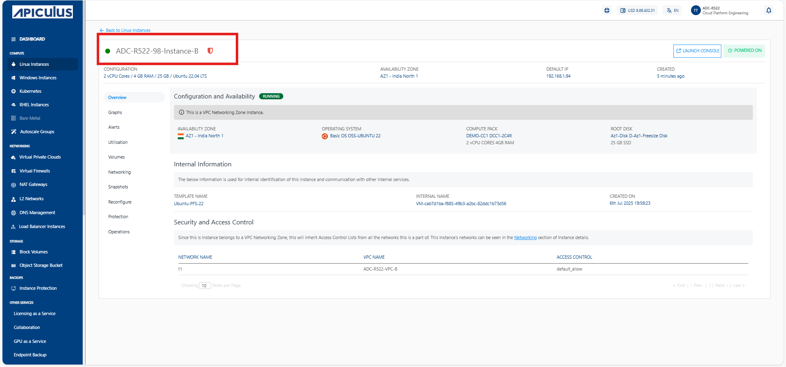
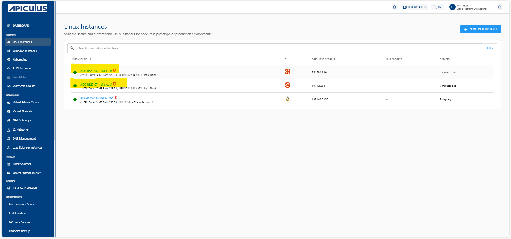
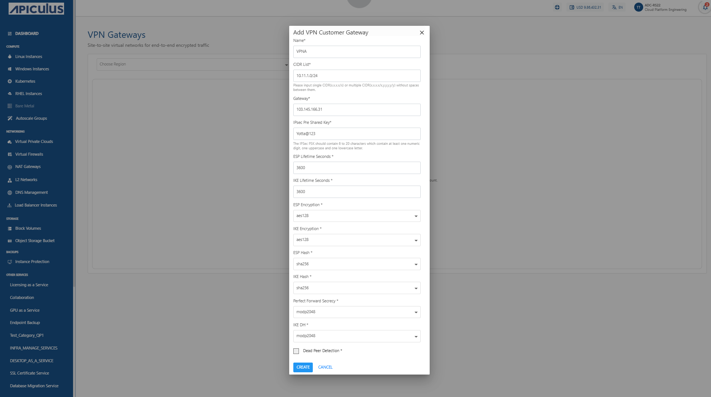
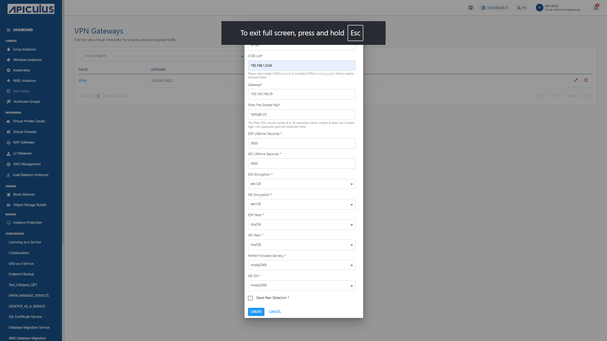
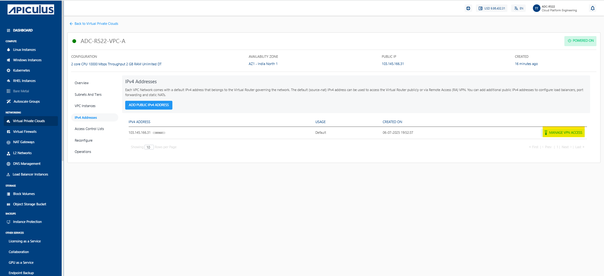
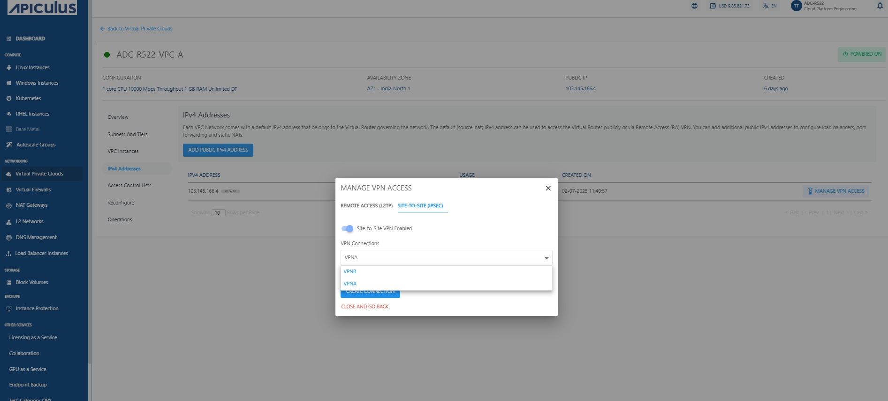

# Establishing Site-to-Site VPN Between Two VPCs

A Site-to-Site Virtual Private Network (VPN) provides a secure and encrypted connection between two Virtual Private Clouds (VPC), enabling seamless communication across geographically separated networks. This setup is commonly used to connect different environments (such as production and development) or extend on-premises infrastructure to the cloud.

This section outlines all the steps required to establish a Site-to-Site VPN between two VPCs. The following are the high level steps to establish site-to-site VPN between two VPCs.

1.  [Creating Two VPCs](#creating-two-vpcs)
2. [Launching virtual machines](#launching-virtual-machines)
3. [Configuring VPN Gateways](#configuring-vpn-gateways)
4. [Creating Customer Gateways](#creating-customer-gateways)
5. [Enabling VPN Connection](#enabling-vpn-connection)
6. [Verifying VPN Status](#verifying-vpn-status)
7. [Testing Connectivity](#testing-connectivity)
## Creating Two VPCs

Begin by provisioning two separate VPCs (for example, **ADC-R522-VPC A** and **ADC-R522-VPC B**) in your cloud environment:
1. VPCs must be created with non-overlapping CIDR blocks to avoid IP conflicts.
2. Ensure each VPC is associated with its own internet gateway and route table for external connectivity.
 
This setup establishes the foundational network segmentation necessary to enable a Site-to-Site VPN connection between the two VPCs.
## Launching Virtual Machines

Deploy one Virtual Machine (VM) inside each VPC. Create Virtual Machine (for example, **ADC-R522-97-instance-A**) in Virtual Private Cloud **ADC-R522-VPC A** and (for example, **ADC-R522-98-instance-B**) in Virtual Private Cloud  **ADC-R522-VPC B**.

Refer to the [Creating Linux Instances](/docs/Subscribers/Compute/LinuxInstances/CreatingLinuxInstances) note for detailed steps on creating Linux instances. 

These instances are used to validate VPN connectivity after the tunnel is established. Make sure the instances have proper security group and firewall rules to allow ICMP (ping) or SSH for testing purposes.
## Configuring VPN Gateways

Set up VPN gateways in each VPC to serve as endpoints for the IPsec tunnel:
1. Navigate to **Networking > VPN Gateways** from the main navigation panel and click **Add Gateway**
2. Provide required IPsec tunnel details such as: 
   - Gateway name
   - Tunnel IP settings
   - IPsec Pre Shared secrets
   - Routing methods
Repeat this step for both VPCs—each will have its own dedicated VPN Gateway.
## Creating Customer Gateways

Define the customer gateway configurations for each side of the VPN, Create two customer gateways:
1. For Gateway **VPN A**, specify the public IP address of Virtual Private Cloud **ADC-R522-VPC A**.

2. For Gateway **VPN B**, specify the public IP address of of Virtual Private Cloud **ADC-R522-VPC B**.

This setup allows each VPN Gateway to identify and establish a connection with its remote peer. These customer gateways act as references for establishing IPsec sessions.
## Enabling VPN Connection

Establish the Site-to-Site VPN tunnel between the two VPCs:
1. Within the VPC’s detail page, click on **Manage VPN access** under the **IPv4 Addresses** section.

2. Click **Site-to-Site (IPSEC)**. From the list of available VPN connections, select the appropriate **VPN Connections** that corresponds to the remote VPC.
3. Click on **Create Connection** to initiate the tunnel setup.

Repeat this for the second VPC to complete the bi-directional VPN configuration.
## Verifying VPN Status

Confirm that the VPN connection has been successfully established:
1. Navigate to the VPN Gateways section and check the tunnel status for both VPCs.
2. The status should reflect as **Connected**, indicating that the IPsec tunnel is active and secure. If not connected, verify tunnel settings, shared secrets, and routing configurations.

## Testing Connectivity

Ensure that the communication between VPCs is operational:
1. From Virtual Machine **ADC-R522-97-instance-A** in VPC **ADC-R522-VPC A**, try pinging into Virtual Machine **ADC-R522-98-instance-B** in VPC **ADC-R522-VPC B**, and vice versa.

2. Successful connectivity confirms that the Site-to-Site VPN is functioning correctly. Also, validate routing tables to ensure that traffic is correctly forwarded through the VPN tunnel.
