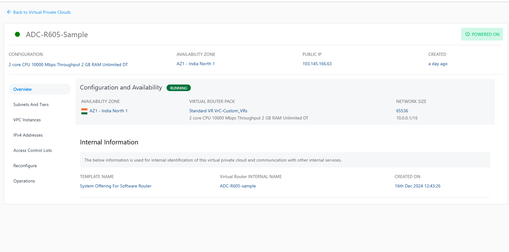
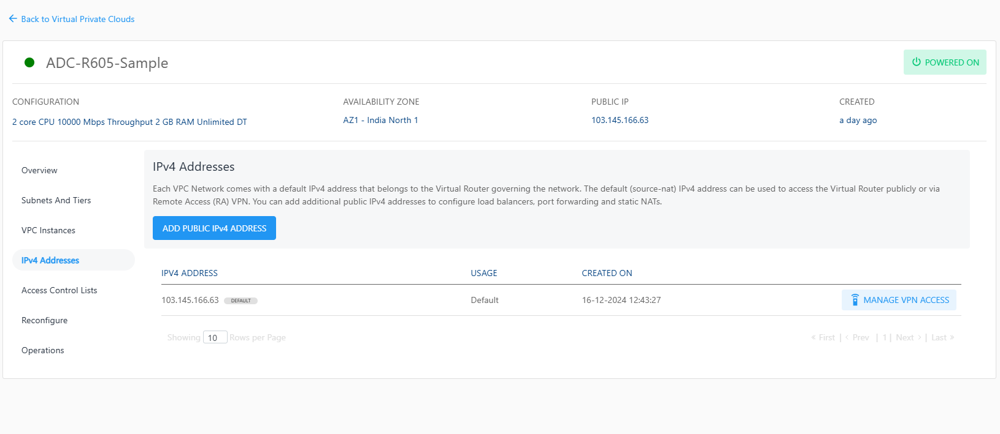
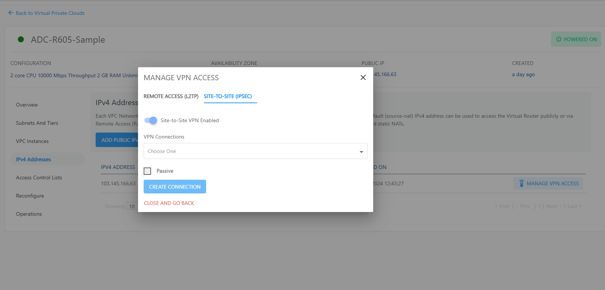

# Managing VPN Gateways and Site-to-Site VPN

## Creating a VPN Gateway

Site-to-site VPN gateways can be configured from the **Networking > VPN Gateways** section on the main navigation panel.

To create a VPN gateway, navigate to the **VPN Gateways** section and click the **Add Gateway** button. This opens up a dialog box with IPSec tunnel detail requirements.

:::note
	 You need to obtain the gateway details from your ISP’s control panel or the primary firewall console
 :::

## Using Site-to-Site VPN Connections with a VPC

To use a site-to-site VPN connection into your VPC, you’ll need to first define a VPN gateway by following the steps in the above section. Once the gateway has been configured, follow these steps:

1. Navigate to **Networking  > Virtual Private Clouds** from the main navigation panel and enter the VPC that you wish to connect using the VPN.
   
2. Navigate to **VPC** > **IPv4 ADDRESSES** section, Click the **Manage VPN access** then click the **Enable Site-to-Site(IPSEC) VPN** option.
   
   
3. Then select **VPN Connection** from the list of all the VPN connections i.e. the VPN gateway you want to connect to this VPC, click the **CREATE CONNECTION** button.

To test this configuration, you can ping any of the subnet IPs or the VR’s default IP from within your external private network.

