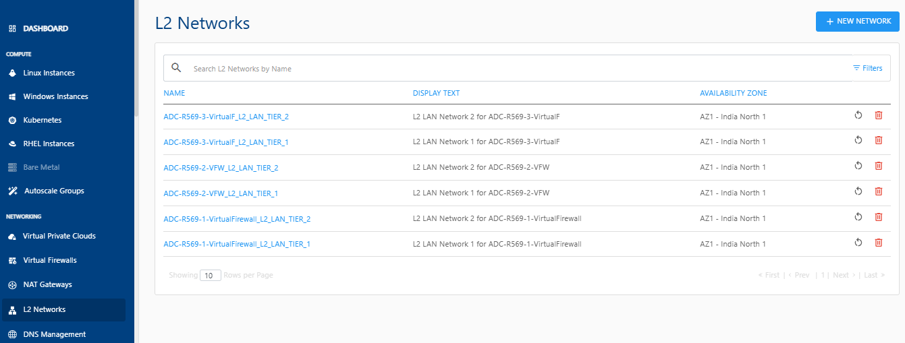
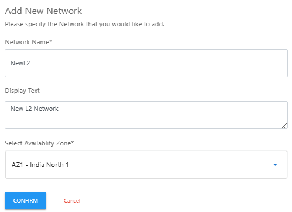

# About L2 Networks

L2 networks, often called data link layer networks, play a crucial role in computer networking by establishing direct connections between devices in a local network and ensuring data packets are delivered accurately to their intended destination.

To manage an L2 network, follow these steps:

1. Navigate to **Networking > L2 Networks**. The following screen appears where all the L2 networks are listed. You have the option restart or delete the L2 networks.
   
2. To add a new L2 network, click on a **New Network** button. The following screen appears:
   
3. Enter the following details and then click **Confirm**:
	- **Network Name**
	- **Display Text** (Optional)
	- **Select the Availability Zone** from the drop-down list.
   

