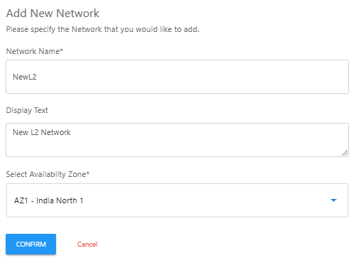

# Adding New L2 Network

To add a new L2 network, click on a **New Network** button. The following screen appears:
   
3. Enter the following details and then click **Confirm**:
	- **Network Name**
	- **Display Text** (Optional)
	- **Select the Availability Zone** from the drop-down list.
   

