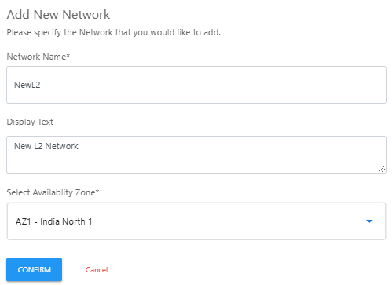

# Adding an L2 Network

To add an L2 network, click the **New Network** button. The following screen appears:

   
Enter the following details and then click **Confirm**:
	- **Network Name**
	- (Optional) **Display Text**
	- **Select the Availability Zone** from the drop-down list.
   

