# IPv4 Addresses
Each virtual gateway comes with a default IPv4 address that belongs to the Virtual Gateway governing the network. The default (source - NAT) IPv4 address can be used to access the Virtual Gateway publicly or via Remote Access (RA) VPN.
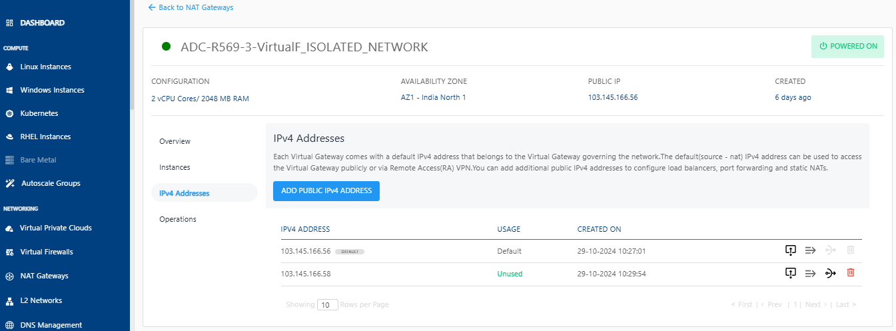

### Adding Public IPv4 Addresses
You can add additional public IPv4 addresses to configure firewall rules, port forwarding rules and source NATs.

1. Click the **Add Public IPv4 Address** button. The following screen appears:
   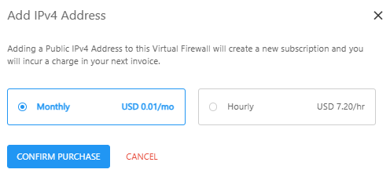
2. Select the **Monthly** or **Hourly** option and then click the **Confirm Purchase** button. The following screen appears.
   
	  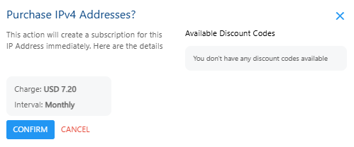
3. Verify the details and click the **Confirm** button to create complete adding a public IPv4 address.
### Managing Firewall Rules
1. Click the **Firewall Rules** icon.
   
2. Enter the details as shown to create a new firewall rule.
	1. Select Traffic Rule from the drop-down list.
	2. Enter the Source CIDR.
	3. Select the Protocol from the drop-down list.
	4. Enter the Start Port. 
	5. Enter the End Port.
	6. Click on **Add Rule**.
    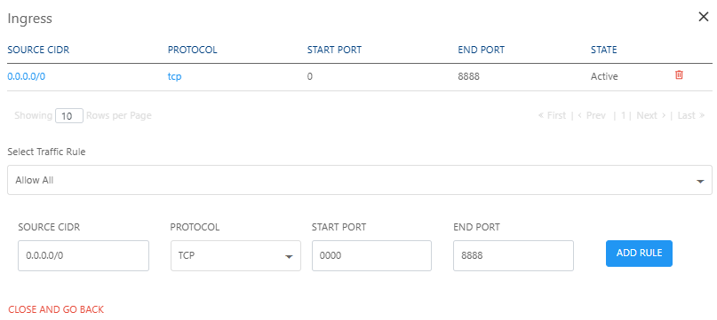

### Managing Port Forwarding Rules
1. Click the **Port Forwarding Rule** icon.
   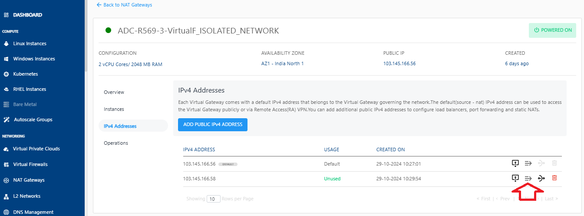
	The following screen appears where you can view the already created port forwarding rules.
	
2. To add a new rule, click on **Add Rule**.
   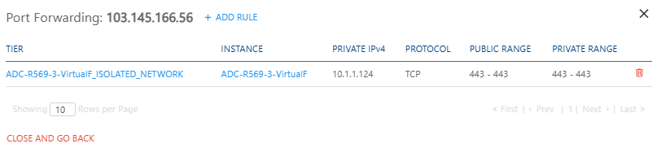

3. Enter the required details to add a rule.
   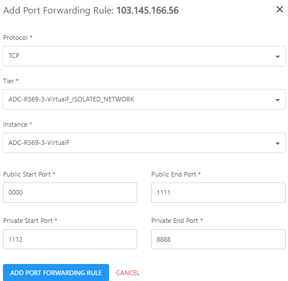

5. Click the **Add Port Forwarding Rule** button.
   

### Changing Source NAT IPv4 Address
1. Click the **Source NAT** icon.
   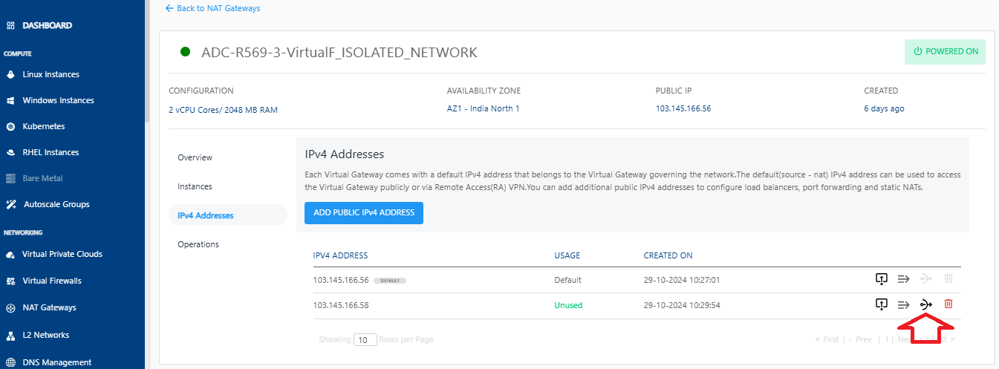

2. Click **OKAY**.  
   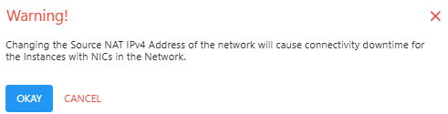
   
### Deleting IP Address
1. Click the **Delete IP** icon.
   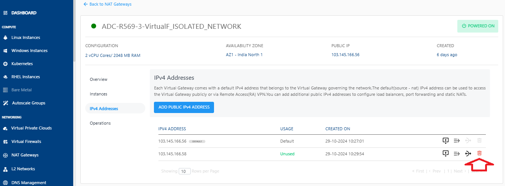
2. Select the **I confirm that I have remove everything from this IPv4 Address** option and click the **Delete Now** button.
   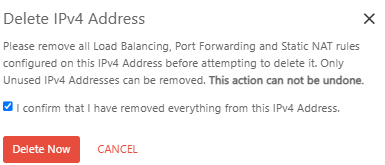
	:::warning
	This is an irreversible action.
	:::

