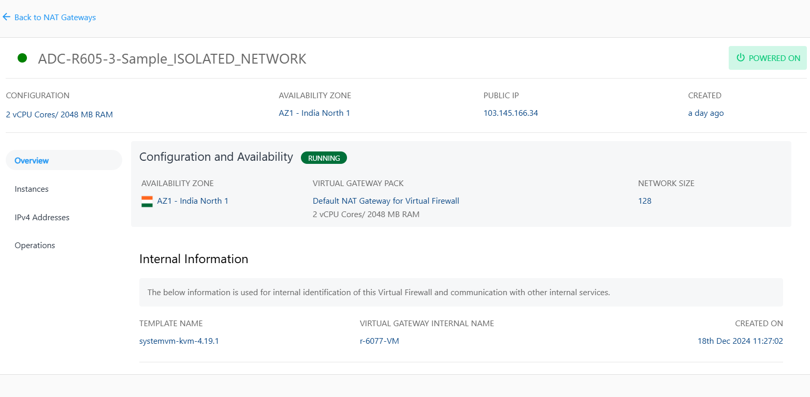
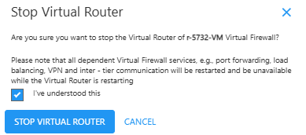

# Overview

Navigate to the **Overview** tab to view the following details:

- **Configuration and Availability**
	This section displays the instance's status, **RUNNING**, is displayed in **green**, whereas STOPPED is displayed in greyed out and the information about the networking zone.
- **Internal Information**
	This section displays the information used for internal identification of this instance and communication with other internal services.
	- Template Name
	- Virtual Gateway Internal Name
	- Created On
	

To power off the virtual router, click on the **Powered On** button. The Stop Virtual Router window appears that lets you stop the virtual router. To power on a virtual router, click the **Powered Off** button.
   
   
