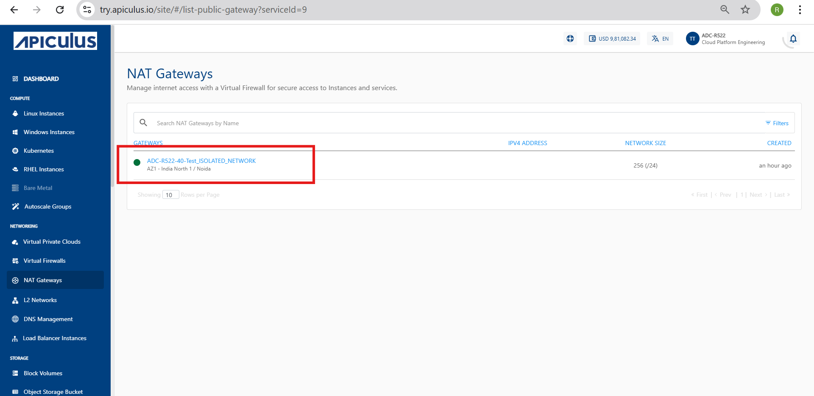
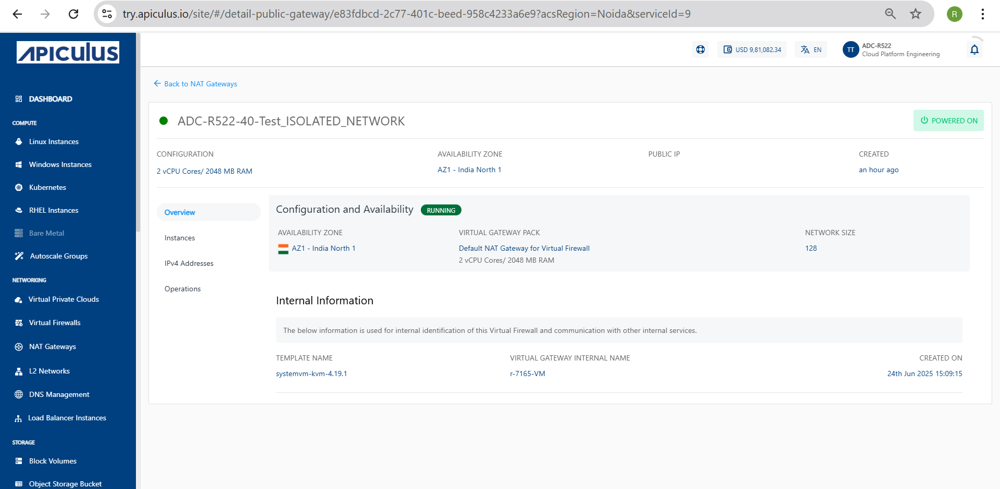
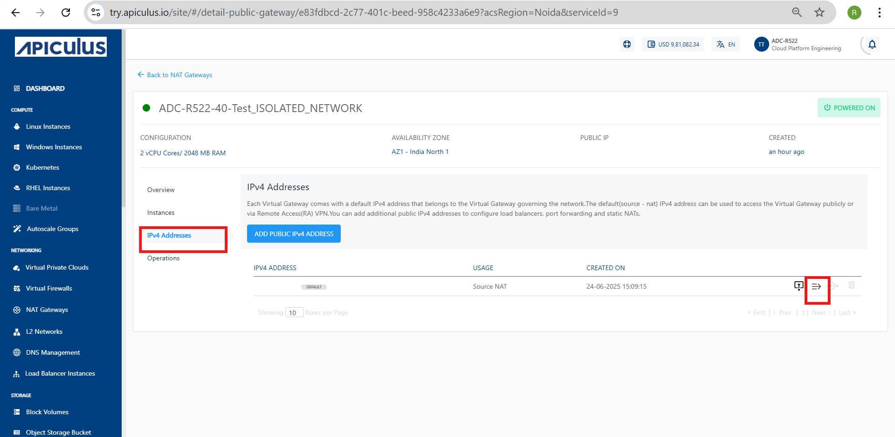
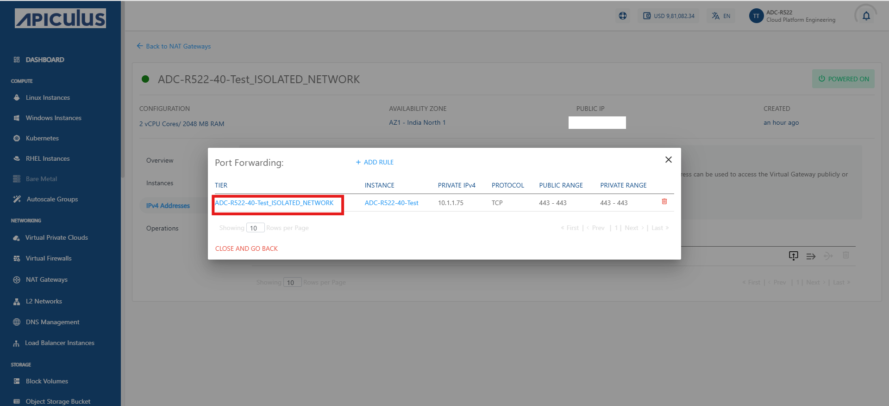
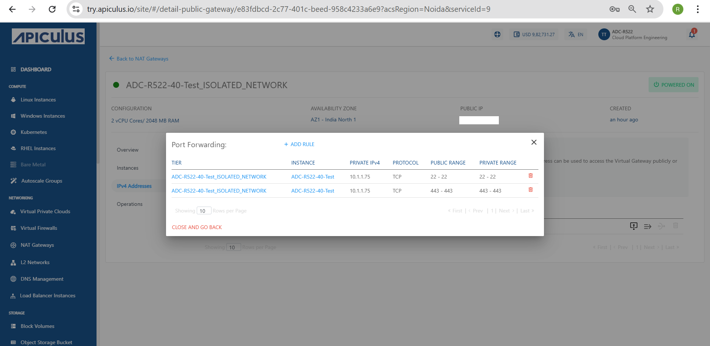
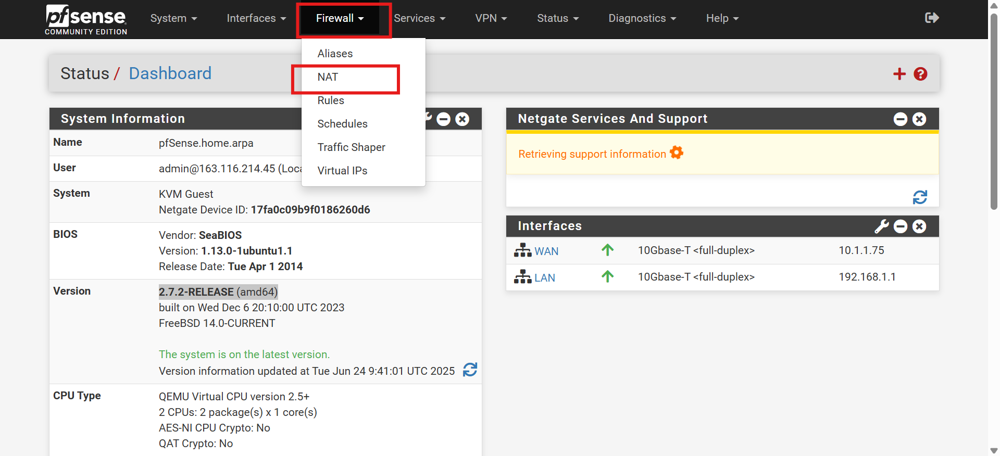
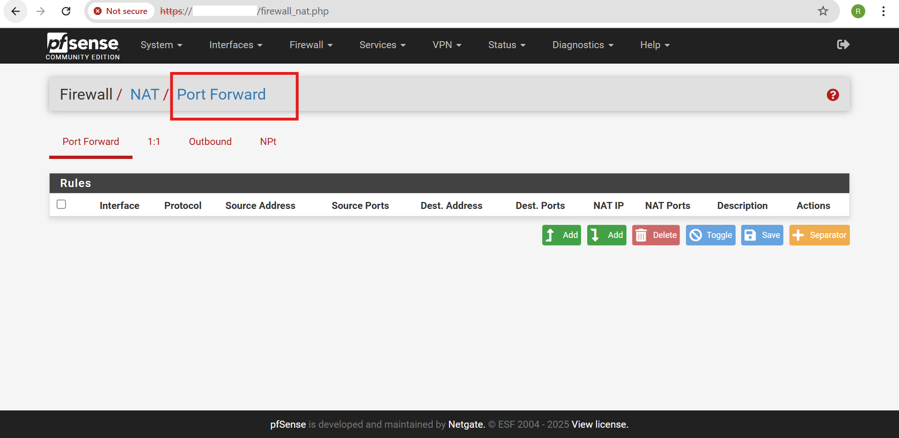
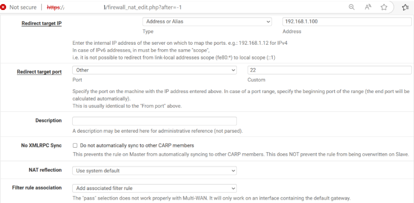
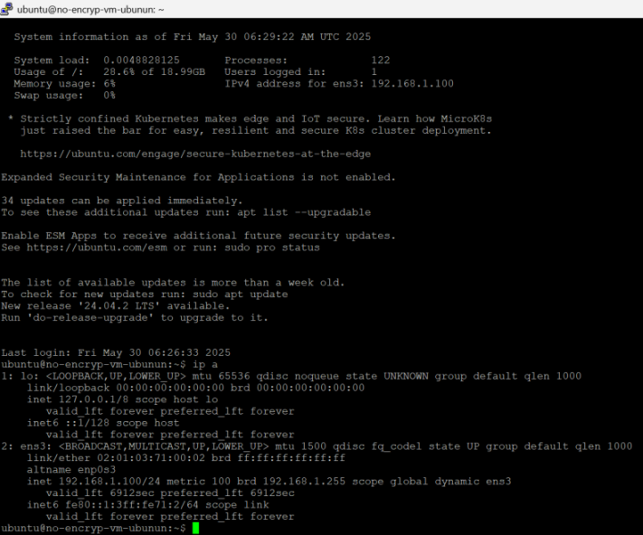

# Port Forwarding for VM via VNF

This section outlines the steps to configure port forwarding for a Virtual Machine (VM) using a Virtual Network Function (VNF) in a cloud environment. Port forwarding allows external clients to securely access services (for example SSH, HTTP) hosted on the VM by mapping ports from the VNF’s public IP to the VM’s private IP. This approach improves network segmentation and control by routing all incoming traffic through the VNF layer.

This section outlines all the steps required for configuring Port Forwarding for a VM via VNF. Here are the following steps:

1. [Accessing and Selecting a NAT Gateway](#accessing-and-selecting-a-nat-gateway)
2. [Reviewing Configuration](#reviewing-configuration)
3. [Accessing Port Forwarding Settings for NAT Gateway](#accessing-port-forwarding-settings-for-nat-gateway)
4. [Adding a New Port Forwarding Rule](#adding-a-new-port-forwarding-rule)
5. [Adding Details and Creating Port Forwarding Rule](#adding-details-and-creating-port-forwarding-rule)
6. [Verifying the Added Port Forwarding Rule](#verifying-the-added-port-forwarding-rule)
7. [Configuring NAT Settings In pfsense Firewall](#configuring-nat-settings-in-pfsense-firewall)
8. [Adding a New Port Forward Rule in pfsense Firewall](#adding-a-new-port-forward-rule-in-pfsense-firewall)
9. [Adding a Rule with Value](#adding-a-rule-with-value)
10. [Verifying SSH Access Using Public IP](#verifying-ssh-access-using-public-ip)
11. [Verifying VM Info and IP Configuration](#verifying-vm-info-and-ip-configuration)

## Accessing and Selecting a NAT Gateway

This section outlines the steps to access and select a NAT Gateway within the Apiculus Cloud platform. Before managing configuration or operational settings, users must navigate to the appropriate section of the dashboard and identify the NAT Gateway instance relevant to their network environment. This ensures that all subsequent actions are performed on the correct gateway associated with the intended Virtual Network Function (VNF). 

The following steps guide you through locating and selecting your NAT Gateway from the dashboard:

1. Navigate to the **Networking > NAT Gateways** section from the  Cloud dashboard.
2. Select the appropriate NAT Gateway (for example `ADC-R522-40-Test_ISOLATED_NETWORK`) associated with your VNF.

## Reviewing Configuration

This section offers a detailed review of the current NAT Gateway configuration within the  Cloud environment. It includes essential system specifications, deployment parameters, and operational status to ensure the gateway is correctly set up and functioning as expected. Verify these details before initiating any advanced networking configurations, such as port forwarding or scaling operations.

The following steps guide you through reviewing key configuration details, checking operational status, and accessing internal system information necessary for validation and troubleshooting within your cloud environment: 

1. NAT Gateway Configuration Overview: The following details summarize the key configuration parameters of the selected NAT Gateway.
   
    - **vCPU/RAM**: For example `2 vCPU Cores / 2048 MB RAM` (Indicates the computational resources allocated for the NAT Gateway)
    - **AVAILBILITY Zone**: For example `AZ1-India North 1` (The region or zone where the gateway is deployed)
    - **PUBLIC IP**: For example `103.145.166.60` (The public-facing IP through which outbound traffic is routed.)
  
2. Check Operational Status: The NAT Gateway is in a **RUNNING** state, indicating it is active and fully operational.
3. Confirm Network and Gateway Configuration: Review the virtual gateway pack and network size settings to ensure the correct configuration is applied before proceeding with port forwarding or deployment steps.
   
     - **Virtual Gateway Pack**: `Default NAT Gateway for Virtual Firewall`
     - **Network Size**: `128` (Specifies the subnet size associated with the gateway)
  
4. Access Internal Information for System Reference: The following internal configuration details are provided for system-level reference and tracking of the NAT Gateway within the  Cloud environment.
   
    - **TEMPLATE NAME**: `systemvm-kvm-4.19.1`(Base image used to launch this NAT Gateway)
    - **VIRTUAL GATEWAY INTERNAL NAME**: `r-7165-VM`(Used internally by  for VM/gateway tracking and routing.)
    - **CREATED ON**: `24th Jun 2025, 15:09:15`(Exact timestamp of NAT Gateway provisioning)

## Accessing Port Forwarding Settings for NAT Gateway

To enable external access to internal services hosted behind a NAT Gateway, you need to configure port forwarding rules. This section explains how to access the port forwarding settings for a NAT Gateway within the  Cloud environment. Port forwarding allows specific inbound traffic to reach designated internal resources by mapping external ports to internal IPs and ports.

The following steps outline the process to navigate to the NAT Gateway, locate the public IP address, and access the port forwarding configuration interface to add or manage rules effectively:

1. In the left-hand menu, click on **NAT Gateways** under the **Networking** section.
2. Select your NAT Gateway from the list (for example`ADC-R522-40-Test_ISOLATED_NETWORK`).
3. In the gateway page, click on the **IPv4 Addresses** tab.
4. Find your public IP address listed on this page.
5. Click the **Port Forwarding Rule** icon (next to the IP address) to start adding a port forwarding rule.

## Adding a New Port Forwarding Rule

To allow external access through a NAT Gateway in the  Cloud Portal, you can add a new port forwarding rule. This involves selecting the appropriate NAT Gateway and configuring the necessary forwarding details. 

The following steps guide you through logging into the Cloud Portal, navigating to the NAT Gateways section, selecting the relevant gateway, and initiating the process of creating a new port forwarding rule by accessing the Port Forwarding interface and reviewing any existing rules: 

1. Login to the  Cloud Portal.
2. From the left-hand side menu, under the **Networking** section, click on **NAT Gateways**.
3. Choose the NAT Gateway for which you want to configure the port forwarding rule (for example `ADC-R522-40-Test_ISOLATED_NETWORK`).
4. Once inside the selected NAT Gateway, see a section titled **Port Forwarding** along with the public IP address (for example `103.145.166.60`).
5. Click on the **+ ADD RULE** button located next to the Port Forwarding heading. This opens the interface to add a new port forwarding rule.
6. Review Existing Rules (Optional): Below the **+ ADD RULE** button, you may see a list of existing rules including details like:
    - **TIER** (for example `ADC-R522-40-Test_ISOLATED_NETWORK`)
    - **INSTANCE** (for example `ADC-R522-40-Test`)
    - **PRIVATE IPv4** (for example `10.1.1.75`)
    - **PROTOCOL** (for example `TCP`)
    - **PUBLIC RANGE** (for example  `443 - 443`)
    - **PRIVATE RANGE** (for example `443 - 443`)

## Adding Details and Creating Port Forwarding Rule

Once you click on **+ ADD RULE**, a new form opens where you need to enter the required information. These details define how incoming traffic on the public IP is routed to your internal instance. 

The following steps guide you through completing the port forwarding rule form by selecting the appropriate protocol, tier, and instance, and by specifying the public and private port ranges required to establish the forwarding rule:

1. After clicking on **+ ADD RULE** a new form titled **Add Port Forwarding Rule** appears.
2. Fill in all the required fields marked with a red asterisk (*):
	- **Protocol**:  Select the desired protocol from the dropdown (for example `TCP` or `UDP`).
	- **Tier**:  Choose the appropriate tier from the list that maps to your network environment.
	- **Instance**:  Select the instance (virtual machine) that receives the forwarded traffic.
	- **Public Start Port**:  Enter the starting port number from the public IP address range.
	- **Public End Port**:  Enter the ending port number from the public IP address range.
	- **Private Start Port**: Enter the starting port on the internal (private) IP to which traffic must be forwarded.
	- **Private End Port**: Enter the ending port on the private IP.
      
:::note
If you want to forward only one port, enter the same value for start and end ports.
:::
  
:::note
Same rule as above applies if forwarding a single port.
:::
   
3. Click on **ADD PORT FORWARDING RULE** to save and apply the new rule.
4. Click **CANCEL** if you do not wish to proceed or want to discard the current inputs.
   
## Verifying the Added Port Forwarding Rule

After creating the port forwarding rule, it is important to verify that it has been added correctly. This ensures that traffic is properly forwarded to the intended internal instance. Review the rule details listed under the **Port Forwarding** section to confirm everything matches your configuration.

The following steps guide you through locating the newly added rule in the **Port Forwarding** section, reviewing its associated tier, instance, IP addresses, and port ranges, and confirming that all values align with the configuration you specified during rule creation:

1. Once the rule is added, it appears in the list under the **Port Forwarding** section for the selected public IP.
2. Review the displayed rule details, which include:
    - **Tier** name (for example `ADC-R522-40-Test_ISOLATED_NETWORK`)
    - **Instance** name (for example  `ADC-R522-40-Test`)
    - **Private IPv4 address** (for example  `10.1.1.75`)
    - **Protocol** (for example TCP)
    - **Public Range** (for example `22 - 22` or `443 - 443`)
    - **Private Range** (for example `22 - 22` or `443 - 443`)
3. Ensure the information is accurate and matches the values you entered during rule creation. 
 
## Configuring NAT Settings In pfsense Firewall

To fully enable port forwarding, you must set up the necessary NAT (Network Address Translation) rules in the pfsense firewall. This step ensures that incoming traffic on specific ports is correctly directed to your internal server. 

The Following steps to access and configure the NAT settings:

1. Log in to the **pfSense Firewall** using the IP address shown in the browser (for example  `http://103.145.166.60`).
2. From the top menu bar, click on the **Firewall** .
3. In the dropdown menu under **Firewall**, select **NAT** (as shown highlighted in the image).
4. This takes you to the NAT settings page, where you can configure the required port forwarding rules for pfsense.

## Adding a New Port Forward Rule in pfsense Firewall

To enable traffic redirection to an internal server, you need to create a new Port Forward rule in the pfsense firewall. This rule helps map incoming traffic on a specific port to the desired internal IP and port within your network. 

The following steps to add the rule and configure the necessary settings, including interface selection, protocol type, port range, and internal destination details, to ensure accurate traffic forwarding through the pfsense firewall:
 
1. Ensure you're in the **Port Forward** tab under the **Firewall > NAT** section.
2. Click on the green **Add** button (with the upward arrow icon) on the right side of the page to create a new port forwarding rule.
3. This opens the configuration form where you can define the interface, protocol, source and destination addresses, ports, and the internal (NAT) IP to forward the traffic to.   
   
## Adding a Rule with Value

To define specific port forwarding behavior, you can manually add a rule with precise values that match your network and access requirements. This allows you to control how incoming traffic on selected ports is redirected to internal resources within your environment.

The following steps guide you through completing each required field with the appropriate values—such as interface, protocol, destination port, and target IP—to ensure accurate and secure forwarding of incoming traffic to the intended internal server:
   
1. Click on the **Add** button to create a new port forwarding rule.
2. Fill in the Rule Details as per requirement:
    - **Interface**: Select `WAN`.
    - **Address Family**: Choose `IPv4`.
    - **Protocol**: Select `TCP`.
    - **Destination**: Choose `WAN address`.
3. **Destination port range**:
    - From Port: `22`
    - To Port: `22`
4. **Redirect target IP**:
    - Enter the internal IP address of the server (for example `192.168.1.100`)
5. **Redirect target Port**:
    - Enter the port number: `22`
6. **Description**(Optional):
    - Add a short note for reference.
7. **NAT reflection**:
    - Leave as `Use system default`.
8. **Filter rule association**:
    - Choose `Add associated filter rule`.
9. Click on **Save** and then apply the changes to activate the rule.

## Verifying SSH Access Using Public IP

Once the port forwarding rule has been successfully created in pfsense, the next step is to verify that external SSH access to the internal virtual machine (VM) is functioning as expected. This involves using an SSH client, such as PuTTY, to connect to the VM via the firewall’s public IP address and the forwarded port. If the configuration is correct, the connection is established and the VM’s shell access becomes available remotely.

The following steps guide you through initiating an SSH session using the public IP to confirm that the port forwarding rule is working correctly and external connectivity to the internal VM is operational:

1. Open **PuTTY** or any **SSH** client on your local machine.
2. Enter the **Public IP** of the pfsense WAN interface (for example `103.145.166.60`) and **port 22** in **PuTTY**.
3. On the first connection attempt, a security alert window pops up showing the host key is not cached.
4. Click **Accept** to store the key and proceed with the connection.

## Verifying VM Info and IP Configuration

This section helps you check the basic details of your virtual machine. After logging in, you can view the system status and find the IP address to make sure the VM is running and connected to the network.

The following steps guide you through logging into the VM terminal, reviewing system and network information, identifying the correct network interface and IP address, and checking for any available software or OS updates:
   
1. Log in to the VM terminal.
2. Check system status (CPU, memory, processes, IP) – shown on login.
3. Note the IP address (for example `192.168.1.100` on interface `ens3`).
4. Check for updates:
    - Run: `sudo apt update`
5. See upgradeable packages:
    - Run: `apt list --upgradable`
6. Check for OS upgrade:
    - New version `24.04.2 LTS` is available.
7. Run IP command:
    - Command: `ip a`
8. Confirm network interface IPs:
    - `lo` = `127.0.0.1`
    - `ens3` = `192.168.1.100` (IPv4), `fe80::...` (IPv6)  
