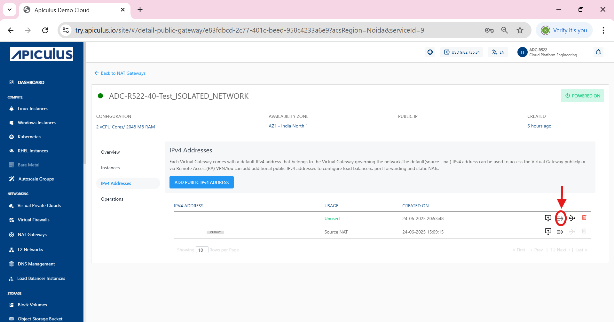
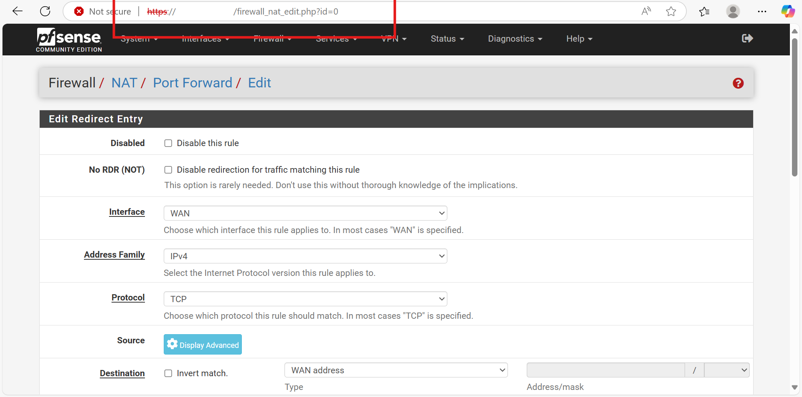
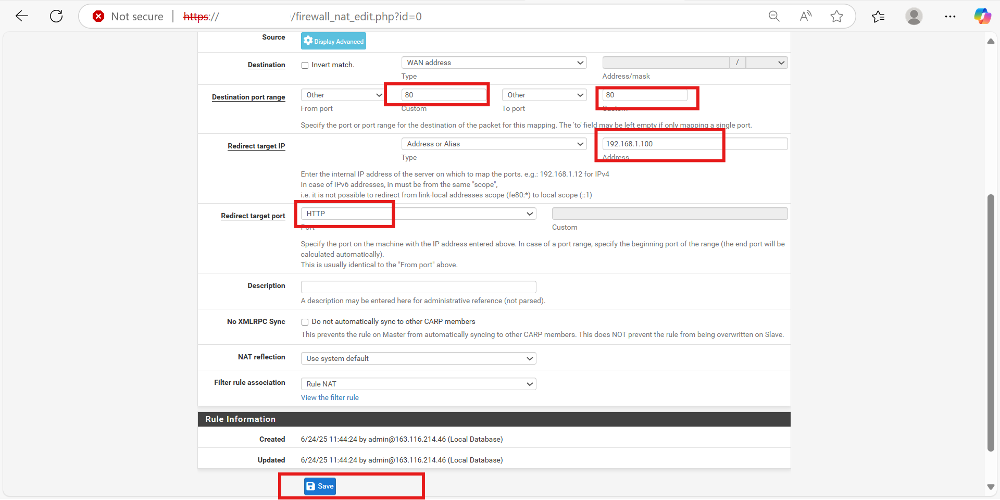

# Port Forwarding with Public IP

In Apiculus Cloud, an additional Public IP enables you to expose internal services hosted on virtual machines (VMs) to the internet by creating dedicated port forwarding rules. This approach is especially useful when multiple external IPs are needed for services such as SSH, HTTP, or custom applications. By assigning specific public IPs to particular services or VMs, you can achieve greater control, flexibility, and network segmentation.

This section outlines all the steps required for configuring Port Forwarding with Public IP. Here are the following steps:

1. [Adding Public IPv4 Address](#adding-public-ipv4-address)
2. [Adding a Port Forwarding Rule](#adding-a-port-forwarding-rule)
3. [Requiring Values in the Rule](#requiring-values-in-the-rule)
4. [Configuring Port Forwarding in pfsense](#configuring-port-forwarding-in-pfsense)
5. [Verifying the Functionality](#verifying-the-functionality)
6. [ Web and SSH Port Forwarding in pfsense](#web-and-ssh-port-forwarding-in-pfsense)
7. [WAN Rule at pfsense](#wan-rule-at-pfsense)
## Adding Public IPv4 Address

To enable external connectivity for your services through a NAT Gateway, you need to allocate a public IPv4 address. This address serves as the entry point for inbound traffic and is essential for setting up port forwarding or other external access configurations.

The following steps walk you through the process of navigating to your NAT Gateway, generating a new public IPv4 address, and verifying its successful addition and availability within the Apiculus Cloud environment:

1. Navigate to the **NAT Gateways** section from the left-hand menu.
2. Select the desired gateway (e.g., `ADC-R522-40-Test_ISOLATED_NETWORK`).
3. Click on the **IPv4 Addresses** tab from the left options.
4. Click the **ADD PUBLIC IPv4 ADDRESS** button.
5. A new public IP is generated and listed under the IPv4 ADDRESS section.
6. A confirmation message **IPv4 Address purchase successful** appears at the top.
7. The newly added IP (e.g., `103.145.166.60`) shows the status as **Unused**.

## Adding a Port Forwarding Rule

Once a public IPv4 address has been successfully added to your NAT Gateway, the next step is to configure port forwarding. This enables external access to internal services by mapping incoming traffic on specific ports to designated internal IP addresses within your network.

The following steps guide you through locating the unused public IP, accessing the port forwarding interface, and initiating the configuration of a new port forwarding rule using the Apiculus Cloud Portal:

1. Navigate to IPv4 Addresses: In the left-hand menu under **Networking**, click on **IPv4 Addresses**.
2. Identify the Newly Acquired Public IP: Look for the public IP address that is marked as **Unused** under the **USAGE** column.
3. Click on the Port Forwarding Icon: 
    - In the row corresponding to the **Unused** public IP (e.g., `103.145.166.4`), locate and click on the **port forwarding icon**.
    - The icon is next to other icons like the delete (trash bin) and details (eye) icon, as shown in  the red box in the screenshot.
4. Proceed to Configure the Rule: After clicking the icon, follow the prompted interface to define your port forwarding rule (not shown in the screenshot but typically involves specifying internal and external ports, protocol, and target IP).

## Requiring Values in the Rule

After accessing the port forwarding configuration interface, the next step is to specify the necessary rule parameters. These values determine how external traffic is routed through the public IP to the intended internal instance. Properly selecting these values ensures accurate traffic delivery and secure access.

The following steps outline how to define protocol type, select the appropriate network tier and instance, and configure both public and private port mappings to complete the rule setup:

1. Now select the required values in the rule as shown: Choose the appropriate protocol from the dropdown (for example `TCP`).    
2. Select the network tier (associated network) where the instance resides (for example `ADC-R522-40-Test_ISOLATED_NETWORK`).
3. Choose the specific instance to which you want to forward traffic (for example `ADC-R522-40-Test`).
4. **Public Start Port and End Port**:
    - Enter the port number(s) for incoming traffic on the public IP.
    - For example `80` for both start and end if using a single port.  
5. **Private Start Port and End Port**:
    - Enter the corresponding internal port(s) on the instance to forward traffic to.
    - For example `80` for both start and end.
6. Click the **ADD PORT FORWARDING RULE** button to save and apply the rule.  

## Configuring Port Forwarding in pfsense

To enable external access to internal services through specific ports, you need to configure port forwarding rules within the pfsense firewall. This setup maps incoming traffic on a designated public port to a private IP address and port within your internal network, ensuring controlled and secure connectivity.

The following steps guide you through logging in to the pfsense interface, navigating to the NAT configuration section, and defining the required parameters to create an effective port forwarding rule:

1. Login to pfsense:
     - Open a browser and navigate to `https://<pfSense-IP>` (for example `https://103.145.166.60`).
     - Login with the appropriate credentials.
2. Navigate to NAT Configuration:
     - Navigate to **Firewall** > **NAT**.
     - Click on the **Port Forward** tab.
3. Click the Add button (typically + icon) to create a new port forward rule.
4. Configure the Rule Parameters - Fill out the form with the following values:
      - **Address Family**: `IPv4`
      - **Protocol**: `TCP`
      - **Destination**: `WAN address`
5. Destination Port Range:
      - From: `80`
      - To: `80`
6. Redirect Target IP: `192.168.1.100` _(internal server IP)_
      - **Redirect Target Port**: `80`
7. Advanced Settings (Optional but Recommended):
      - **NAT Reflection**: `Use system default`
      - **Filter Rule Association**: `Add associated filter rule`
8. Click the **Save** button.

## Verifying the Functionality

After configuring port forwarding, it is essential to confirm that external traffic is correctly reaching your internal server. This validation ensures the rule is functioning as intended and that services hosted on the internal machine are accessible via the public IP.

The following steps demonstrate how to verify the port forwarding setup by accessing the public IP through a web browser and confirming that the expected web page (such as the Apache2 default page) is displayed:

1. Open a Web Browser- Launch any web browser on your local system.
2. Type the newly assigned public IP (e.g., `103.145.166.60`) into the browser’s address bar.
3. Check for **Apache2 Default Page**.
    - If the port forwarding is correctly set up, see the **Apache2 Default Page** with a message saying **“It works!”**
    - This confirms that the request to the public IP is successfully reaching the internal web server hosted on the target machine.
  
## Web and SSH Port Forwarding in pfsense

To expose both the web and SSH services running on the internal server, we configured two separate port forwarding rules in pfsense. The following section summarizes the key parameters of each rule and how they map external traffic on ports 80 and 22 to the private IP 192.168.1.100. 

The following steps guide you through configuring both HTTP and SSH port forwarding rules in pfsense to ensure external traffic is correctly routed to the internal server:

1. Open the pfSense NAT Port Forward settings by navigating to **Firewall > NAT > Port Forward** in the pfSense web interface.
2. Add First Port Forwarding Rule (HTTP):
    - **Interface**: Select `WAN`.
    - **Protocol**: Select `TCP`.
    - **Source Address**: Choose `WAN address`.
    - **Source Port**: Enter `80` (HTTP).
    - **Destination Address (NAT IP)**: Enter `192.168.1.100`.
    - **NAT Port (Destination Port)**: Enter `80`.
    - **Description**: Add a meaningful label such as `HTTP access`.
3. Add Second Port Forwarding Rule (SSH):
     - **Interface**: Select `WAN`.
     - **Protocol**: Select `TCP`.
     - **Source Address**: Choose `WAN address`.
     - **Source Port**: Enter `22` (SSH).
     - **Destination Address (NAT IP)**: Enter `192.168.1.100`.
     - **NAT Port (Destination Port)**: Enter `22`.
     - **Description**: Add a meaningful label such as `SSH access`.
4. Save and Apply the Rules:
     - After adding both rules, click **Save**. 
     - Then click **Apply Changes** to activate the rules in pfsense.
5. Port Forwarding Rules:
     - Port **80** traffic to the internal server for web (HTTP) access.
     - Port **22** traffic to the internal server for SSH access.

## WAN Rule at pfsense

When port forwarding rules are added in pfsense, corresponding firewall rules on the WAN interface are automatically created to allow external traffic through the specified ports. These rules are essential for enabling access from the internet to internal services like SSH and HTTP.

The following steps help you verify and manage these auto-generated WAN rules to ensure proper traffic flow and security control:

1. Navigate to **Firewall** > **Rules** > **WAN** tab in the pfsense interface.
2. Review Automatically Created NAT Rules.
3. Two rules are created (based on the earlier port forwarding setup):

   Rule 1: SSH Access
    - **Protocol**: IPv4 TCP
    - **Destination Port**: 22 (SSH)
    - **Destination IP**: 192.168.1.100
    - **Description**: NAT
    - **Purpose**: Allows external SSH access to the internal server.
   Rule 2: HTTP Access
    - **Protocol**: IPv4 TCP
    - **Destination Port**: 80 (HTTP)
    - **Destination IP**: 192.168.1.100
    - **Description**: NAT
    - **Purpose**: Allows external HTTP (web) access to the internal server.
4. Confirm Rule Status:
    - Ensure both rules are **enabled** (indicated by the green check icon).
    - You can also edit or delete them from the **Actions** column if needed.  
