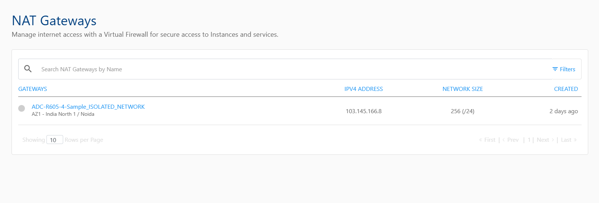
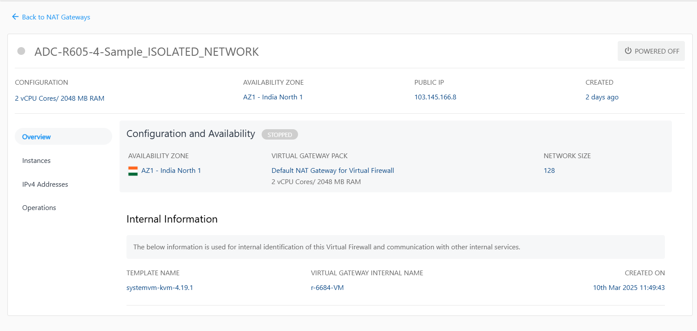

# Viewing NAT Gateways Details

To manage a NAT gateway, follow these steps:

1. Navigate to **Networking > NAT Gateways**.
   
2. Click gateway from the list. The following screen appears:
   
- **Configuration and Availability:** This displays the NAT Gateways configuration details to help verify its current configuration and operational state.
    - The instance's status **Running** or **Stopped**.
    - Availability Zone
    - Virtual Gateway Pack
    - Network Size
- **Internal Information:** This section displays the information used for internal identification of the NAT Gateway and communication with other internal services.
    - Template Name
    - Virtual Gateway Internal Name
    - Created On
