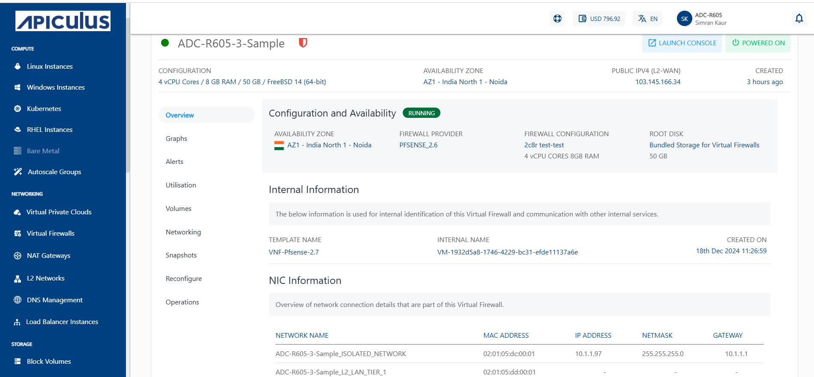

# Accessing the VFI Control Panel

The Virtual Firewall Service is delivered as an integration using OS images pre-loaded with pfSense or FortiGate VM.

Click the **Launch Console** button to proceed with accessing the Virtual Firewall Control Panel.
