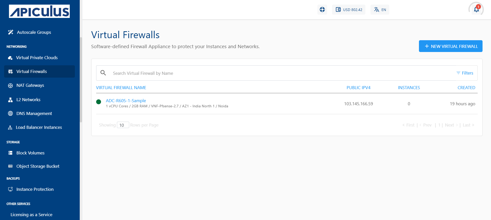
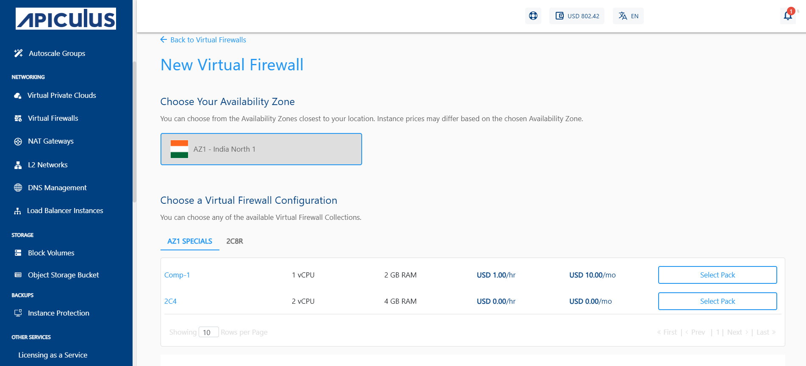
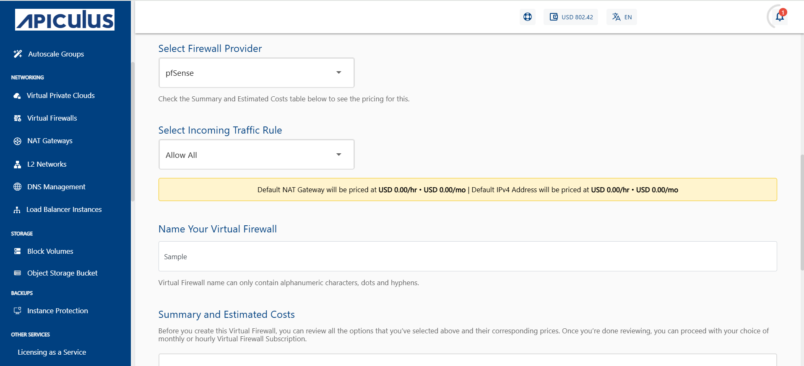
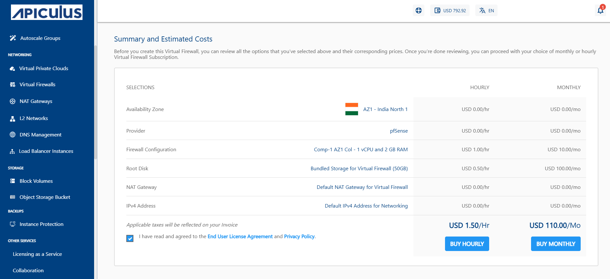
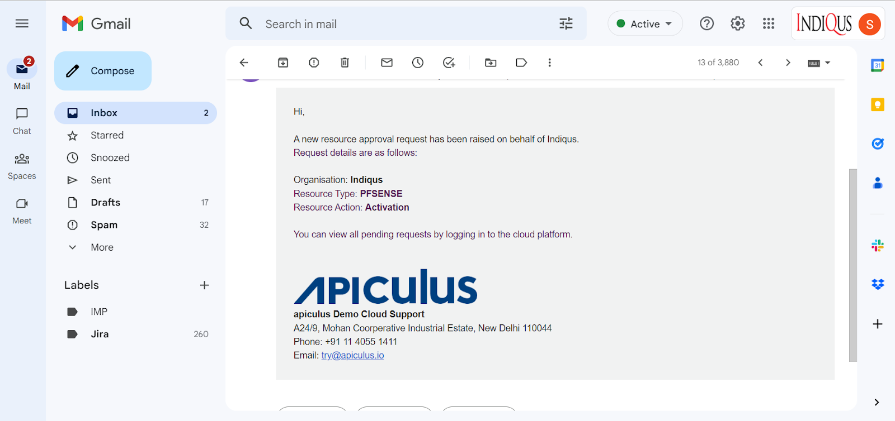
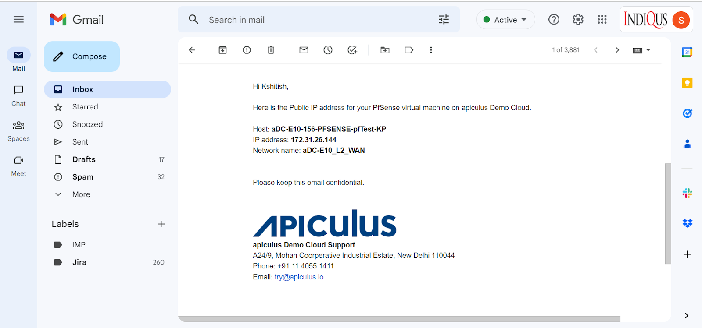

# Creating a Virtual Firewall

 To create a Virtual Firewall, follow these steps:
 
 1. In the main menu, navigate to the **Networking > Virtual Firewalls** tab. 
 2. To activate the service, click the **NEW VIRTUAL FIREWALL** button.
	:::note
	 Apiculus currently only supports one Virtual Firewall per Availability Zone.
	 :::
	
3. Select your Availability Zone.
4. Select the Virtual Firewall provider from the dropdown menu. 
	
5. Choose the compute pack from the list.
6. Select the Incoming Traffic Rule (Allow All, Deny All, Allow Custom) and give a name to your Virtual Firewall.
	:::note
		**Allow All-** Grants access to all protocols and services without restriction when selected.
		**Deny All-**  Restrict access to all protocols and services when selected.
		**Allow Custom-** Enable the user to specify the Source from which traffic should be allowed.
	:::
	
7. Review the summary and estimated costs for both **Hourly** and **Monthly** options.
   
8.  Choose **Buy Hourly** or **Buy Monthly** based on your requirement, and then click **Confirm** on the confirmation popover.

The Virtual Firewall service can be configured for provisioning in a self-service or an approval-based manner.

## Managing Virtual Firewall Provisioning Requests

If **approval-based provisioning** is enable for the VFI Service, the following process follows:
1. **Request Submission**
	-  A provisioning request is automatically raised to the cloud administrator.
	- The requester will be notified via email once the request is approved or rejected.
	  
2. **Request Status**
	-  Upon approval or activation, the Virtual Firewall appliance becomes visible in the **Virtual Firewalls list**.
	  
3. **Accessing the Request**
	- The request is available under the **Requests** section in the **Support & Operations** menu on the Apiculus Admin Console.
4. **Admin Actions**
	- The administrator can:
	    - Review the request
	    - Approve or reject the request
	    - Enter any custom price overrides
	    - Click **OK** to finalize the action
	- The **end user** and the **admin** will receive an email notification regarding the request status.
	  
5. **End User Notification**
	- If the request is approved, the end user will receive an additional email with- **Subscription details, Service access information.**
	  

