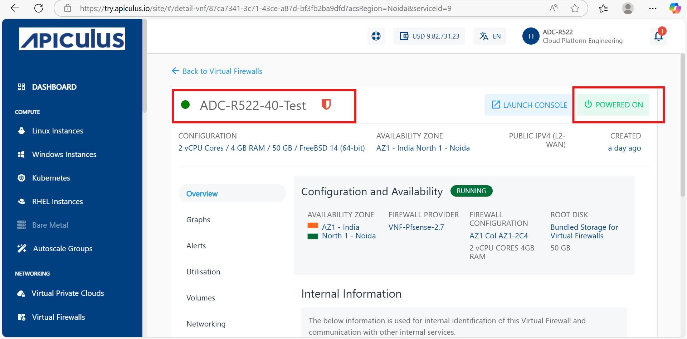
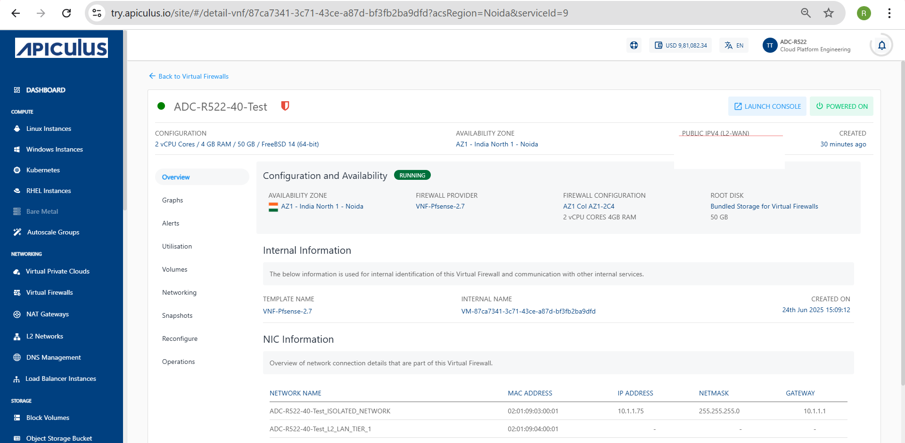
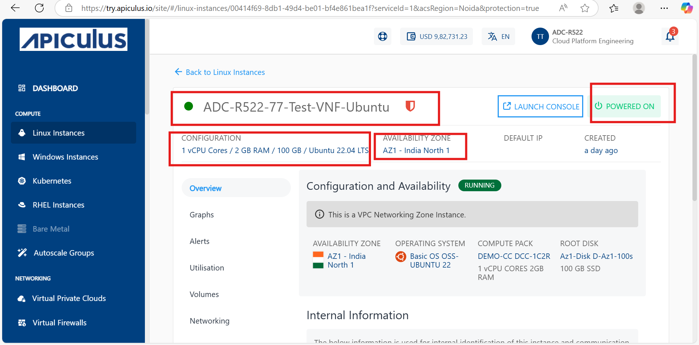

# Deploying VNF and VM Within VNF

This section provides a step-by-step guide for deploying a Virtual Network Function (VNF)—specifically a virtual firewall—and provisioning a Virtual Machine (VM) behind it using the Apiculus Cloud platform. This setup allows users to route VM traffic through the VNF, enabling secure and segmented network environments. 

It is ideal for use cases requiring:
- Advanced traffic control
- Isolation
- Policy enforcement
  
The following are the high level steps required for deploying VNF and VM within VNF:
  
1. [Creating The New Virtual Firewall](#creating-the-new-virtual-firewall)
2. [Configuration Options For Virtual Firewall](#configuration-options-for-virtual-firewall)
3. [Deploying Virtual Firewall](#deploying-virtual-firewall)
4. [Viewing Firewall Details](#viewing-firewall-details)
5. [Viewing LAN and WAN Tiers](#viewing-lan-and-wan-tiers)
6. [Accessing Pfsense Firewall GUI](#accessing-pfsense-firewall-gui)
7. [Deploying A Linux VM Under Pfsense Firewall](#deploying-a-linux-vm-under-pfsense-firewall)
8. [Creating a New Linux Instance](#creating-a-new-linux-instance)
9. [Choosing A Root Disk](#choosing-a-root-disk)
10. [Authentication Method](#authentication-method)
11. [Confirming Instance Purchase](#confirming-instance-purchase)
12. [Checking VM Console And Internet Connectivity](#checking-vm-console-and-internet-connectivity)
  
## Creating the New Virtual Firewall

To enhance your network security within the Apiculus cloud platform, you can deploy a virtual firewall that manages and filters traffic between your virtual resources. This firewall acts as a protective layer, enforcing rules and access controls based on your configuration.

The following steps guide you through the process of navigating to the correct section, initiating the firewall creation, and completing its configuration:

1. In the left-hand menu, go to **Virtual Firewalls** under the **Networking** section.
2. On the Virtual Firewalls page, click the **NEW VIRTUAL FIREWALL** button.
3. Follow the prompts to configure and create the virtual firewall.

### Configuration Options for Virtual Firewall

To configure the new virtual firewall in the Apiculus cloud platform, you must define a few key options such as the zone, compute size, firewall provider, and access rules. These settings ensure the firewall is tailored to your deployment needs.

The following steps guide you through selecting configuration options like availability zone, compute configuration, firewall provider, and traffic rules before finalizing the setup:

1. **Choose Availability Zone**: Select your preferred availability zone (for example, **AZ1- India North 1**) based on your location and network needs.
2. **Choose Compute Configuration**: Pick a compute option that matches your performance requirements.
3. **Select Firewall Provider**: Choose a firewall provider from the dropdown (for example, **pfsense Plan**)    
4. **Set Incoming Traffic Rule**: Select the desired ACL rule, such as **Allow All**, from the dropdown menu.
5. **Name Your Virtual Firewall**: Enter a name for your virtual firewall. Use only letters, numbers, hyphens, or dots.
6. **Review Estimated Costs**: Check the summary and pricing before proceeding.

### Deploying Virtual Firewall

After completing the configuration and deployment steps, the newly created virtual firewall appears in the Virtual Firewalls section. This interface provides a summary of key details such as the firewall's name, compute configuration, provider, zone, public IP address, instance count, and deployment status.

The following steps guide you through accessing the Virtual Firewalls section and verifying that your newly deployed firewall is active and correctly configured:

1. Navigate to the **Virtual Firewalls** section from the left-hand menu. 
2. See a list of deployed virtual firewalls. 
3. The newly created firewall (for example, ADC-R522-40-Test) appears with:
    - Name
    - vCPU and RAM details
    - Firewall provider
    - Availability zone
    - Public IPv4 address
    - Creation time 
A green **POWERED ON** icon confirms that the firewall is active and running.

### Viewing Firewall Details

To check the configuration and operational status of your deployed virtual firewall, you can access its detailed view in the Apiculus cloud platform. This section provides essential system specifications, network settings, and real-time status indicators.

The following steps guide you through viewing the full details of your virtual firewall instance, including public IP, provider, and availability zone:

1. From the Apiculus cloud platform:
    - Navigate to the **Virtual Firewalls** section in the left-hand menu.
    - Locate and click on the **ADC-R522-40-Test** firewall instance to open its configuration page.
2. On the firewall **Overview** page, you can view the following key details:
    - **Configuration**: vCPU, RAM, and OS details.
    - **Availability Zone**: For example AZ1-India North 1-Noida.
    - **Firewall Provider**: For example VNF-Pfsense-2.7.
    - **Public IPv4 (L2-WAN)**: Note down the public IP which is used for SSH access.
    - **Status**: Ensure the firewall is in **Running** state.

### Viewing LAN and WAN Tiers

To understand the network configuration, navigate to the **Networking** section where you can view both **LAN** and **WAN** tiers. This helps identify how instances are connected and how traffic flows between internal and external networks.

The following steps guide you through accessing the Networking section and identifying the WAN and LAN tiers connected to your firewall:

1. Open the Firewall Instance: From the Apiculus cloud platform, navigate to the **Virtual Firewalls** section and open the required firewall instance (for example, ADC-R522-40-Test).
2. Click on the **Networking** option: In the left-side menu, under the opened firewall instance, click on the **Networking** tab. This section displays all networks linked to the selected firewall.
3. Identify the **WAN Tier**: Look for the network labeled as ISOLATED_NETWORK. This is the WAN Tier (for example, ADC-R522-40-Test), typically connected to external/public networks.
4. Identify the **LAN Tiers**: LAN tiers used for internal communications. For example:
    - ADC-R522-40-Test_L2_LAN_TIER_1
    - ADC-R522-40-Test_L2_LAN_TIER_2
 
### Accessing pfsense Firewall GUI

To manage and configure the pfsense firewall, you can access its web-based Graphical User Interface (GUI). This interface allows you to perform tasks such as monitoring network traffic, updating firewall rules, and managing network settings. You can access the GUI securely using the public IP address assigned to the firewall. 

The following steps help you access the pfsense firewall GUI from your browser using the public IP address:

1. **Copy the Public IP Address**: From the firewall details page in Apiculus cloud platform, note down the Public IPv4 (L2-WAN) address.
2. **Open a Web Browser**
3. Paste the IP address in the address bar and press **Enter**.
4. **Ignore the Security Warning**: If a warning appears, it is because of a self-signed certificate. Just click **Advanced** and then **Proceed** to continue.
5. **Accept the License**: A blue screen with license information appears. Click the **Accept** button.

### Deploying a Linux VM under pfsense Firewall

To deploy a Linux virtual machine (VM) behind the pfsense firewall in Apiculus Cloud, begin by navigating through the dashboard and accessing the compute section. This allows you to view existing Linux instances or initiate the creation of the new under the desired network configuration.

The following steps guide you through deploying the new Linux VM under the pfsense firewall:

1. From the Apiculus cloud platform, navigate to the left sidebar.
2. Under the Compute section, click on Linux Instances.
3. Choose Availability Zone: Select a zone for example, AZ1- India North 1 (or as per your requirement).
4. Select Compute Configuration: Choose a VM configuration.
5. Click **Select** to confirm the compute pack.
6. Name Your Linux Instance: Provide a name (Test-VNF-Ubuntu)
7. After filling in all details, proceed with the deployment.

## Creating a New Linux Instance

To create a new Linux instance in Apiculus cloud platform, you must to configure parameters such as the zone, network, and operating system image. These options help ensure the VM is deployed in the correct environment and connected to the appropriate virtual network and firewall.

The following steps guide you through the process of creating a new Linux instance based on your setup requirements:

1. Select the Availability Zone nearest to your location, for example, AZ1 - India North 1.
2. **Select Network Destination**: Pick a VPC network with a subnet or a VNF Appliance that has already been created in the chosen availability zone.
    - **VPC:** ADC-R522-40-Test
    - **VNF:** ACP-E244-1-Gaurav-Test_L2_LAN_TIER_1
3. Choose an OS image, (for example, Ubuntu Server 22.04), or use a custom one if needed; note that some images may be chargeable.

### Choosing a Root Disk
   
When deploying a Linux VM in Apiculus cloud platform, selecting the right root disk is a key step in defining your VM’s storage capacity and performance. The root disk serves as the primary storage where the operating system and essential files are installed. You can choose from predefined disk packs or specify a custom size based on your needs.
   
The following steps guide you through choosing a root disk option that best fits your storage needs and budget:
   
1. Navigate to the **Root Disk** selection section: The following are the three available disk options under the SSD tab:
    - **Freesize**: Custom size (default 25 GB)
    - **RD 50**: 50 GB
    - **RD 100**: 100 GB (Selected)
2. Click on **Select Pack** for your desired option. For Example:
     - **RD 100** (100 GB) is selected.

### Authentication Method

To ensure secure access to your Linux instance, selecting the right authentication method is crucial. The following options are available: 

- SSH key pair for enhanced security (recommended)
- Root user password (Less secure but may be necessary for certain setups).  
   
The following steps guide you through the configuration and final review before launching your instance:
   
1. **Choose an Authentication Method**:
    - **Use SSH key pair (Recommended)**
    - **Use root user password** (Root passwords are less secure than SSH-based access). 
     
:::note
If you choose root user password method, ensure that **Also email me the password** is checked to receive the root password via email for initial access.
::
  
2. **Name Your Linux Instance**:
    - For example, **Test-VNF-Ubuntu** (Instance name can only contain alphanumeric characters, underscores, dots, and hyphens).
3. **Summary and Estimated Costs**:
    - Before creating this Linux instance, you can review all the selected options and their corresponding prices. Once you are done reviewing, you can proceed with your choice. 
4. **SELECTIONS**:
    - Availability Zone: **AZ1- India North 1**
    - HOURLY: **USD 200.00/Hr**
    - MONTHLY: **USD 400.00/Mo**

### Confirming Instance Purchase 

Once you finalized all the configuration details for your Linux VM in Apiculus cloud platform, the platform prompts you to confirm the instance purchase. This is your final opportunity to review costs and apply any available discount codes before deployment.
   
The following steps guide you through the confirmation process:
   
1. After reviewing the instance details, a confirmation pop-up appears.
2. The window displays the **Hourly** charge: for example, USD 200.40.
3. Click the **CONFIRM** button to proceed with the instance purchase.

### Checking VM Console and Internet Connectivity

After deploying a Linux VM under the pfsense firewall in Apiculus cloud platform, it is important to verify that the instance is running correctly and has internet access. This ensures successful configuration and network functionality.
 
 The following steps help you check the VM console and test internet connectivity:

1. Open the VM console from the cloud portal.
2. Log in to the VM and set a new password if asked.
3. Run `ip a` to check the VM's IP address.
4. Run `ping 1.1.1.1` to test internet connectivity.
5. If you get a reply with 0% packet loss, the internet is working.
6. Once the VM is deployed, access its console and check the internet connectivity by running network diagnostic commands.

 
