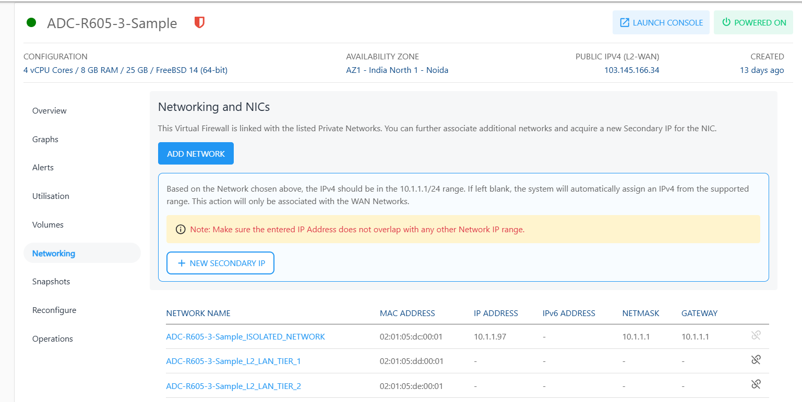

# Networking Management

To view the networks Instance, navigate to the **Virtual Firewall** > **Networking** tab.
The following screen appears:

The Networking and NICs section lists all the networks that a Linux Instance is attached to.

The following actions are available:

- If the Instance is inside a VPC, you can associate the Instance to multiple tiers within the VPC or share the Instance with other VPC networks in the same Availability Zone by using the **ADD NETWORK** option.
- Network/tier associations can be removed from this section by using the **unlink** action.

:::note
You can configure advanced networking settings using the Virtual Private Clouds service.
:::

