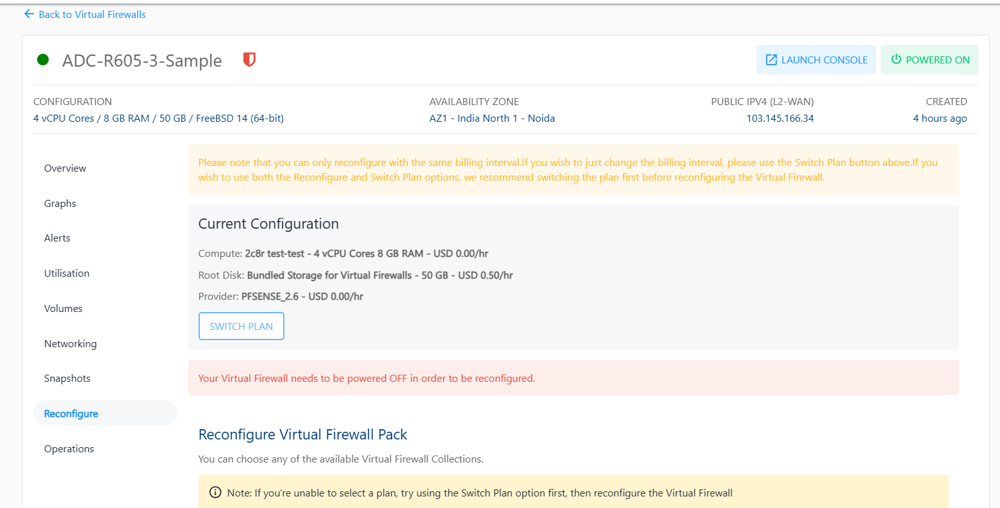
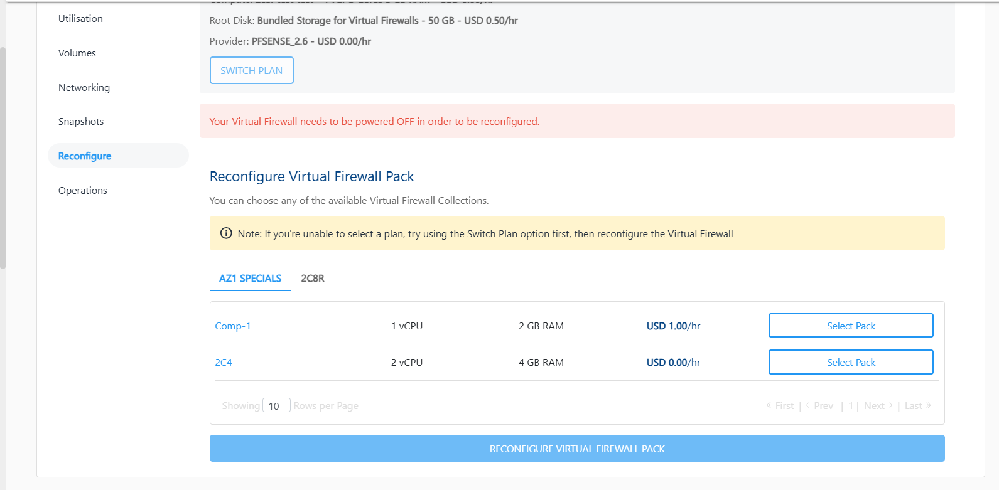

# Reconfiguring Virtual Firewall

To view available reconfiguration options, navigate to the **Networking** section and select a **Virtual Firewall** and access the **Reconfigure** tab.

:::note
Your Virtual Firewall needs to be powered OFF in order to be reconfigured.
:::
The Virtual Firewall on Apiculus can be reconfigured in the following ways:

- The Billing interval changed between monthly and hourly.
- Choosing and applying a new Compute pack.
- Choosing and applying a new Root Disk pack.

:::note
You can only reconfigure with the same billing interval. If you wish to change the billing interval, please use the Switch Plan button. We suggest switching the plan first before reconfiguring the instance if you intend to use both the Reconfigure and Switch Plan options. Charges apply based on the reconfigured pack, not the older pack.
:::

