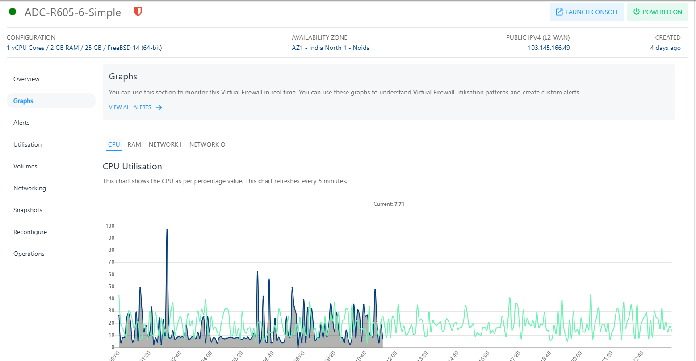
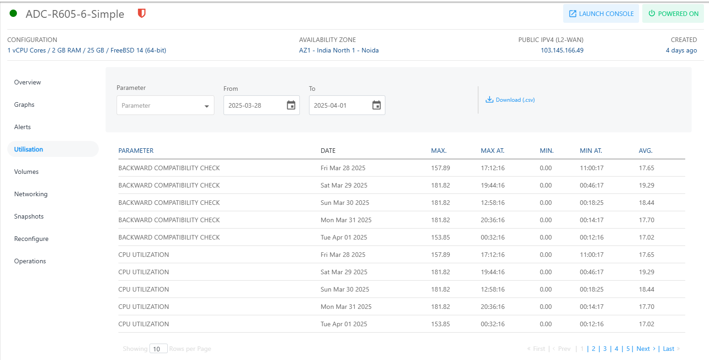

# Viewing Graphs and Utilization

To view the available graphs and monitor the instance in real-time, navigate to the Virtual Firewall and access the **Graphs** tab.

You can use these graphs to understand Instance utilisation patterns and create custom alerts.

The following graphs are available on a 24-hour time-scale graph with a 30-day trend line for the following parameters:

- CPU Utilisation
- RAM Utilisation
- Network Input
- Network Output

## Utilisation (Historical)[​](http://localhost:3000/docs/Subscribers/Compute/LinuxInstances/ViewingGraphsandUtilizationofLinuxInstances#utilisation-historical "Direct link to Utilisation (Historical)")

To view historical usage across supported parameters, navigate to the [Networking](AboutFirewallInstances.md), select a and access the **Utilisation** tab.

The Utillisation table shows a historical date-wise details of daily maximum, minimum, and average readings for all parameters. The utilisation report is downloadable as a .csv file.

