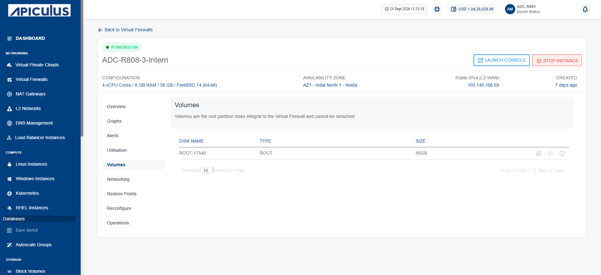
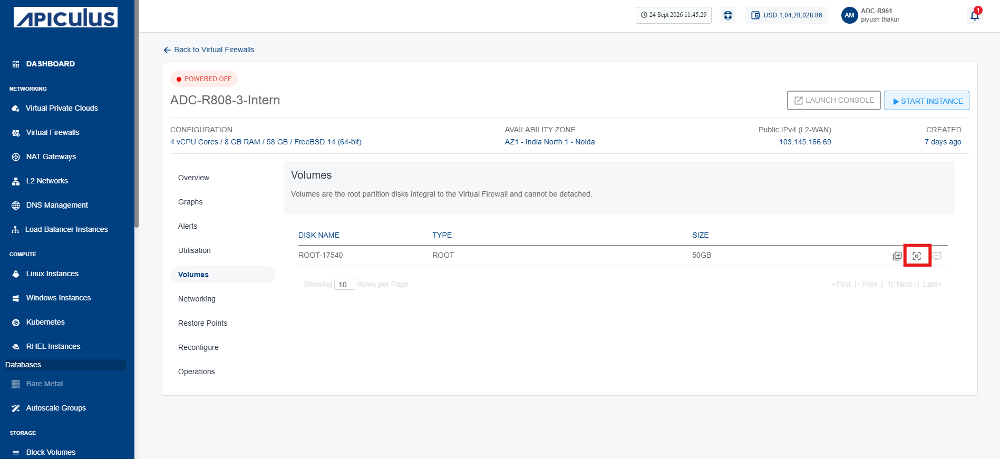
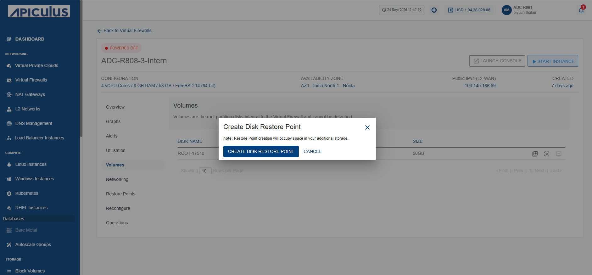
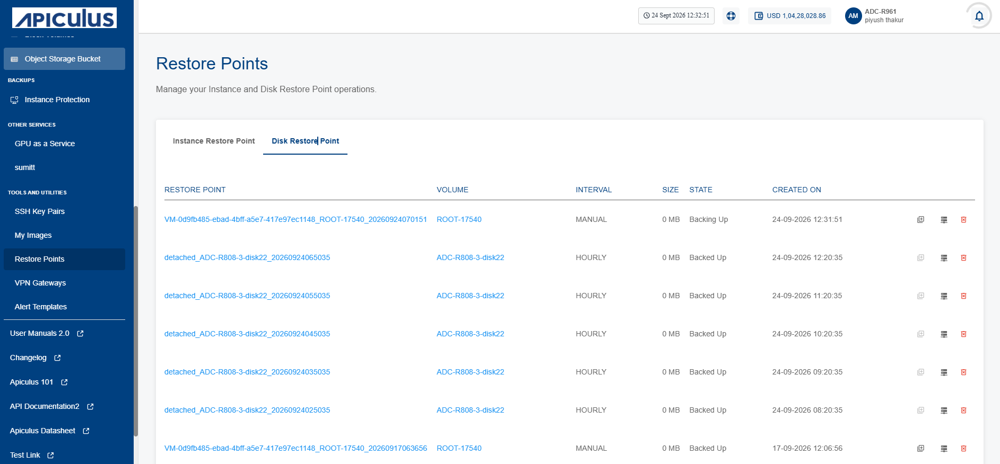
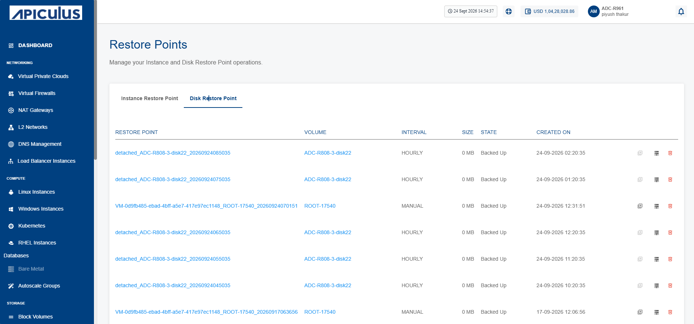

# Managing Volume
Manage volumes to monitor and protect the storage resources attached to your instances. Volume management allows you to view attached disks, create disk restore points to safeguard data before changes, and create custom images for rapid instance deployment and recovery. These operations help ensure data protection, simplify backup and restoration, and maintain consistent storage configurations across your cloud environment.

This section comprises of the following sub-sections:
- [Viewing Attached Disk](#viewing-attached-disk)
- [Creating Disk Restore Point](#creating-disk-restore-point)
- [Viewing Disk Restore Point](#viewing-disk-restore-point)
- [Creating Volume from Disk Restore Point](#creating-volume-from-restore-point)
- [Deleting Disk Restore Point](#deleting-disk-restore-point)
## Viewing Attached Disk

View the disks attached to an instance to verify the storage resources associated with it. This helps you identify the attached disks, review their details, and confirm that the required storage volumes are correctly connected, enabling efficient storage management and troubleshooting.

To view the disks attached to an Instance, follow these steps:

1. Navigate to **Networking > Virtual Firewalls**. The following screen appears:
	
2. Click on your created virtual firewall name from the list.
3. Click **Volumes**. The following screen appears that shows the associated disks:
	
## Creating Disk Restore Point

Create a disk restore point to capture the current state of a disk before performing updates, configuration changes, or other modifications. A disk restore point preserves the disk data at a specific point in time, allowing you to restore the disk to that state if needed. This helps protect against accidental data loss, simplifies recovery from unexpected issues, and ensures business continuity with minimal downtime.

:::note

Restore Point creation will occupy space in your additional storage.
:::

To create the disk restore point, follow these steps:

1. Navigate to **Networking > Virtual Firewalls**. The following screen appears:
	
2.  Click on your created virtual firewall name from the list.
3. Click **Volumes**. The following screen appears:
	
4. Click the **Create Restore Point** icon (highlighted in red). The following screen appears:
	
5. Click the **Create Disk Restore Point** button. The disk restore point is created.
## Viewing Disk Restore Point

View disk restore points to monitor the available recovery snapshots created for a disk. Reviewing restore points helps you verify backup availability, identify restore points based on their creation time, and select the appropriate recovery point when restoring a disk. This ensures you can quickly recover disk data to a known good state whenever required.

To view the disk restore point, follow these steps:

1. Navigate to **Tools and Utilities > Restore Points** >**Disk Restore Point**. The following screen appears:
	
## Creating Volume from Disk Restore Point

Create a volume to provision additional block storage for your cloud resources. Volumes provide persistent storage that can be attached to instances to expand storage capacity, host application data, or separate data from the operating system. Creating dedicated volumes improves storage flexibility, simplifies data management, and allows independent backup, restore, and lifecycle management without affecting the associated instance.

To create volume from disk restore point, follow these steps:

1. Navigate to **Networking > Virtual Firewalls**. The following screen appears:
	
2. Click **Volumes**. The following screen appears:
	
3. Click the **Create Restore Point** icon (highlighted in red). The following screen appears:
	
4. Click the **Create Disk Restore Point** button.
5. Navigate to **Tools and Utilities > Restore Points** >**Disk Restore Point**. The following screen appears:
	
6. Click the create volume icon (highlighted in red) to initiate the process of volume creation.
## Deleting Disk Restore Point

Delete a disk restore point when it is no longer required to free up storage resources and simplify restore point management. Removing outdated or unnecessary restore points helps maintain an organized backup environment while ensuring that only relevant recovery points are retained.

:::warning

This action can not be reversed.
:::

To delete disk restore point, follow these steps:

1. Navigate to **Networking > Virtual Firewalls**. The following screen appears:
	
2. Click on your created virtual firewall name from the list.
3. Click **Volumes**. The following screen appears:
	
4. Click the **Create Restore Point** icon (highlighted in red). The following screen appears:
	
5. Click the **Create Disk Restore Point** button.
6.  Navigate to **Tools and Utilities > Restore Points** >**Disk Restore Point**. The following screen appears:
	
7. Click the **Delete Disk Restore Point** button (highlighted in red). The following screen appears:
	
8. Click the **Yes** button. The disk restore point is deleted.