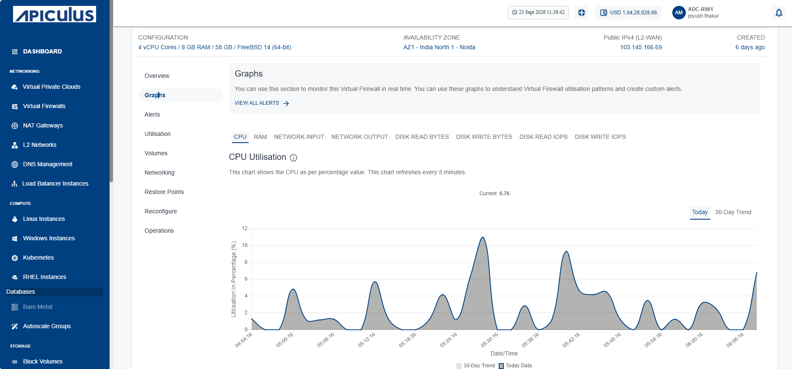
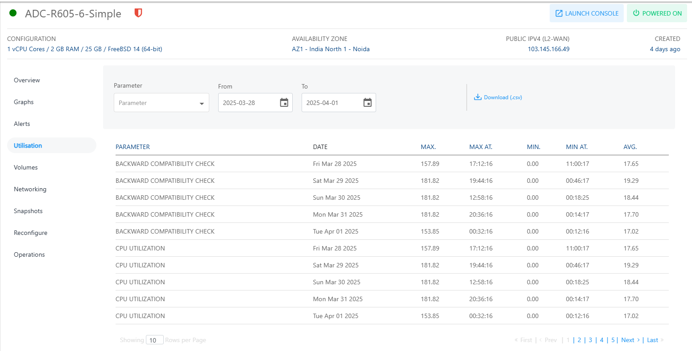

# Viewing Graphs 
Graphs display key performance metrics of your Virtual Firewall instance. You can view CPU, RAM, network traffic, and disk activity on a 24‑hour time scale with a 30‑day trend line. Graphs help you track utilization patterns and configure custom alerts to manage performance effectively.

To view the available graphs and monitor the instance in real-time, follow these steps:

1. Navigate to **Networking > Virtual Firewalls**. The following screen appears:
	
2. Click on your created virtual firewall name from the list.
3. Click **Graphs**. The following screen appears:
	
## Utilisation (Historical)[​](http://localhost:3000/docs/Subscribers/Compute/LinuxInstances/ViewingGraphsandUtilizationofLinuxInstances#utilisation-historical "Direct link to Utilisation (Historical)")

To view historical usage across supported parameters, navigate to the [Networking](AboutFirewallInstances.md), select the **Virtual Firewall** and access the **Utilisation** tab.

The Utillisation table shows a historical date-wise details of daily maximum, minimum, and average readings for all parameters. The utilisation report is downloadable as a .csv file.

