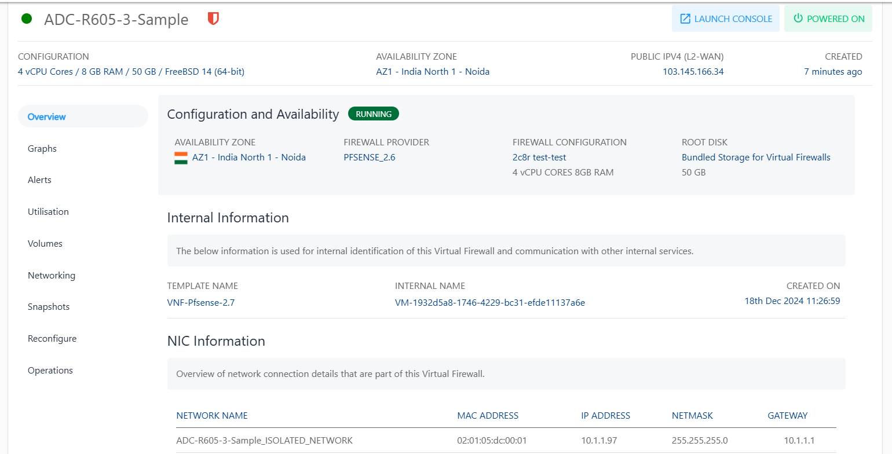

# Viewing VFI Network Details

As the VFI and the VFI-based network are created, Cloud Console users can view the enabled Virtual Firewall in the Networking > Virtual Firewall section. The following details will be displayed in this section:
- Name of the Virtual Firewall
- Public IPv4
- Number of instances associated with each Virtual Firewall
- Created

To view a list of section and the various operations or actions you can perform by going inside the particular section, click on the instance name. Below the Instance name, there is an informational view where you can find the following details:

- Configuration
- Availability Zone
- Public IPV4 (L2 WAN)
- Created 

On the top right corner, two quick options are available, one to **LAUNCH CONSOLE** and the other to **POWER OFF/ON** the Instance.

Details on available Linux Instance operations and actions can be found in their respective sections.

- Overview
- Graphs & Utilisation
- Alerts
- Volumes
- Networking
- Snapshots
- Reconfigure
- Operations