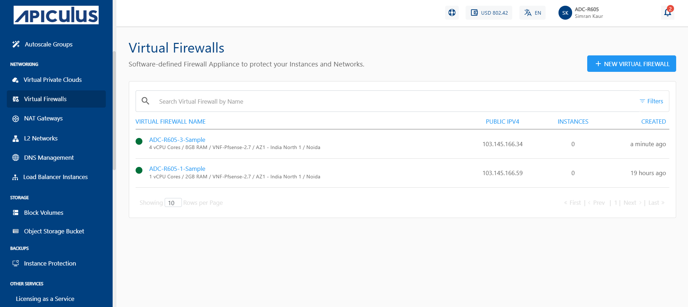
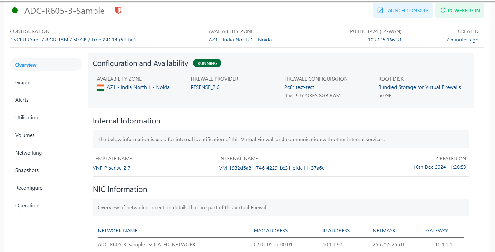
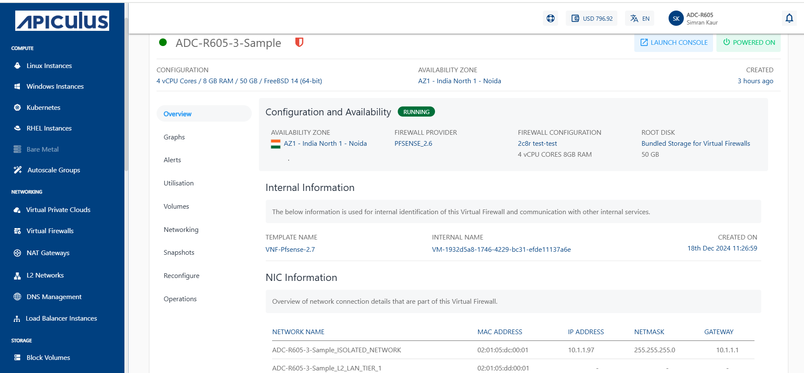

# Viewing Virtual Firewall 

As the virtual firewalls are created, Cloud Console users can view the enabled Virtual Firewalls in the **Networking > Virtual Firewalls** section. The following details are shown:

1. Names of the Virtual Firewalls
2. Public IPv4
3. Number of Instances associated with each Virtual Firewall
4. Creation Date

To view a list of sections and the various operations or actions you can perform by going inside the particular section, click on the instance name. Below the Instance name, there is an informational view where you can find the following details:

- Configuration
- Availability Zone
- Public IPV4 (L2 WAN)
- Created 

On the top right corner, two quick options are available, one to **LAUNCH CONSOLE** and the other to **POWER OFF/ON** the Instance.

Details about Virtual Firewall operations and actions can be found in their respective sections:

- [Viewing Graphs and Utilisation](docs/Subscribers/Networking/VirtualFirewall/FirewallInstances/ViewingGraphsandUtilization.md)
- [Configuring Alerts](docs/Subscribers/Networking/VirtualFirewall/FirewallInstances/ConfiguringAlerts.md)
- [Volume Management](docs/Subscribers/Networking/VirtualFirewall/FirewallInstances/VolumeManagement.md)
- [Networking Management](docs/Subscribers/Networking/VirtualFirewall/FirewallInstances/NetworkingManagement.md)
- [Snapshots](docs/Subscribers/Networking/VirtualFirewall/FirewallInstances/Snapshots.md)
- [Reconfiguring Virtual Firewall](ReconfiguringVirtualFirewall.md)
- [Operations](docs/Subscribers/Networking/VirtualFirewall/FirewallInstances/Operations.md)

To view the details associated with a virtual firewall instances, follow these steps:
-  [Configuration and Availability](#configuration-and-availability)
- [Internal Information](#internal-information)
- [Security and Access Control](#security-and-access-control)

---

## Configuration and Availability

This section displays the instance's status, **RUNNING**, is displayed in  **green**, whereas STOPPED is displayed in greyed out and the information about the networking zone.
## Internal Information

This section displays the information used for internal identification of this instance and communication with other internal services.

- Template Name
- Internal Name
- Created On
## Security and Access Control

This section displays the following information:

- Network Name
- MAC Address
- IP Address
- Netmask
- Gateway

