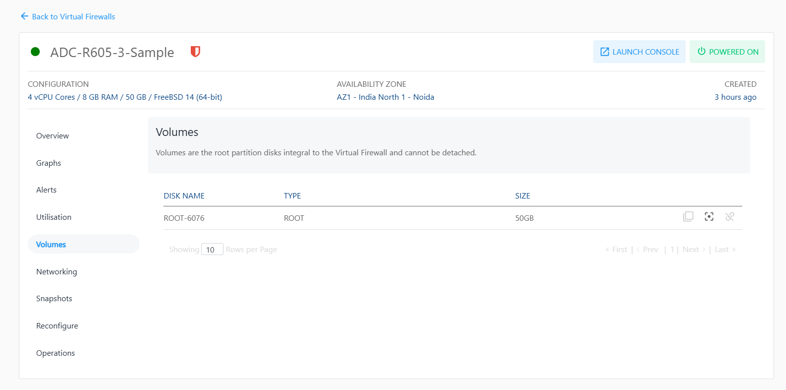

# Volume Management with Virtual Firewall

To view the disks attached to this Instance, navigate to the Networking, select a Virtual Firewall and access the **Volumes** tab.

Virtual Firewall on Apiculus work with the [Block Volumes Service](/docs/Subscribers/Storage/BlockVolumes/AboutBlockVolumes) and let you carry out basic disk operations.

The following are the quick actions:

- **Create Template** - Click on it, and enter the image name and description.
- **Create Snapshot** - Clicking on this will create a Volume snapshot.
- **Detach/attach** - This will attach/detach the volume to/from the instance.

:::note
Volume-level operations are available as part of the Block Volumes service.
:::
