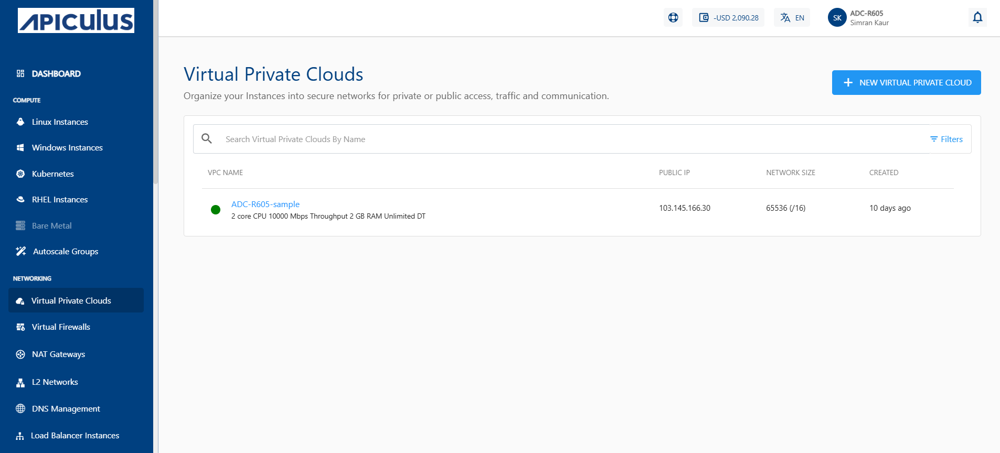
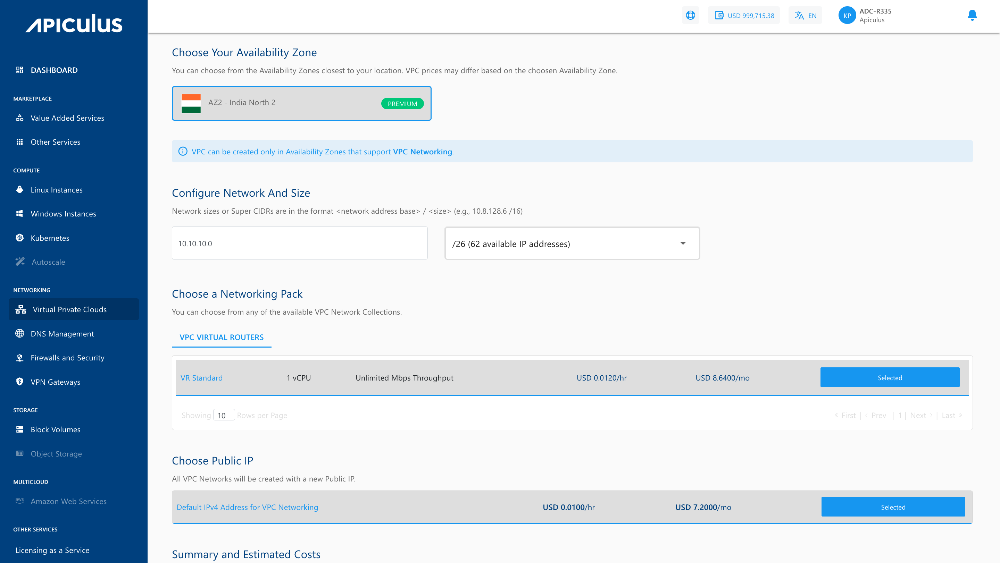
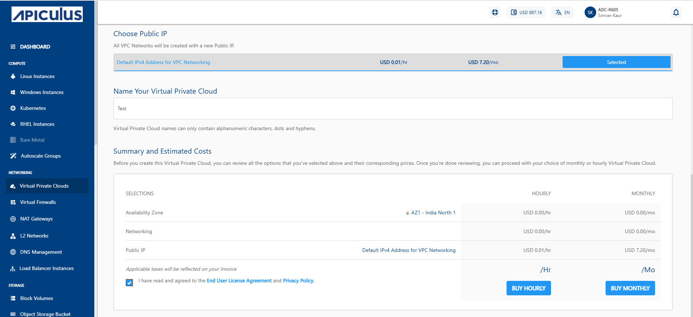
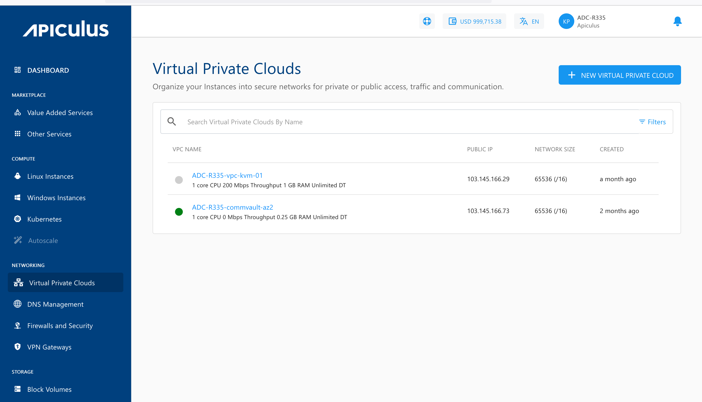

# Create, List and View VPCs

## Creating a VPC

To create a VPC, follow the below steps:

1. Navigate to **Networking > Virtual Private Clouds**
2. Click the **+ NEW VIRTUAL PRIVATE CLOUD** from the top right.
   
3. Choose an Availability Zone, which is the geographical region where your VPC will be configured.
4. Specify network address base size and select size i.e. The **super CIDR** for the internal IP allocation in an x.x.x.x/x format.
5. Choose a Networking pack from the available network collections. 
6. Select the default IPV4 address for VPC Networking so that the VPC network will be created with a new Public IP address.
   
7. Verify the Estimated Cost of your VPC, based on the options that you have chosen from the Summary and Estimated Costs Section.
8. Click on the check box after going through the policies mentioned by your cloud service provider.
9. Clicking on the BUY HOURLY or BUY MONTHLY button, a confirmation pop-over will open up, and the price summary will be displayed along with the discount codes, if you have any in your account. 
    1. You can apply any of the discount codes listed by clicking on the **APPLY** button. 
    2. You can also remove the applied discount code by clicking the **REMOVE** button. 
    3. Clicking on the **CANCEL** button, this action will be canceled.
       
10. Click on the **CONFIRM** to create the VPC.

Once ready, you’ll be notified of this purchase on your email address on record. 

:::note
This might take up to 5-8 minutes. You may use the Cloud Console during this time, but it is advised that you do not refresh the browser window.
:::

## Viewing Available VPC

All VPC created in a user account can be accessed from **Networking >** **Virtual Private Clouds** on the main navigation panel. The listing will have the following details.

- VPC Name
- Public IP
- Network Size
- Created

