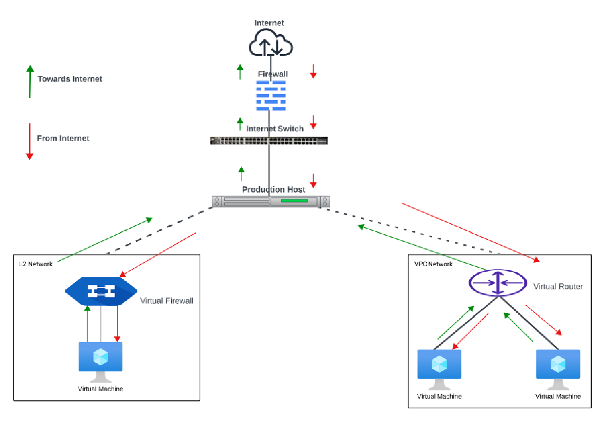

# About Virtual Private Cloud and L2 Network

A VPC is a higher-level abstraction that allows you to create isolated network environments with more advanced features. A VPC can include multiple tiers, such as public and private subnets, and it provides for the implementation of advanced networking features like VPNs (Virtual Private Networks) and ACLs.
## 3-Tiered Network Architecture

VPCs follow the convention of 3-tiered network architecture, with web, app, and DB tiers forming the norm.

**Web Tier (Public Subnet)**
- This layer contains web servers and is placed in a public subnet.
- It manages user requests coming from the internet.
- It accepts incoming traffic and sends it securely to the application tier.

**App Tier (Private Subnet)**
- This layer contains the application servers that process the business logic.
- It manages requests forwarded by the web tier.
- It is placed in a private subnet with no direct internet access.

**DB Tier (Private Subnet)**
- This layer hosts the database servers.
- It resides in a private subnet and is strictly isolated from the internet.
- It is accessed only by the app tier to ensure data protection.

 VPC is delivered using a virtual router (VR). The following sections outline various functionalities using a VPC:

- [Create, List and View VPCs](CreateListandViewVPCs)
- [Overview](docs/Subscribers/Networking/VirtualPrivateClouds/AboutVPCInstances/Overview.md)
- [Creating subnets and tiers](CreatingVPCSubnetsTiers)
- [Managing VPC Instances](ManagingVPCInstances)
- [Working with IPv4 addresses](IPv4AddressesandVPC)
- [Access control on a VPC](ManagingAccessControlonVPCSubnets)
- [Reconfiguring the VPC](Reconfiguring)
- [VPC operations](VPCManagementandBasicOperations)

## L2 Networks

L2 networks provide network isolation without any other services. This means that there will be no virtual router. It is assumed that the end user will have their **IPAM**IP Address Management helps in assigning, tracking, and managing IP addresses inside your network infrastructure.in place or that they will statically assign IP addresses.

The end-users can create L2 networks; however, network offerings that allow the network creator to specify a VLAN can only be created by the root admins. It does not assign IP addresses to instances. User data and metadata can be passed to the instance using a config drive (which must be enabled in the network service offering).

The difference in Traffic Flow is simplified in the following diagram:

