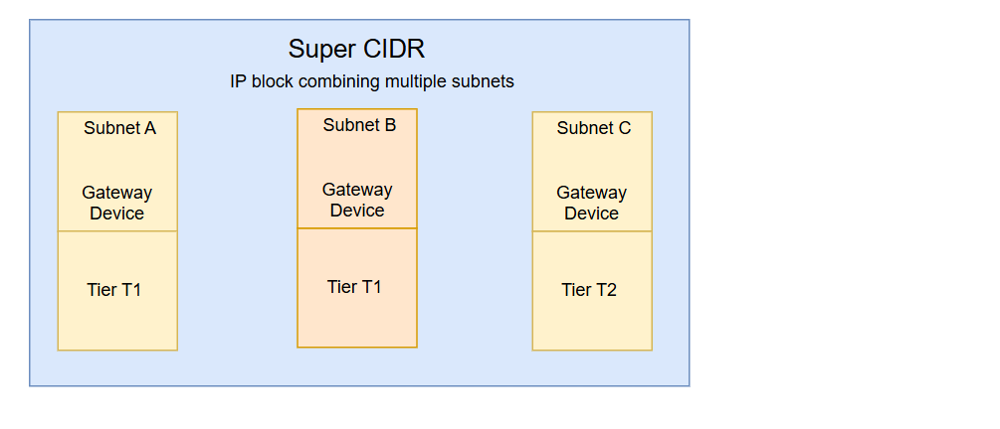
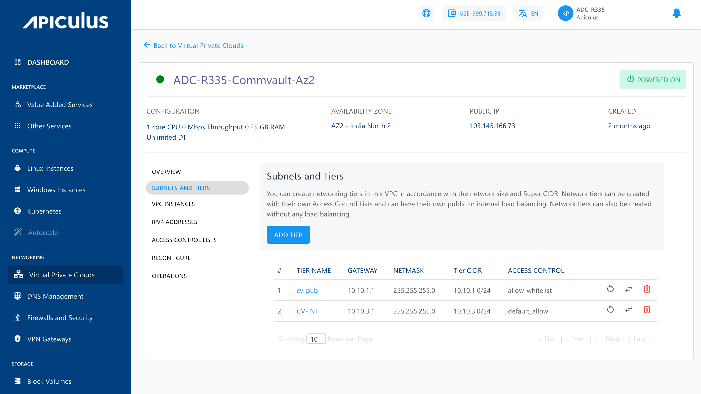
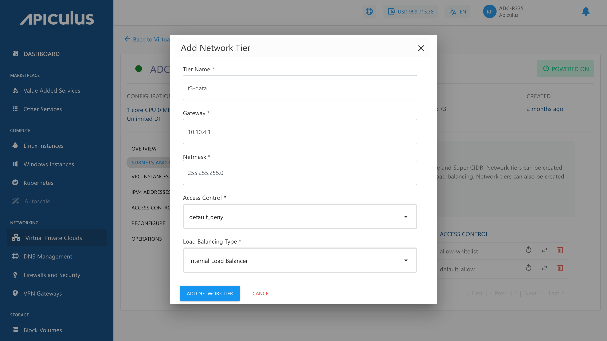
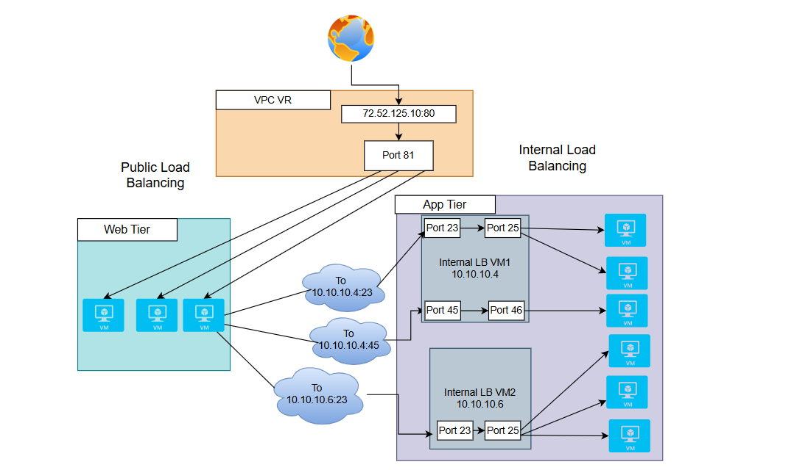

# Creating VPC Subnets and Tiers

VPCs follow the convention of 3-tiered architectures, with web, app, and DB tiers forming the norm. You can, however, configure these tiers to suit your application architecture or just follow the common convention.
## Subnet and Tiers 

In a VPC, subnets define IP-based network segments, and tiers represent logical layers of your application architecture. You can design networking tiers within this VPC based on the overall network size and the allocated Super CIDR range.

To add a tier to your VPC, navigate to the VPC you wish to add the tier to, and click the **ADD TIER** option present inside the **SUBNETS AND TIERS** section of the VPC. This will open up a dialog box asking you to provide the following information:

- **Name** of the tier.
- **Gateway** for the subnet.
- **Netmask** for the tier/subnet.
	:::note
	 The gateway should be consistent with the subnet mask.
	:::
- Default **access control** policy for this tier.
- **Load balancing type** required on this tier. 
  :::note
	 To set up a public load balancer, you need to select **Public LB** on this dropdown. There can only be 1 tier of type Public LB in a network.
  :::

To create the tier or subnet to be used as part of the VPC, click on **ADD NETWORK TIER**.

There are three icons available on the right side for quick actions like restarting the network, replacing the access control list, and deleting the tier.

### Public Load Balancer

A Public Load Balancer is used to manage traffic that comes from the internet. It comprises a public IP address, allowing users or external systems to access your application from outside your network.

#### Use Case
- Select this option if your application or service needs to be accessed from the public internet.
- It is ideal for websites, public APIs, or any system where users connect directly from browsers or apps.
#### Placement
- It is placed in the web tier, which is a public subnet in your VPC.
- It can forward traffic to backend instances located in either public or private subnets using routing rules.

### Internal Load Balancer

It works only inside your VPC. It has a private IP address, which means it is not accessible from the internet. It is used for managing traffic between internal services, like from your web tier to your application tier.

#### Use Case
- Select this option when your services do not need public access but need to communicate within your VPC.
- Useful in a multi-tier setup, where one layer of your application communicates to another.

#### Placement
- It is placed in the application or internal tier, which is a private subnet.
- It routes traffic to backend services or internal logic components.

:::note
Only empty tiers can be deleted, which means that to delete a tier, ensure that there are no Instances and no NAT rule(s) associated with it.
:::

