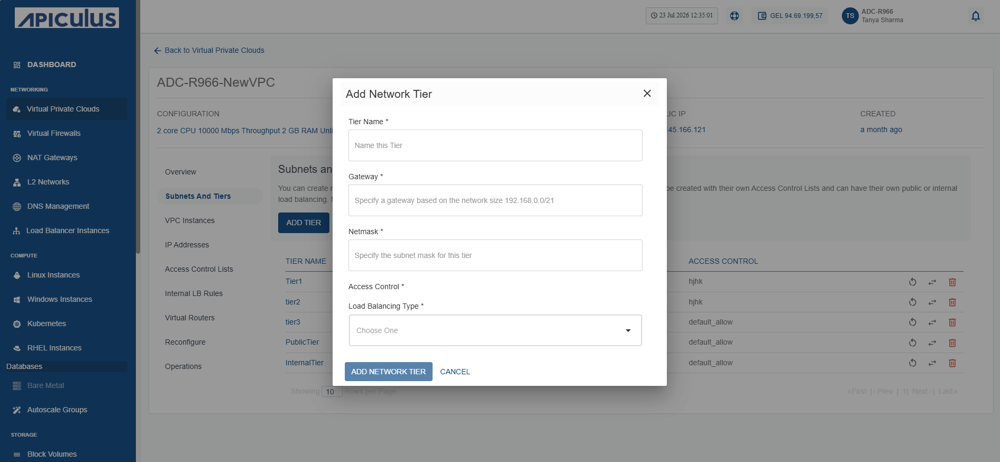
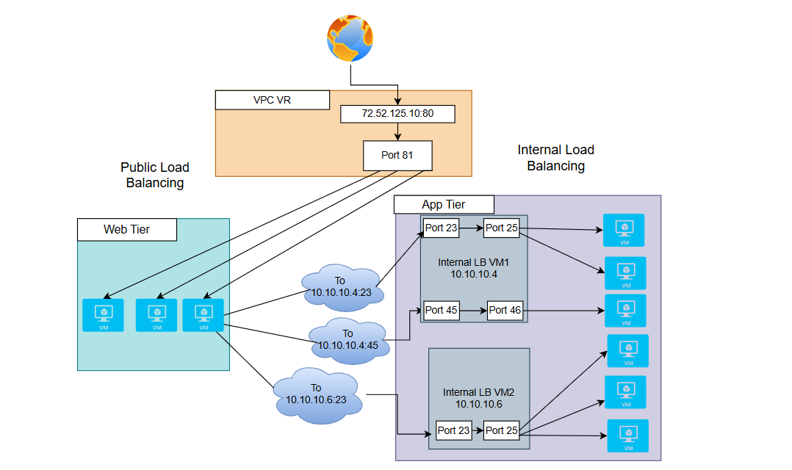

# Creating VPC Subnets and Tiers
Subnets and tiers are essential components of network design to ensure efficient traffic
management and security.
## Subnet and Tiers 
In a VPC, subnets define IP-based network segments, and tiers represent logical layers of your application architecture. You can design networking tiers within this VPC based on the overall network size and the allocated Super CIDR range.

To add a tier to your VPC, navigate to the VPC, select the **Subnets and Tiers** section. The following details are displayed:

- **Name** of the tier.
- **Gateway**for the subnet. 
- **Netmask** for the tier/subnet.
- **Tier CIDR** for this tier.
- **Tier IPv6 Gateway** of this tier.
- **Tier IPv6 CIDR** of this tier.
- **Access Control** of this tier.
	
There are three icons available on the right side for quick actions:
	- Restarting the network
	- Replacing the access control list
	- Deleting the tier
### Adding a Tier
To add a tier, follow these steps:
1. Click the **Add Tier** button. The following screen appears:
	
2. Enter the following details:
    - **Tier Name:** Name of the network tier you are creating.
    - **Gateway:** IP address for the gateway of the tier.
    - **Netmask:** Subnet mask defining the IP range.
    - **Access Control:** Choose rules for network traffic control.
3. Click the **Add Network Tier** button.
:::note 
You can attach the network tier to the instance as a Network Interface Card (NIC).
:::
### Replacing an ACL
To replace an ACL, follow these steps:
1. Click the **Replace Access Control List** (highlighted in red) icon.
	
	The following screen appears:
	
2. Select a different **ACL** from the dropdown list.
3. Click the **Replace Tier ACL** button.

The tier is attached with selected ACL.
### Public Load Balancer

A Public Load Balancer is used to manage traffic that comes from the internet. It comprises a public IP address, allowing users or external systems to access your application from outside your network.

#### Use Case
- Select this option if your application or service needs to be accessed from the public internet.
- It is ideal for websites, public APIs, or any system where users connect directly from browsers or apps.
#### Placement
- It is placed in the web tier, which is a public subnet in your VPC.
- It can forward traffic to backend instances located in either public or private subnets using routing rules.

### Internal Load Balancer

It works only inside your VPC. It has a private IP address, which means it is not accessible from the internet. It is used for managing traffic between internal services, like from your web tier to your application tier.

#### Use Case
- Select this option when your services do not need public access but need to communicate within your VPC.
- Useful in a multi-tier setup, where one layer of your application communicates to another.

#### Placement
- It is placed in the application or internal tier, which is a private subnet.
- It routes traffic to backend services or internal logic components.

:::note
You can delete only the empty tiers, which means that in order to delete a tier, ensure that there are no Instances and no NAT rule(s) associated with it.
:::

