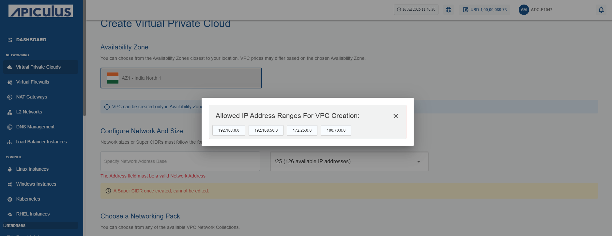
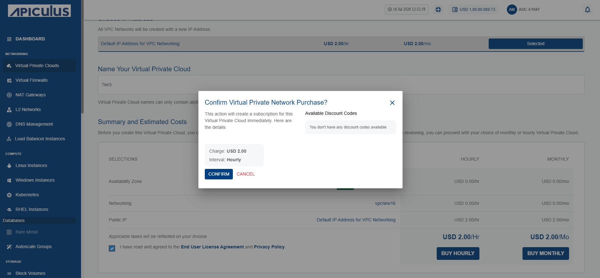

 # Creating and Viewing VPCs

Managing VPCs is important because it gives you full control over your cloud network. By creating, listing, and viewing VPCs, you can organize your resources better, keep track of active networks, and quickly access details when you need to manage or troubleshoot them.

To create, list and view VPCs, navigate to the **Networking** tab and select the **Virtual Private Clouds** option.
## Creating a VPC
 A VPC is created to provide a secure, isolated, and fully controllable virtual network environment for cloud resources.
To create a VPC, follow the below steps:
1. Navigate to **Networking > Virtual Private Clouds**. The following screen appears:
	
2. Click the **NEW VIRTUAL PRIVATE CLOUD** button. The following screen appears:
   
3. Click the **New Virtual Private Cloud** button. The following screen appears:
4. Choose an Availability Zone, which is the geographical region where your VPC will be configured.
5. Specify network address base size and select size i.e. The **super CIDR** for the internal IP allocation in an x.x.x.x/x format.
:::note 
To know allowed IP address ranges for VPC creation, select the **click here** link (highlighted in red).
:::
	
	
6. Choose a **Dual Stack VPC (IPv6 + IPv4)** from the available networking pack.
	:::note 
	To configure IPv6 under a **VPC,** you must create a ticket with our support team for assistance. 
	:::
	

7. To create the VPC with a new NICNET IP address, select **Default IP Address for VPC Networking**.
8. Enter the valid name in the **Name your Virtual Private Cloud** field.
9. Verify the **Summary and Estimated Costs** section (Here, both the hourly and monthly price summaries are displayed).
10. Select the **I have read and agreed to the End User License Agreement and Privacy Policy** option.
	
11. To display the price summary, click the **Buy Hourly** or **Buy Monthly** button, a confirmation screen appears:
- To apply any of the listed discount codes, click **Apply**.
- To remove the applied discount code, click **Remove**.
- To cancel the action, click **Cancel**.
	
12. Click **Confirm**.
	Once ready, you get the notification of this purchase on your email address on record.
## Viewing Available VPCs
You can access all the VPCs created in your account from **Networking >** **Virtual Private Clouds** on the main navigation panel. The listing will have the following details.
- VPC Name
- Public IP
- Network Size
- Created

Click on the VPC name to view the associated details and manage the VPC.

