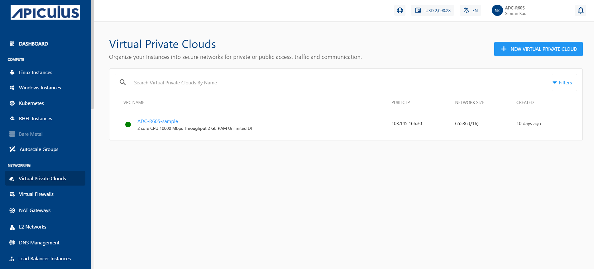
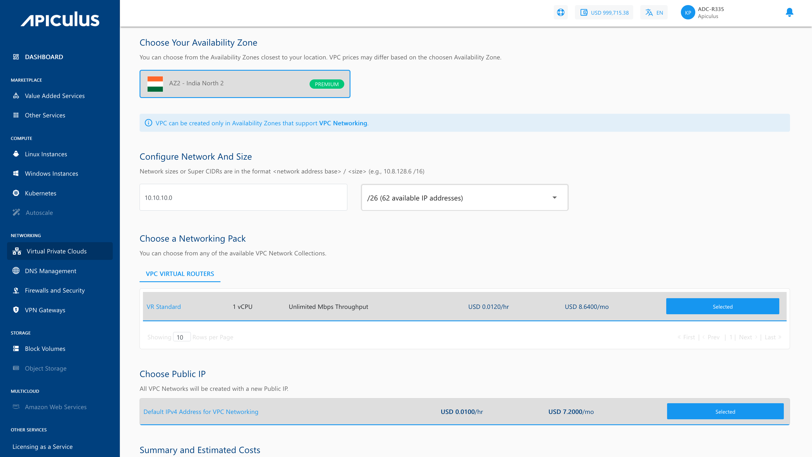
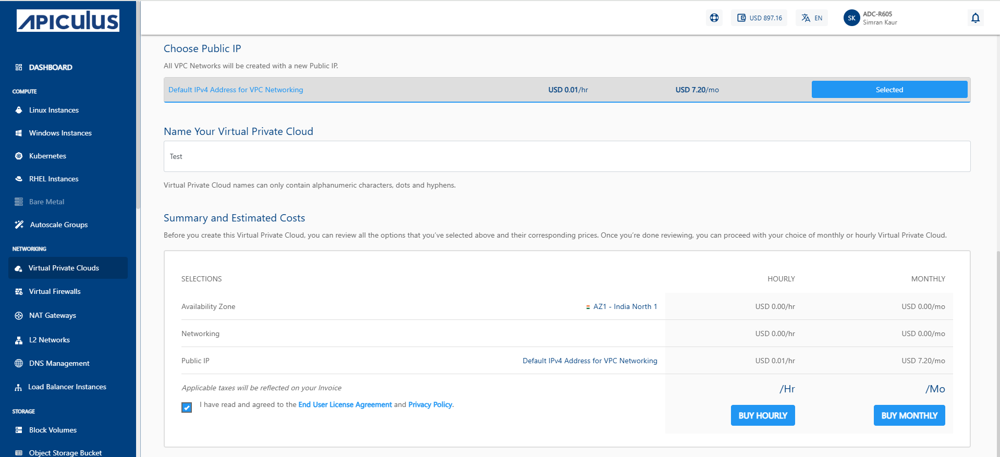

# Creating and Viewing VPCs

Managing VPCs is important because it gives you full control over your cloud network. By creating, listing, and viewing VPCs, you can organize your resources better, keep track of active networks, and quickly access details when you need to manage or troubleshoot them.

To create, list and view VPCs, navigate to the **Networking** tab and select the **Virtual Private Clouds** option.
## Creating a VPC
 A VPC is created to provide a secure, isolated, and fully controllable virtual network environment for cloud resources.
To create a VPC, follow the below steps:
1. Navigate to **Networking > Virtual Private Clouds**. The following screen appears:
	
2. Click the **NEW VIRTUAL PRIVATE CLOUD** button. The following screen appears:
   
3. Click the **New Virtual Private Cloud** button. The following screen appears:
4. Choose an Availability Zone, which is the geographical region where your VPC will be configured.
5. Specify network address base size and select size i.e. The **super CIDR** for the internal IP allocation in an x.x.x.x/x format.
6. Choose a Networking pack from the available network collections. 
7. Select the default IPv4 address for VPC Networking to create the VPC network with a new Public IP address.   
8. Verify the Estimated Cost of your VPC, based on the options that you have chosen from the Summary and Estimated Costs Section.
9. Select the **I have read and agreed to the End User License Agreement and Privacy Policy** option.
10. Clicking the **BUY HOURLY** or **BUY MONTHLY** button, a confirmation appears, and the price summary is displayed along with the discount codes, if you have any in your account. 
    - You can apply any of the discount codes listed by clicking on the **APPLY** button. 
    - You can also remove the applied discount code by clicking the **REMOVE** button.       
11. Click on the **CONFIRM** to create the VPC.
Once your VPC is ready, you will notified of this purchase on your email address on record. 
:::note
This might take up to 5-8 minutes. You may use the Cloud Console during this time, but it is advised that you do not refresh the browser window.
:::
## Viewing Available VPCs
You can access all the VPCs created in your account from **Networking >** **Virtual Private Clouds** on the main navigation panel. The listing will have the following details.
- VPC Name
- Public IP
- Network Size
- Created

Click on the VPC name to view the associated details and manage the VPC.

