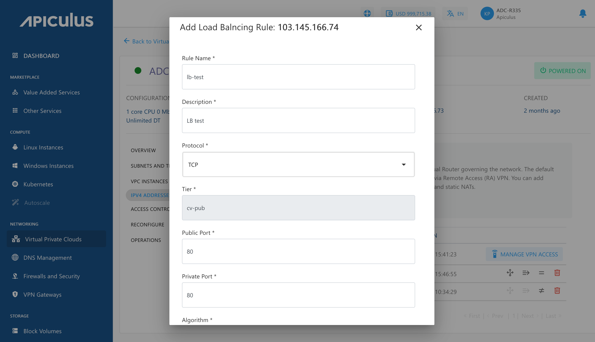

# IPv4 Addresses and VPC

IPv4 Addresses are an integral part of using VPC networking, and need to be used to access various components of the VPC. By default, a public IPv4 Address is assigned to the VR which can communicate through the internet to transmit traffic to/from the VR. This IPv4 can also be used for configuring remote access (L2TP) and site-to-site (IPSec) VPN connections.

## Using Additional IPv4

Primarily, IPv4 Addresses can be used for configuring access and NAT-ing via:

- [Load balancing](#configuring-load-balancing)
- [Port Forwarding](#configuring-port-forwarding)
- [Static NAT](#configuring-static-nat)

As a first step, a new IPv4 Address needs to be added to the VPC, which can be done using the **ADD PUBLIC IPv4 ADDRESS** button.

:::note
Public IPv4 addresses may carry a price which may vary depending on availability of IPv4 addresses in the country of operation, and/or how the service provider has priced them.
:::

## Configuring Load Balancing 
To configure the Load Balancing Rule, follow these steps:
1. To create Load Balancing Rule, click the icon.
2. The following window appears:
	
3. Click **Add Rule**. The following window appears:
	
4. Specify the following details in the window:
	- A **name** and **description** for the load balancer rule.
	- **Protocol** to use for the load balancer.
	- Select the **Tier**.
	- The **load balancing algorithm** to use.
	- **Public** and **private** port mapping.
5. Click the **ADD LOAD BALANCING RULE** button.

Once the load balancer rule has been created, you can navigate to load balancer and add (or remove) Instances to this rule. To do this, follow these steps:

1. Click the **Load Balancer Rule** icon.
2. Select the **Load Balancing Rule**.
  
3. The following window appears:
	  
4. This window shows Instances that are part of this load balancer, and those available to be added. 
5. Click the **+** icon to add an instance and the **X** icon to remove an instance.
:::note
To delete this Load Balancing Rule, click **DELETE THIS RULE**.
:::

To verify the load balancer configuration, log into each virtual machine behind it, create an **index.html** file with different content on each, and access the public IP address from your browser. If configured correctly, each browser page refresh should take turns in loading the two index.html pages.

:::note
A load balancer IP rule can only be configured if the tier/subnet type is set to **Public IP**.
:::

## Configuring Port Forwarding

A Port Forwarding rule is required for accessing the virtual machines contained in a VPC. Since virtual machines in a VPC only have a private IP address, a public IP address is required for each virtual machine that you want to access from your terminal.

To configure port forwarding, follow these steps:
1. To configure Port Forwarding Rule, click the icon.
2. The following window appears:  
3. Click **ADD RULE**. The following window appears: 
4. Specify the following details in the window:
	- **Protocol** for port-forwarding.
	- The **tier** and the Instance to port-forward to.
	- Set the**Public** and **private port** range.
	  :::note
	  The end ports should be equal to or greater than the start ports.
	  :::
5. Click **ADD PORT FORWARDING RULE**.

Once the Port-Forwarding rule is created, you can view its details by following these steps:
1. Click the **Port Forwarding Rule** icon.
2. The following window appears:
3. In this window, you can view the Instance where this rule is configured, along with the private and public port range mappings.

To test if port-forwarding is configured correctly, use the public IP to SSH into the virtual machine the IP forwards to.

:::note
A Port-Forwarding IP address can be used to configure multiple Port-Forwarding access rules but with one virtual machine. To port-forward into a different virtual machine, you’ll need to purchase an additional public IP address.
:::
## Configuring Static NAT

1. To use the public IP as a static translation, click the icon. 
2. The following window appears: 
	
3. Select the Instance you want to assign the public IP to, then click **Add Static NAT**.

To test whether static NAT has been configured correctly, you can use the public IP to SSH into the virtual machine that the IP is NAT-ing to.

