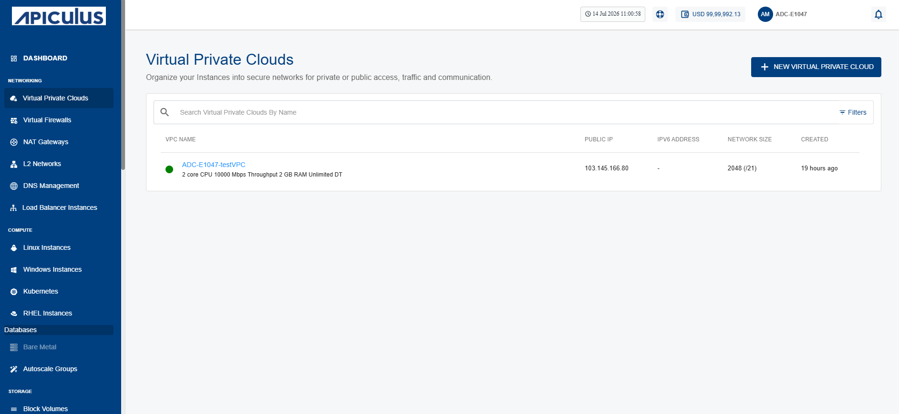
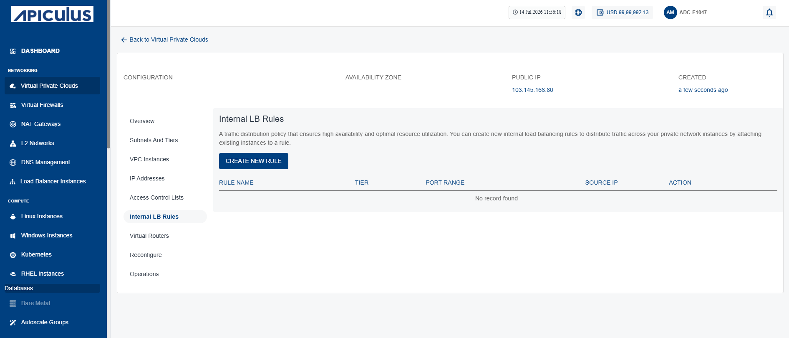
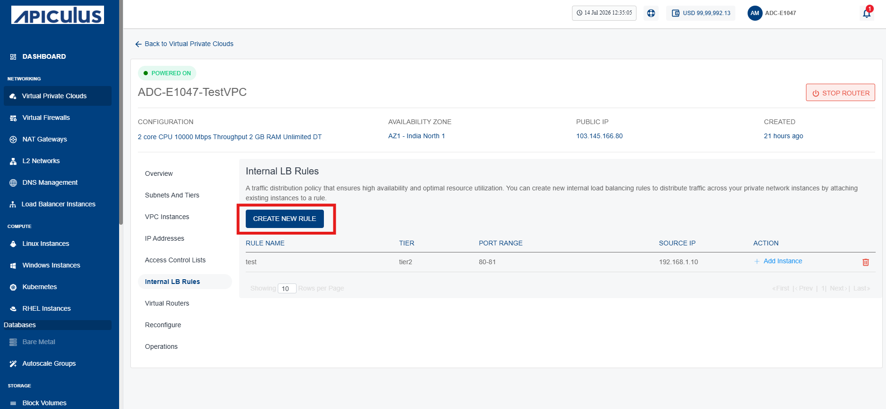
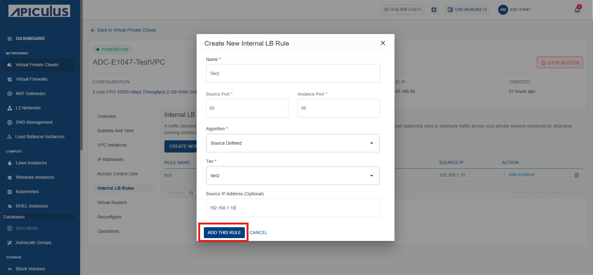
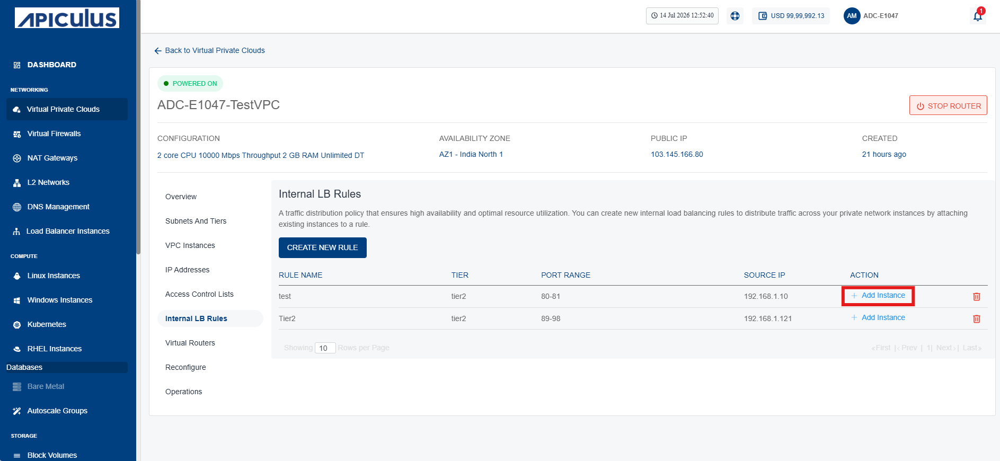
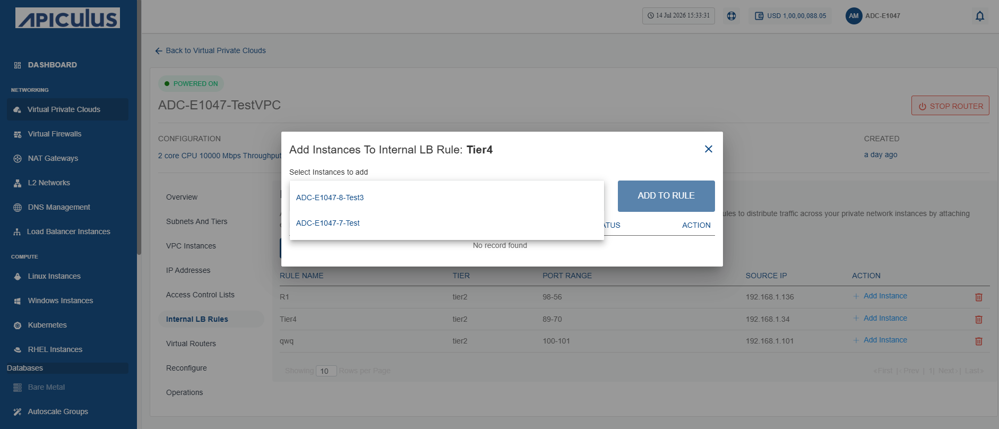
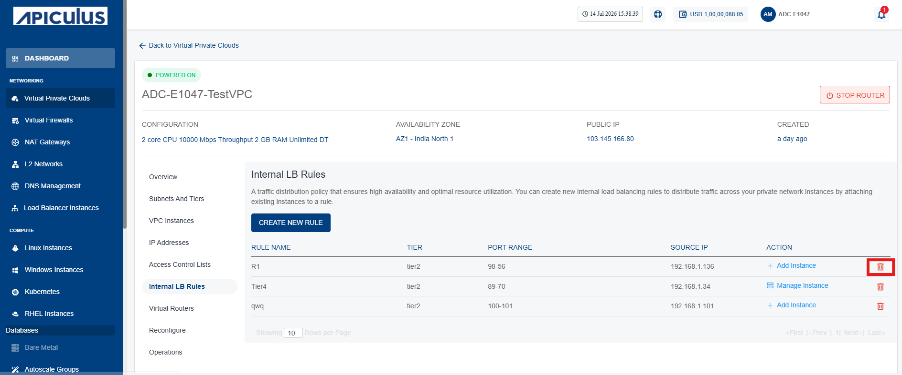
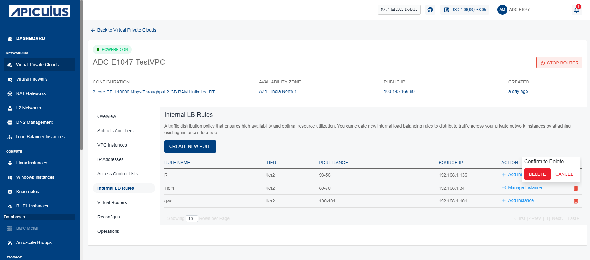

# Internal LB Rule 
An internal Load Balancer (LB) is a type of load balancer that routes traffic to workloads within a 
private virtual network (VNet).
## Creating a New Internal LB Rule 
To create a new Internal LB Rule, follow these steps:
1. Navigate to **Networking > Virtual Private Clouds**. The following screen appears:
	
2. Click the **VPC name** and navigate to the **Internal LB Rules** tab. The following screen appears:
	
3. Click the **New Rule** button (highlighted in red).
	
    The following screen appears:
	
4. Provide the details on the Create New Internal LB Rule screen.
5. Click the **Add this Rule** button (highlighted in red).
## Adding an Instance

To add an instance, follow these steps:
1. Navigate to **Networking > Virtual Private Clouds**. The following screen appears:
	
2. Click the **VPC name** and navigate to the **Internal LB Rules** tab. The following screen appears:
	
3. Click on **Add Instance** icon (highlighted in red). The following screen appears:
4. Select the instance to add in Internal LB Rule.	
5. Click the **Add to Rule** button.
## Deleting an Instance 
To delete an instance, follow these steps:
1. Navigate to **Networking > Virtual Private Clouds**. The following screen appears:
	
2. Click the **VPC name** and navigate to the **Internal LB Rules** tab. The following screen appears:
	
3. Click the **Delete** icon (highlighted in red). The following screen appears:
	
4. Click the **Delete** button.

